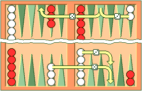
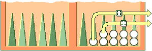

GNUBG Manual
============
.. container:: article

   .. container:: titlepage

      .. container::

         .. container::

            .. rubric:: GNU Backgammon Manual V1.00.0
               :name: gnu-backgammon-manual-v1.00.0
               :class: title

         .. container::

            .. container:: authorgroup

               .. container:: author

                  .. rubric:: Christian Anthon
                     :name: christian-anthon
                     :class: author

                  .. container:: affiliation

                     GNU Backgammon Project

                     .. container:: address

                        |
                        | ``<christian.anthon@gmail.com>``
                        |

         .. container::

            This manual describes version 1.00.0 of GNU Backgammon.

         .. container::

            Copyright © 1999, 2000, 2001, 2002, 2003 Achim Mueller, Gary
            Wong

         .. container::

            Copyright © 2007 Christian Anthon

         .. container::

            .. container:: legalnotice

               Permission is granted to copy, distribute and/or modify
               this document under the terms of the GNU Free
               Documentation License, Version 1.3 or any later version
               published by the Free Software Foundation; with no
               Invariant Sections, no Front-Cover Texts, and no
               Back-Cover Texts. A copy of the license is included in
               the section entitled “GNU Free Documentation
               License”.\ `Appendix A, GNU Free Documentation
               License <#fdl>`__.

               **Feedback**

               To report a bug or make a suggestion regarding the GNU
               Backgammon application or this manual, send your
               suggestions to ``<bug-gnubg@gnu.org>`` or make a `bug
               report <https://savannah.gnu.org/bugs/?group=gnubg>`__.

         .. container::

            .. container:: revhistory

               **Revision History**

Revision GNU Backgammon Manual (docbook version)

February 2007

GNU Backgammon Project

Revision GNU Backgammon Manual (wiki version)

January 2007

GNU Backgammon Project

Revision GNU Backgammon Manual (texinfo version)

November 2003

GNU Backgammon Project

.. container::

   .. container:: abstract

      **Abstract**

      The GNU Backgammon manual

--------------

.. container:: toc

   **Table of Contents**

   `Introduction <#gnubg-intro>`__
   `GPL copying/warranty info <#gnubg-intro_gpl>`__
   `Rules of the game <#gnubg-rules>`__
   `Setup <#gnubg-rules_setup>`__
   `Object of the Game <#gnubg-rules_object>`__
   `Movement of the Checkers <#gnubg-rules_movement>`__
   `Hitting and Entering <#gnubg-rules_hitting>`__
   `Bearing Off <#gnubg-rules_bearingoff>`__
   `Doubling <#gnubg-rules_doubling>`__
   `Gammons and Backgammons <#gnubg-rules_gammons>`__
   `Optional Rules <#gnubg-rules_optional>`__
   `Rules for Match Play <#gnubg-rules_match>`__
   `Starting GNU Backgammon <#gnubg-starting>`__
   `GNU/Linux and Unix <#gnubg-starting_unix>`__
   `Microsoft Windows <#gnubg-starting_ms>`__
   `Mac OS X <#gnubg-starting_mac>`__
   `Command line options <#gnubg-starting_options>`__
   `Playing a game <#gnubg-playing>`__
   `Starting a new match or session <#gnubg-playing_new>`__
   `Rolling the dice <#gnubg-playing_roll>`__
   `Moving the checkers <#gnubg-playing_move>`__
   `Using the doubling cube <#gnubg-playing_double>`__
   `Resigning <#gnubg-playing_resign>`__
   `Getting hints and Tutor Mode <#gnubg-hint>`__
   `Getting hints manually <#gnubg-hint_manual>`__
   `Tutor mode <#gnubg-hint_tutor>`__
   `Setting up a position <#gnubg-edit>`__
   `Entering Edit mode <#gnubg-edit_entering>`__
   `Editing <#gnubg-edit_edit>`__
   `Clearing the board <#gnubg-edit_clear>`__
   `Quick edit <#gnubg-edit_quick>`__
   `Editing by drag and drop <#gnubg-edit_drag>`__
   `Setting the player on turn <#gnubg-edit_turn>`__
   `Setting the dice <#gnubg-edit_dice>`__
   `Setting the cube <#gnubg-edit_cube>`__
   `Setting the score <#gnubg-edit_score>`__
   `Exiting Edit mode <#gnubg-edit_exit>`__
   `Analysing the position <#gnubg-edit_analyse>`__
   `Working with matches <#gnubg-matches>`__
   `Retrieving and storing backgammon files <#gnubg-matches_ras>`__
   `Entering live tournament matches <#gnubg-matches_entering>`__
   `Analysing matches <#gnubg-matches_analysing>`__
   `Reviewing matches <#gnubg-matches_review>`__
   `Rollouts <#gnubg-rollouts>`__
   `Introduction to rollouts <#gnubg-rollouts_intro>`__
   `Rollouts in GNU Backgammon <#gnubg-rollouts_gnubg>`__
   `Customizing GNU Backgammon <#gnubg-custom>`__
   `Evaluation settings <#gnubg-custom_eval>`__
   `Appearance <#gnubg-custom_appearance>`__
   `Technical Notes <#gnubg-technotes>`__
   `Obtaining bearoff databases <#gnubg-tech_databases>`__
   `Match Equity Tables <#gnubg-tech_met>`__
   `Python scripting <#gnubg-tech_python>`__
   `Equities explained <#gnubg-tech_equities>`__
   `A technical description of the Position
   ID <#gnubg-tech_postionid>`__
   `A technical description of the Match ID <#gnubg-tech_matchid>`__
   `Description of the CSS style sheet <#gnubg-tech_css>`__
   `Frequently Asked Questions <#gnubg-faq>`__
   `General questions <#gnubg-faq_general>`__
   `How to install <#gnubg-faq_install>`__
   `Running GNU Backgammon <#gnubg-faq_start>`__
   `Playing backgammon <#gnubg-faq_play>`__
   `Settings <#gnubg-faq_settings>`__
   `Analysing <#gnubg-faq_analysing>`__
   `Abbreviations <#gnubg-faq_abbr>`__
   `A. GNU Free Documentation License <#fdl>`__

.. container:: sect1

   .. container:: titlepage

      .. container::

         .. container::

            .. rubric:: Introduction
               :name: introduction
               :class: title

         .. container::

            .. container:: abstract

               **Abstract**

               Introduction to GNU Backgammon

   This manual describes how to use GNU Backgammon to play and analyse
   backgammon games and matches. It corresponds to version 1.00.0
   (updated in August, 2013).

   GNU Backgammon (gnubg) plays and analyses both money game sessions
   and tournament matches. It evaluates and rolls out positions, and
   much more. Driven by a command-line interface, it displays an ASCII
   rendering of a board on text-only terminals, but also allows the user
   to play games and manipulate positions with a graphical
   GTK+interface. GNU Backgammon is extensible on platforms which
   support Python.

   .. container:: screenshot

      .. container:: mediaobject

         +----------+
         | |image0| |
         +----------+

   GNU Backgammon is a world class opponent and rates at around 2100 on
   FIBS, the First Internet Backgammon Server - at its best, it is in
   the top 5 of over 6000 rated players there). GNU Backgammon can be
   played on numerous other on-line backgammon servers.

   The following features can be found in the current release of GNU
   Backgammon.

   .. container:: itemizedlist

      -  A command-line interface (with full command editing features if
         GNU readline is available) that lets you play matches and
         sessions against GNU Backgammon with a rough ASCII
         representation of the board on text terminals.

      -  Support for a GTK+ graphical user interface with both 2D and 3D
         views of the board.

      -  Tournament match and money session cube handling and cubeful
         play. All governed by an underlying cubeless money game based
         neural net.

      -  Support for both 1-sided and 2-sided bearoff databases: 1-sided
         bearoff database for 15 checkers on the first 6 points and
         optional 2-sided database kept in memory. Larger 1-sided and
         2-sided databases may be stored on disk.

      -  Automated rollouts of positions, with lookahead and variance
         reduction where appropriate. Rollouts may be extended.

      -  Automatic and manual annotation (analysis and commentary) of
         games and matches.

      -  Record keeping of player statistics in games and matches using
         relational databases (SQLite, MySQL, and PostgreSQL are
         supported).

      -  Loading and saving analysed games and matches as .sgf files
         (Smart Game Format).

      -  Importing of positions, games and matches from a number of
         standard file formats, including: native GNU Backgammon file
         (.sgf), Jellyfish Match (.mat), GridGammon Save Game (.sgg),
         FIBS Oldmoves (.fibs), Jellyfish Position (.pos), Snowie Text
         (.txt), TrueMoneyGames (.tmg), GammonEmpire Game (.gam),
         PartyGammon Game (.gam), and BGRoom Game (.bgf).

      -  Exporting of positions, games and matches to a number of
         standard file formats, including: native GNU Backgammon file
         (.sgf), Hypertext Markup Language (.html), Jellyfish Game
         (.gam), Jellyfish Match (.mat), Jellyfish Position (.pos),
         LaTeX (.tex), Portable Document Format (.pdf), Plain Text
         (.txt), Portable Network Graphics (.png), Postscript (.ps),
         Snowie Text (.txt), and Scalable Vector Graphics (.svg).

      -  Python scripting ability.

      -  Native language support; 15 languages are complete or in
         progress: (cs_CZ, da_DK, en_GB, en_US, es_ES, fi_FI, fr_FR,
         de_DE, el_GR, is_IS, it_IT, ja_JP, ro_RO, ru_RU and tr_TR)

   .. container:: sect2

      .. container:: titlepage

         .. container::

            .. container::

               .. rubric:: GPL copying/warranty info
                  :name: gpl-copyingwarranty-info
                  :class: title

      GNU Backgammon is developed under the GNU General Public License
      (GPL) and it is part of the GNU project. For more information
      about the GNU project please visit their website:
      https://www.gnu.org/ For more information about free software in
      general please visit The Free Software Foundation at:
      https://www.fsf.org/.

.. container:: sect1

   .. container:: titlepage

      .. container::

         .. container::

            .. rubric:: Rules of the game
               :name: rules-of-the-game
               :class: title

   This section describes how to play a game, a match, or a session of
   money games against GNU Backgammon or a human opponent. It is taken
   directly from the rules section of `Backgammon
   Galore <https://www.bkgm.com/>`__ , courtesy of Tom Keith.

   .. container:: sect2

      .. container:: titlepage

         .. container::

            .. container::

               .. rubric:: Setup
                  :name: setup
                  :class: title

      Backgammon is a game for two players, played on a board consisting
      of twenty-four narrow triangles called points. The triangles
      alternate in color and are grouped into four quadrants of six
      triangles each. The quadrants are referred to as a player's home
      board and outer board, and the opponent's home board and outer
      board. The home and the outer boards are separated from each other
      by a ridge down the center of the board called the bar.

      .. container:: figure

         **Figure 1. A board with the checkers in their initial
         position.**

         .. container:: figure-contents

            .. container:: mediaobject

               |A board with the checkers in their initial position.|

      An alternate arrangement is the reverse of the one shown here,
      with the home board on the left and the outer board on the right.

      The points are numbered for either player starting in that
      player's home board. The outermost point is the twenty-four point,
      which is also the opponent's one point. Each player has fifteen
      checkers of his own color. The initial arrangement of checkers is:
      two on each player's twenty-four point, five on each player's
      thirteen point, three on each player's eight point, and five on
      each player's six point.

      Both players have their own pair of dice and a dice cup used for
      shaking. A doubling cube, with the numerals 2, 4, 8, 16, 32, and
      64 on its faces, is used to keep track of the current stake of the
      game.

   .. container:: sect2

      .. container:: titlepage

         .. container::

            .. container::

               .. rubric:: Object of the Game
                  :name: object-of-the-game
                  :class: title

      The object of the game is for a player to move all of his checkers
      into his own home board and then bear them off. The first player
      to bear off all of his checkers wins the game.

      .. container:: figure

         **Figure 2. Direction of movement of White's checkers. Red's
         checkers move in the opposite direction.**

         .. container:: figure-contents

            .. container:: mediaobject

               |Direction of movement of White's checkers. Red's
               checkers move in the opposite direction.|

   .. container:: sect2

      .. container:: titlepage

         .. container::

            .. container::

               .. rubric:: Movement of the Checkers
                  :name: movement-of-the-checkers
                  :class: title

      To start the game, each player throws a single die. This
      determines both the player to go first and the numbers to be
      played. If equal numbers come up, then both players roll again
      until they roll different numbers. The player throwing the higher
      number now moves his checkers according to the numbers showing on
      both dice. After the first roll, the players throw two dice and
      alternate turns.

      The roll of the dice indicates how many points, or pips, the
      player is to move his checkers. The checkers are always moved
      forward, to a lower-numbered point. The following rules apply:

      .. container:: orderedlist

         1. A checker may be moved only to an open point, one that is
            not occupied by two or more opposing checkers.

         2. The numbers on the two dice constitute separate moves. For
            example, if a player rolls 5 and 3, he may move one checker
            five spaces to an open point and another checker three
            spaces to an open point, or he may move the one checker a
            total of eight spaces to an open point, but only if the
            intermediate point (either three or five spaces from the
            starting point) is also open.

            .. container:: figure

               **Figure 3. White opens the game with 53.**

               .. container:: figure-contents

                  .. container:: mediaobject

                     |White opens the game with 53.|

            | 

         3. A player who rolls doubles plays the numbers shown on the
            dice twice. A roll of 6 and 6 means that the player has four
            sixes to use, and he may move any combination of checkers he
            feels appropriate to complete this requirement.

         4. A player must use both numbers of a roll if this is legally
            possible (or all four numbers of a double). When only one
            number can be played, the player must play that number. Or
            if either number can be played but not both, the player must
            play the larger one. When neither number can be used, the
            player loses his turn. In the case of doubles, when all four
            numbers cannot be played, the player must play as many
            numbers as he can.

   .. container:: sect2

      .. container:: titlepage

         .. container::

            .. container::

               .. rubric:: Hitting and Entering
                  :name: hitting-and-entering
                  :class: title

      A point occupied by a single checker of either color is called a
      blot. If an opposing checker lands on a blot, the blot is hit and
      placed on the bar.

      Any time a player has one or more checkers on the bar, his first
      obligation is to enter those checker(s) into the opposing home
      board. A checker is entered by moving it to an open point
      corresponding to one of the numbers on the rolled dice.

      For example, if a player rolls 4 and 6, he may enter a checker
      onto either the opponent's four point or six point, so long as the
      prospective point is not occupied by two or more of the opponent's
      checkers.

      .. container:: figure

         **Figure 4. White rolls 64 with a checker on the bar.**

         .. container:: figure-contents

            .. container:: mediaobject

               |White rolls 64 with a checker on the bar.|

      If White rolls [64] with a checker on the bar, he must enter the
      checker onto Red's four point since Red's six point is not open.
      If neither of the points is open, the player loses his turn. If a
      player is able to enter some but not all of his checkers, he must
      enter as many as he can and then forfeit the remainder of his
      turn.

      After the last of a player's checkers has been entered, any unused
      numbers on the dice must be played, by moving either the checker
      that was entered or a different checker.

   .. container:: sect2

      .. container:: titlepage

         .. container::

            .. container::

               .. rubric:: Bearing Off
                  :name: bearing-off
                  :class: title

      Once a player has moved all of his fifteen checkers into his home
      board, he may commence bearing off. A player bears off a checker
      by rolling a number that corresponds to the point on which the
      checker resides, and then removing that checker from the board.
      Thus, rolling a 6 permits the player to remove a checker from the
      six point.

      If there is no checker on the point indicated by the roll, the
      player must make a legal move using a checker on a higher-numbered
      point. If there are no checkers on higher-numbered points, the
      player is permitted (and required) to remove a checker from the
      highest point on which one of his checkers resides. A player is
      under no obligation to bear off if he can make an otherwise legal
      move.

      .. container:: figure

         **Figure 5. White rolls 64 and bears off two checkers.**

         .. container:: figure-contents

            .. container:: mediaobject

               |White rolls 64 and bears off two checkers.|

      A player must have all of his active checkers in his home board in
      order to bear off. If a checker is hit during the bear-off
      process, the player must bring that checker back to his home board
      before continuing to bear off. The first player to bear off all
      fifteen checkers wins the game.

   .. container:: sect2

      .. container:: titlepage

         .. container::

            .. container::

               .. rubric:: Doubling
                  :name: doubling
                  :class: title

      Backgammon is played for an agreed stake per point. Each game
      starts at one point. During the course of the game, a player who
      feels he has a sufficient advantage may propose doubling the
      stakes. He may do this only at the start of his own turn and
      before he has rolled the dice.

      A player who is offered a double may refuse, in which case he
      concedes the game and pays one point. Otherwise, he must accept
      the double and play on for the new higher stakes. A player who
      accepts a double becomes the owner of the cube and only he may
      make the next double.

      Subsequent doubles in the same game are called redoubles. If a
      player refuses a redouble, he must pay the number of points that
      were at stake prior to the redouble. Otherwise, he becomes the new
      owner of the cube and the game continues at twice the previous
      stakes. There is no limit to the number of redoubles in a game.

   .. container:: sect2

      .. container:: titlepage

         .. container::

            .. container::

               .. rubric:: Gammons and Backgammons
                  :name: gammons-and-backgammons
                  :class: title

      At the end of the game, if the losing player has borne off at
      least one checker, he loses only the value showing on the doubling
      cube (one point, if there have been no doubles). However, if the
      loser has not borne off any of his checkers, he is gammoned and
      loses twice the value of the doubling cube. Or, worse, if the
      loser has not borne off any of his checkers and still has a
      checker on the bar or in the winner's home board, he is
      backgammoned and loses three times the value of the double cube.

   .. container:: sect2

      .. container:: titlepage

         .. container::

            .. container::

               .. rubric:: Optional Rules
                  :name: optional-rules
                  :class: title

      The following optional rules are in widespread use.

      .. container:: orderedlist

         1. Automatic doubles. If identical numbers are thrown on the
            first roll, the stakes are doubled. The doubling cube is
            turned to 2 and remains in the middle. Players usually agree
            to limit the number of automatic doubles to one per game.

         2. Beavers. When a player is doubled, he may immediately
            redouble (beaver) while retaining possession of the cube.
            The original doubler has the option of accepting or refusing
            as with a normal double.

         3. The Jacoby Rule. Gammons and backgammons count only as a
            single game if neither player has offered a double during
            the course of the game. This rule speeds up play by
            eliminating situations where a player avoids doubling so he
            can play on for a gammon.

   .. container:: sect2

      .. container:: titlepage

         .. container::

            .. container::

               .. rubric:: Rules for Match Play
                  :name: rules-for-match-play
                  :class: title

      When backgammon tournaments are held to determine an overall
      winner, the usual style of competition is match play. Competitors
      are paired off, and each pair plays a series of games to decide
      which player progresses to the next round of the tournament. This
      series of games is called a match.

      Matches are played to a specified number of points. The first
      player to accumulate the required points wins the match. Points
      are awarded in the usual manner: one for a single game, two for a
      gammon, and three for a backgammon. The doubling cube is used, so
      the winner receives the value of the game multiplied by the final
      value of the doubling cube.

      Matches are normally played using the Crawford rule. The Crawford
      rule states that if one player reaches a score one point short of
      the match, neither player may offer a double in the immediately
      following game. This one game with no doubling is called the
      Crawford game. If the Crawford game is won by the trailing player
      then the doubling cube becomes available in all subsequent games
      (and it's most often in the best interests of the trailing player
      to double immediately in these games).

      .. container:: informaltable

         ============ ===== ===== =============
         Match to 5   White Black Doubling
         White wins 2 2     0     Allowed
         Black wins 1 2     1     Allowed
         White wins 2 4     1     Allowed
         Black wins 1 4     2     Crawford Game
         Black wins 2 4     4     Allowed
         White wins 2 6     4     Allowed
         ============ ===== ===== =============

      In this example, White and Black are playing a 5-point match.
      After three games White has 4 points, which is just one point
      short of what he needs. That triggers the Crawford rule which says
      there can be no doubling in next game, Game 4.

      There is no bonus for winning more than the required number of
      points in match play. The sole goal is to win the match, and the
      size of the victory doesn't matter.

      Automatic doubles, beavers, and the Jacoby rule are not used in
      match play.

.. container:: sect1

   .. container:: titlepage

      .. container::

         .. container::

            .. rubric:: Starting GNU Backgammon
               :name: starting-gnu-backgammon
               :class: title

         .. container::

            .. container:: abstract

               **Abstract**

               Starting GNU Backgammon. Command line options.

   .. container:: sect2

      .. container:: titlepage

         .. container::

            .. container::

               .. rubric:: GNU/Linux and Unix
                  :name: gnulinux-and-unix
                  :class: title

      If GNU Backgammon is properly installed on your system, you can
      start it by simply typing gnubg at the command prompt. If you want
      to start the GNU Backgammon command-line interface, you can type
      gnubg --tty or gnubg -t. With this option, GNU Backgammon starts
      without the graphical user interface. There is also other options
      which can be added at the start-up.

   .. container:: sect2

      .. container:: titlepage

         .. container::

            .. container::

               .. rubric:: Microsoft Windows
                  :name: microsoft-windows
                  :class: title

      The builds of GNU Backgammon which may be downloaded from the
      `main GNU Backgammon
      page <https://www.gnu.org/software/gnubg/#TOCdownloading>`__ are
      packaged as an executable installer file. Running it will install
      GNU Backgammon and create a launch menu item in your start menu.
      Usually the menu item can be found by choosing Start → Programs →
      GNU Backgammon → GNU Backgammon.

      GNU Backgammon also has a command-line interface. This is supplied
      as a separate executable file on Microsoft Windows. You can start
      this version of GNU Backgammon by choosing Start → Programs → GNU
      Backgammon → GNU Backgammon CLI.

   .. container:: sect2

      .. container:: titlepage

         .. container::

            .. container::

               .. rubric:: Mac OS X
                  :name: mac-os-x
                  :class: title

      Once you have installed both an X11R6 server and GNU Backgammon
      for Mac OS X, you can run GNU Backgammon for Mac OS X by:

      .. container:: orderedlist

         1. Start your X11R6 server;

         2. Once your X11R6 server is running, in one of its Terminal
            windows (by default, Apple's X11 opens one such window at
            start-up, and XDarwin opens three), do the following:

            .. container:: orderedlist

               a. If you have installed GNU Backgammon in your private
                  Applications folder, type cd Applications/gnubg to get
                  into GNU Backgammon for Mac OS X's folder, and then
                  type ./gnubg to run it;

               b. If you have installed GNU Backgammon in the global,
                  top-level Applications folder, type cd
                  /Applications/gnubg to get into GNU Backgammon for Mac
                  OS X's folder, and type ./gnubg to run it;

   .. container:: sect2

      .. container:: titlepage

         .. container::

            .. container::

               .. rubric:: Command line options
                  :name: command-line-options
                  :class: title

      The following options control the startup of GNU Backgammon. Most
      options are available in all versions of GNU Backgammon, but
      notably, the -w and -t options do not work under Microsoft Windows
      where separate command-line and GUI applications exist instead.

      .. container:: example

         **Example 1. GNU Backgammon startup options**

         .. container:: example-contents

            .. code:: programlisting

               Usage:
                 gnubg [OPTION?] [file.sgf]

               Help Options:
                 -h, --help                   Show help options
                 --help-all                   Show all help options
                 --help-gtk                   Show GTK+ Options

               Application Options:
                 -b, --no-bearoff             Do not use bearoff database
                 -c, --commands=FILE          Evaluate commands in FILE and exit
                 -l, --lang=LANG              Set language to LANG
                 -p, --python=FILE            Start in Python mode or evaluate code in FILE and exit
                 -q, --quiet                  Disable sound effects
                 -r, --no-rc                  Do not read .gnubgrc and .gnubgautorc commands
                 -S, --splash                 Show GTK splash screen
                 -t, --tty                    Start the command-line instead of using the graphical interface
                 -v, --version                Show version information and exit
                 -w, --window-system-only     Ignore tty input when using the graphical interface
                 -d, --debug                  Turn on debug
                 -D, --datadir                Specify location of general data
                 -P, --pkgdatadir             Specify location of program specific data
                 -O, --docdir                 Specify location of program documentation
                 -s, --prefsdir               Specify location of user's preferences directory
                 --display=DISPLAY            X display to use
                         

.. container:: sect1

   .. container:: titlepage

      .. container::

         .. container::

            .. rubric:: Playing a game
               :name: playing-a-game
               :class: title

   .. container:: sect2

      .. container:: titlepage

         .. container::

            .. container::

               .. rubric:: Starting a new match or session
                  :name: starting-a-new-match-or-session
                  :class: title

      To start a new game, match or session choose File → New, or use
      the New button in the toolbar. This will open a dialog box, where
      you can select the main options for the new backgammon game you
      are about to begin.

      .. container:: figure

         **Figure 6. The dialog for starting a new match.**

         .. container:: figure-contents

            .. container:: mediaobject

               |The dialog for starting a new match.|

      The shortcut buttons are the quickest way to start the game or
      match. If you click on the button with the $ sign, you will start
      a new money game session immediately. If you click on a numbered
      button, you will start a new match of the specified length. If you
      click on the pencil-and-paper button you will start editing a
      position.

      The dialog allows a fine tuning of the startup options:

      .. container:: orderedlist

         1. In none of the above shortcuts is suitable, clicking OK will
            start a new match of the length set in the Match length
            field.

         2. You may play against both the program itself or against a
            friend. If you want to start a match or game against a
            friend, select the Human vs. Human option.

         3. Normally the dice are generated by a random number
            generator, but you may use manual dice if you check this
            option. Then GNU Backgammon will prompt for the dice roll
            before each roll.

         4. GNU Backgammon comes with a tutor mode. If this mode is
            active, GNU Backgammon analyses each move you do, and warn
            you each time you make a mistake. More about tutor mode
            later.

         5. By clicking on the Modify player settings... button, you
            will see the whole player setting dialog. Here you define
            the playing strength of GNU Backgammon. This dialog will be
            explained later.

   .. container:: sect2

      .. container:: titlepage

         .. container::

            .. container::

               .. rubric:: Rolling the dice
                  :name: rolling-the-dice
                  :class: title

      The simplest way to roll the dice is to click in the right board
      area between the board points. You can also roll the dice from the
      menu Game → Roll or with the keyboard shortcut Ctrl+R.

      .. container:: figure

         **Figure 7. Click in the red rectangle to roll the dice.**

         .. container:: figure-contents

            .. container:: mediaobject

               |Click in the red rectangle to roll the dice.|

      When you have moved your checkers to make the desired move, you
      complete your turn by clicking on the dice.

   .. container:: sect2

      .. container:: titlepage

         .. container::

            .. container::

               .. rubric:: Moving the checkers
                  :name: moving-the-checkers
                  :class: title

      .. container:: sect3

         .. container:: titlepage

            .. container::

               .. container::

                  .. rubric:: Moving by drag and drop
                     :name: moving-by-drag-and-drop
                     :class: title

         One way to move the checkers is to click on a checker you want
         to move and then drag it, while holding the mouse button down,
         to the desired designation point. If you have the option Show
         target help when dragging checkers enabled, you will see the a
         green guiding at any legal target point for the checker you are
         dragging. You can find this option by choosing Settings →
         Options... → Display

      .. container:: sect3

         .. container:: titlepage

            .. container::

               .. container::

                  .. rubric:: Moving checkers by clicking
                     :name: moving-checkers-by-clicking
                     :class: title

         Move the mouse cursor over the checker you want to move. If you
         now click the left mouse button, the checker will move the pips
         of the left die. If you have already moved one checker,
         clicking on a new checker will move it according to the pips of
         the remaining die. If you click with the right mouse button on
         a checker, the checker will move according to the right die.

         Using this method for moving the checkers can be really
         effective. Some users prefer showing the higher die to the
         left. You can make GNU Backgammon show the highest die to the
         left if you choose Settings → Options... → Dice and check the
         check box labeled Show higher die on left.

      .. container:: sect3

         .. container:: titlepage

            .. container::

               .. container::

                  .. rubric:: Undo a move
                     :name: undo-a-move
                     :class: title

         Before you complete your move by clicking the dice, it's
         possible to undo your moves and return to the position before
         any checkers have been moved. You can either click the Undo
         button in the toolbar, or you can choose Edit → Undo from the
         menu or the keyboard shortcut Ctrl+Z.

      .. container:: sect3

         .. container:: titlepage

            .. container::

               .. container::

                  .. rubric:: Some shortcuts
                     :name: some-shortcuts
                     :class: title

         There are some shortcuts for moving the checkers. You can make
         a new point by right clicking on the empty point that you want
         to make. As an example, if you roll 31 as the opening roll, and
         you want to play 8/5 6/5, you simply place the mouse cursor on
         the 5-point and right click. Making points this way also works
         if you hit a checker, and with doubles.

         Another shortcut can be used in the bearoff phase of the game.
         By clicking in the bearoff tray, two checkers will be born off
         if such a move is legal.

         GNU Backgammon can auto play forced moves for you. This feature
         can be enabled by choosing Settings → Options... → Game, and
         then check the box Play forced moves automatically.

   .. container:: sect2

      .. container:: titlepage

         .. container::

            .. container::

               .. rubric:: Using the doubling cube
                  :name: using-the-doubling-cube
                  :class: title

      .. container:: sect3

         .. container:: titlepage

            .. container::

               .. container::

                  .. rubric:: Offering a double
                     :name: offering-a-double
                     :class: title

         You offer a double to your opponent by clicking on the cube.
         This will offer the cube immediately. You can also click Game →
         Double from the menu or the keyboard shortcut Ctrl+D.

      .. container:: sect3

         .. container:: titlepage

            .. container::

               .. container::

                  .. rubric:: Accepting or declining a cube
                     :name: accepting-or-declining-a-cube
                     :class: title

         You accept a double made by your opponent by clicking on the
         offered doubling cube at the board. If you want to decline the
         double, you can right click on the cube.

         There are also three buttons in the toolbar for handling cube
         offers. These buttons are marked Accept, Decline and Beaver.
         The beaver button is only activated in money game sessions
         where beavers are allowed.

         .. container:: figure

            **Figure 8. The toolbar double buttons.**

            .. container:: figure-contents

               .. container:: mediaobject

                  |[[cubebuttons.png]]|

         There are also menu options from the drop down menu for all the
         cube actions. Click Game → Take from the menu, to accept an
         offered double(Ctrl+T). Click Game → Drop, from the menu, to to
         decline an offered double(Ctrl+P). Click Game → Beaver, from
         the menu, to beaver an offered double.

   .. container:: sect2

      .. container:: titlepage

         .. container::

            .. container::

               .. rubric:: Resigning
                  :name: resigning
                  :class: title

      .. container:: sect3

         .. container:: titlepage

            .. container::

               .. container::

                  .. rubric:: Offering a resignation
                     :name: offering-a-resignation
                     :class: title

         It's also possible to resign during a game. To resign during
         play press the Resign button in the toolbar. This is the button
         with the image of a white flag. When this button is pressed, a
         dialog box will appear where you can select if you want to
         resign a single game, gammon or backgammon. The resignation
         dialog may also be reached from the menu system. Click Game →
         Resign to offer your resignation.

      .. container:: sect3

         .. container:: titlepage

            .. container::

               .. container::

                  .. rubric:: Accepting or declining a resignation
                     :name: accepting-or-declining-a-resignation
                     :class: title

         When a resignation is offered a white square will appear on the
         board area. The square has a number 1, 2 or 3. A square with a
         1, means that a single game resignation is offered, a 2 that a
         gammon resignation is offered, and a 3, means that a backgammon
         is offered. If you're using a 3D board, the resignation will be
         a white flag instead of a square.

         To accept the resignation click on the numbered square. If you
         want to decline the resignation, you right click instead. You
         can also use the same toolbar buttons as for accepting or
         declining a double. There is also a menu option for accepting
         and declining resignations. Click Game → Agree to resignation
         from the menu, to accept an offered resignation. Click Game →
         Decline resignation from the menu, to decline an offered
         resignation.

.. container:: sect1

   .. container:: titlepage

      .. container::

         .. container::

            .. rubric:: Getting hints and Tutor Mode
               :name: getting-hints-and-tutor-mode
               :class: title

   .. container:: sect2

      .. container:: titlepage

         .. container::

            .. container::

               .. rubric:: Getting hints manually
                  :name: getting-hints-manually
                  :class: title

      .. container:: sect3

         .. container:: titlepage

            .. container::

               .. container::

                  .. rubric:: Getting checker play hints while playing
                     :name: getting-checker-play-hints-while-playing
                     :class: title

         If you want to get a hint of the best move or the best cube
         action press the Hint button in the tool bar or the menu option
         Analyse → Hint. This will open a hint window.

         .. container:: figure

            **Figure 9. The hint window**

            .. container:: figure-contents

               .. container:: mediaobject

                  |[[hintwindow.png]]|

         This Hint window shows a list of all possible moves for the
         position and dice roll. The different moves are sorted by how
         GNU Backgammon ranks each move; there is one move on each line
         in the list. The rest of the numbers may look a bit complicated
         and cryptic but, once you learn what each number means, it
         isn't really that bad.

         .. container:: orderedlist

            1.  Rank is the number that shows GNU Backgammon's rank of
                the move. All moves evaluated at a given ply are ranked
                above those evaluated at a lesser ply. If you use the 0,
                1, 2, etc, buttons below the hint list to re-evaluate
                one or more moves, the moves will be moved accordingly.
                Therefore, for accurate results when re-evaluating a
                move that you are interested in, it is usually best to
                re-evaluate all moves above it in the list. (And
                slipping with the mouse and re-evaluating, e.g., a 3-ply
                move at 2-ply may make the move disappear down to the
                bottom of the list!)

            2.  Type is a description of the evaluation that was used to
                calculate the results. Cubeful means that it is taking
                into account the possibility that someone may double.
                Occasionally you may see several moves with the equity
                of -1.000, (See Equity below), despite significantly
                different winning percentiles. This is because it thinks
                that if any of these moves are played then the opponent
                will double and you should pass. The n-ply is the depth
                to which GNU Backgammon analysed the move.

            3.  Win is the fractions of games that GNU Backgammon thinks
                will be won by a single game, gammon or backgammon.

            4.  Wg is the fractions of games that GNU Backgammon thinks
                will be won by a gammon or backgammon.

            5.  Wbg is the fractions of games that GNU Backgammon thinks
                will be won by a backgammon.

            6.  Lose is the fractions of games that GNU Backgammon
                thinks will be lost by a single game, gammon or
                backgammon. (Notice that this number is equal to 1 -
                Win)

            7.  Lg is the fractions of games that GNU Backgammon thinks
                will be lost by a gammon or backgammon.

            8.  Lbg is the fractions of games that GNU Backgammon thinks
                will be lost by a backgammon.

            9.  Equity is the overall evaluation of the position by the
                program, after considering the different win/loss
                percentiles, the cube position, and the match score. A
                1.000 would mean that you are expected to win a point, a
                0.000 would mean that it is roughly equal, and a -1.000
                that you are expected to lose a point. When the
                evaluation is cubeful this number is not computable by
                the win/loss brake down of the previous columns.

            10. Diff. is the difference in equity, perceived in
                comparison to the top ranked move.

            11. Move is the move being evaluated. In the case of a red
                line, it is the move that was played.

      .. container:: sect3

         .. container:: titlepage

            .. container::

               .. container::

                  .. rubric:: Getting cube decision hints while playing
                     :name: getting-cube-decision-hints-while-playing
                     :class: title

         If you're thinking about a cube decision before rolling you can
         press the same Hint button in the toolbar, as you pressed when
         you wanted checker play hint. The hint window will again
         appear, but this time it will look a bit different and it will
         show a hint of the correct cube decision.

         .. container:: figure

            **Figure 10. The cube hint window**

            .. container:: figure-contents

               .. container:: mediaobject

                  |[[hintcubewindow.png]]|

         The first lines is the window dialog shows the evaluation
         depth, and the cubeless equity with the evaluated
         probabilities. This equity is compensated for the match score.
         The cubeless equity for a money game, where the the calculation
         of equity is not compensated for match score, is also reported.

         Next follow three lines with cubeful equities. In figure above,
         the cubeful equity for the player on roll for not doubling at
         this turn, is +0.123. The equity for a double and the opponent
         passing is (of course) +1.000, since the player then will win
         one point. (The number is normalized to cube value of one, so
         even if it is a redouble to 4 or 8 or higher, the cubeful
         equity for double/pass is still +1.000 for the doubler.) The
         third number in figure above is the cubeful equity for the
         player doubling and the opponent accepting the double. The
         different option will be listed in order with the best option
         highest. The number right to the listed equities is the
         differences from the cube decision considered best.

         The last line states the best considered cube action. In the
         figure above, GNU Backgammon considers the best cube action to
         be No double, take. The number right to the proper cube action
         is the percentage of bad decisions by the taker that is needed
         to make a bad doubling decision against GNU Backgammon
         profitable against such an opponent. This number is only
         available when the position is considered No double, take or
         Too good to double, pass.

      .. container:: sect3

         .. container:: titlepage

            .. container::

               .. container::

                  .. rubric:: The hint tool buttons
                     :name: the-hint-tool-buttons
                     :class: title

         As you may see in both figures above, there is a set of buttons
         below the move list or cube analysis. Here follows a short
         description of what each of the buttons does:

         .. container:: orderedlist

            1.  Eval will evaluate the selected moves, or the cube
                decision with the current evaluation setting.

            2.  ... will open the evaluation setting dialog. You can
                then modify the evaluation setting. More about
                evaluation settings in the next chapter.

            3.  0 1 2 3 4 will evaluate the selected moves or cube
                decision at cubeful 0-ply or cubeful 1-ply or cubeful
                2-ply and so on.

            4.  Rollout will start a rollout ((A rollout is simply a
                Monte Carlo simulation of a backgammon position. More
                about rollouts in a later chapter.)) of the selected
                moves or cube decision.

            5.  ... will open the rollout settings dialog. This dialog
                will be further described later in this manual.

            6.  MWC (Match Winning Chance). If this button is pressed
                the values in the hint window will be shown as the
                chance to win the whole match. If this button is
                unpressed or there is a money game that's played, the
                values in the hint window is reported as Equity. Notice,
                The equity in a match is actually a recalculation from
                match winning chance to equity. This recalculated number
                is often referred to as EMG, Equivalent to Money Game.
                The EMG number is comparable to the equity in a money
                game, and are therefore labeled 'Equity'.

            7.  Show will show the board as it would be after the
                selected move is made. The button is only available in
                the checker play hint window.

            8.  Move will make the move selected in the list. It's also
                possible to make a move directly from the list by double
                clicking on the move. The button is also available only
                in the checker play hint window.

            9.  Copy will copy the text of all selected moves to
                clipboard.

            10. Temp. Map will show Sho Sengoku's temperature map. This
                map is further described later in the document. When
                this window remembers its size and position it will
                really become useful.

   .. container:: sect2

      .. container:: titlepage

         .. container::

            .. container::

               .. rubric:: Tutor mode
                  :name: tutor-mode
                  :class: title

      One of the greatest tools for learning, is Tutor Mode. Tutor mode
      can be activated by clicking Settings → Options... and then click
      on the Tutor flag. Activate Tutor Mode by checking the Tutor mode
      check box.

      .. container:: figure

         **Figure 11. The tutor window**

         .. container:: figure-contents

            .. container:: mediaobject

               |[[tutor.png]]|

      In Tutor Mode, GNU Backgammon will analyse your moves and/or cube
      decisions and compare them with its choices. You set the threshold
      for its alerts, for example, if you set it for bad then it will
      only warn you when you make a bad mistake. It will then allow you
      to re-examine your choice, go right ahead with it, or provide a
      'hint' - essentially, showing you its analysis.

      The tutor can give warnings on both cube decisions and checker
      play. If you want the tutor to only warn on cube decisions, you
      can uncheck the box for the Checker play. Likewise, if you want it
      to only warn on checker play decisions, you can uncheck the box
      for the Cube decisions.

      .. container:: figure

         **Figure 12. The tutor warning window**

         .. container:: figure-contents

            .. container:: mediaobject

               |[[tutorwarning.png]]|

      In the above figure, you can see a warning dialog from the tutor
      mode. If you press the button labeled Play anyway, the move you
      made will be kept and the game will continue. If you press the
      Rethink button, the dialog will close and the checkers that you
      moved will be returned to their original positions. You can then
      rethink the position and try an alternative move. Keep doing this
      until the Tutor accepts your move as being good enough.
      Alternatively you can press the Hint button to show the hint
      window with its list of possible moves and their evaluations.
      Finally, if you press the End Tutor Mode button, the dialog will
      close and turn Tutor Mode off.

      A similar warning window will also appear for poor cube handling.

.. container:: sect1

   .. container:: titlepage

      .. container::

         .. container::

            .. rubric:: Setting up a position
               :name: setting-up-a-position
               :class: title

   Think about the Friday night chouette where there was this tough
   choice between two move candidates. Which move was the best? Or what
   about that match score cube decision from the weekend tournament.
   Wouldn't it be nice to be able to set up the position in GNU
   Backgammon and ask for its opinion? This is possible in GNU
   Backgammon, and it's one of the features that really can give you the
   answer to a lot of questions, and in that way give you a better
   understanding of the game.

   .. container:: sect2

      .. container:: titlepage

         .. container::

            .. container::

               .. rubric:: Entering Edit mode
                  :name: entering-edit-mode
                  :class: title

      To set up a position, you have to be in Edit mode. To enter Edit
      mode you simply click the Edit button in the tool bar and can
      start editing the current position. There is currently no keyboard
      shortcut or menu item for entering edit mode. The Edit button is a
      toggle button and you will stay in edit mode until you release the
      button by clicking it again.

      If your Edit button in the toolbar is disabled it is because there
      is no game or match in progress hence no current position to edit.
      In this case you can use the New button in the toolbar and then
      the pencil-and-paper button to enter Edit mode on the opening
      position of a unlimited session.

      If used from a game in progress, this New-then-Edit sequence
      enters Edit mode on the current position after normalizing it with
      the player on roll on the bottom side and the match length set to
      unlimited session.

      When you are in edit mode you will see the the text (Editing) in
      the match information box below the board.

   .. container:: sect2

      .. container:: titlepage

         .. container::

            .. container::

               .. rubric:: Editing
                  :name: editing
                  :class: title

      Setting up a position is basically done by editing the current
      position. The editing it self is controlled by clicking different
      areas of the board and may not be obvious at first hand.

   .. container:: sect2

      .. container:: titlepage

         .. container::

            .. container::

               .. rubric:: Clearing the board
                  :name: clearing-the-board
                  :class: title

      In edit mode you can easily clear the board by clicking in one of
      the bearoff trays. It's often easier to start setting up a
      position with a empty board, so this feature is really handy. When
      you click on one of the bearoff tray, all checkers will be moved
      to the bearoff.

      .. container:: figure

         **Figure 13. Click in the one of the areas marked with a red
         ellipse to clear the board.**

         .. container:: figure-contents

            .. container:: mediaobject

               |[[clearboard.png]]|

      You can also just as easy generate the initial position by
      clicking the opposite trays when in edit mode. Clicking in one of
      these trays puts all checkers back to the initial position.

      .. container:: figure

         **Figure 14. Click in the one of the areas marked with a red
         ellipse to get to the initial position.**

         .. container:: figure-contents

            .. container:: mediaobject

               |[[initialboard.png]]|

      Note that the bearoff trays change side when the board is
      displayed with clockwise movement.

      In addition, both click-on-tray actions above reset the cube to
      centered with a value of 1 and clear the dice.

   .. container:: sect2

      .. container:: titlepage

         .. container::

            .. container::

               .. rubric:: Quick edit
                  :name: quick-edit
                  :class: title

      The default method of editing a position is called Quick edit.
      It's based on clicking on the point where you want to place
      checkers. The number of checkers placed on the point is depending
      on where you click, for example if you want to place 3 checkers on
      a point, clicking on the location where the third checker would go
      places 3 checkers. This method should be familiar to Snowie users.

      Clicking with the left button places checkers for player1,
      clicking with the right button places checkers for player2. If you
      want to place more than 5 checkers, click multiple times on the
      tip of the point. To clear a point, click on the border of the
      board below or above the point - depending on if the point is in
      the lower or top half of the board. The bar works just like normal
      points - the more you click to the middle of the bar, the more
      checkers will be placed there.

   .. container:: sect2

      .. container:: titlepage

         .. container::

            .. container::

               .. rubric:: Editing by drag and drop
                  :name: editing-by-drag-and-drop
                  :class: title

      There is also a different way of editing the checker positions.
      You can drag and drop checkers around the board while you're
      holding down the Ctrl key on your keyboard. Press the Ctrl key and
      hold it down. Then left-click the checker you want to drag to
      another point and drag it with the mouse, (while holding down the
      Ctrl key and the left mouse button), to the destination point. You
      can drag checkers to open points or to points where you have
      checkers of the same color. You can also 'hit' opponent blots with
      the drag and drop edit method.

      This method of editing comes handy when there is just a small
      adjustment to be done in the position.

   .. container:: sect2

      .. container:: titlepage

         .. container::

            .. container::

               .. rubric:: Setting the player on turn
                  :name: setting-the-player-on-turn
                  :class: title

      The player on turn can be set by clicking the small checker icons
      below the board. See figure below.

      .. container:: figure

         **Figure 15. Clicking the White checker image will set White on
         turn, clicking the Black image will set Black in turn.**

         .. container:: figure-contents

            .. container:: mediaobject

               |[[initialboard.png]]|

      Note that setting the turn sets the turn before the dice has been
      rolled. If there is a dice present at the board, setting the turn
      will remove the dice rolled. In this way you can set up a position
      to be a cube decision evaluation instead of a move decision
      evaluation.

      The turn can also be set by choosing Game → Set turn. Both these
      methods for setting the player on turn can also be used without
      being in edit mode.

   .. container:: sect2

      .. container:: titlepage

         .. container::

            .. container::

               .. rubric:: Setting the dice
                  :name: setting-the-dice
                  :class: title

      You can set the dice for a player by clicking in the middle part
      of the board where you usually click when you roll the dice while
      playing. Click in the middle of the right playing area to set the
      dice for player 0, the bottom player. Click the left dice rolling
      area to set the dice for player 1, the top player. Once you click
      one of these areas the dice selection widget will appear and you
      can select a dice roll by clicking on a dice pair.

      .. container:: figure

         **Figure 16. Click inside the red rectangle to set the dice for
         Black. Click inside the green rectangle to set the dice for
         White.**

         .. container:: figure-contents

            .. container:: mediaobject

               |[[setdice.png]]|

      Setting the dice in edit mode sets both dice and the player on
      turn. Setting the dice for player 0, will make player 0 on turn
      with that specific dice roll to play.

      This method for setting the dice roll only works in edit mode. If
      you're not in edit mode you can set the dice by choosing Game →
      Set dice... from the menu, however this will set the dice for the
      player on turn.

   .. container:: sect2

      .. container:: titlepage

         .. container::

            .. container::

               .. rubric:: Setting the cube
                  :name: setting-the-cube
                  :class: title

      Setting the cube is quite simple while you're in edit mode. Simply
      click the cube in the board and the cube selection widget appears.

      Selecting a cube in the first row, where the number is displayed
      up-side-down, the top player will be the cube owner. The value of
      the cube will be the value of the cube you click in the widget.
      Note that the unturned cube is the leftmost cube labeled 64, just
      as it usually is on real doubling cube.

   .. container:: sect2

      .. container:: titlepage

         .. container::

            .. container::

               .. rubric:: Setting the score
                  :name: setting-the-score
                  :class: title

      Very often i backgammon the match score does matter on how the
      position is evaluated. GNU Backgammon's evaluation algorithms does
      take the score into account. You can therefore adjust the the
      match length and the score to each player while you're in edit
      mode.

      In the figure you see that the score fields are editable while
      you're in edit mode. Insert the desired match score for each
      player in these fields. Player 0, the top player, has the left
      score field and player 1, the bottom player, has the right score.
      You can also set the match score in the in the match field to the
      right. There is also a box to tick whenever the position is from a
      Crawford game.

      If you want the computer to do a money game evaluation of the
      position, you should set the match score to 0 (zero).

   .. container:: sect2

      .. container:: titlepage

         .. container::

            .. container::

               .. rubric:: Exiting Edit mode
                  :name: exiting-edit-mode
                  :class: title

      Before you can start analysing the position you have to exit edit
      mode. This is done by releasing the Edit button in the toolbar by
      clicking it. Note that editing a position destroys your game
      record with no warning, so it might be an idea to save your match
      if you want to keep it.

   .. container:: sect2

      .. container:: titlepage

         .. container::

            .. container::

               .. rubric:: Analysing the position
                  :name: analysing-the-position
                  :class: title

      After you have successfully set up the position you desire, you
      can now analyse the position. You can click Hint in the toolbar to
      get the best move of cube decision in the same way as described in
      the chapter called `the section called “Playing a
      game” <#gnubg-playing>`__. Hint, rollouts and evaluations done
      from the hint window will not be saved if you try to save the
      position. If you want to analyse the position and then be able to
      save the position and the analysis results you should rather do a
      move and then click back to the move and then choose Analyse →
      Analyse move for the menu. You can then work in the analysis pane
      on the right side instead of in the hint window.

      You can enter checkers on a point by clicking on the point. Notice
      the amount of checkers you add on a point, depends on where on
      that point you click. Left mouse button, black checkers and right
      mouse button, red checkers. (assuming you didn't change the
      colors). You will get used to this editing. and it makes it much
      faster to set up a position.

      See also `Albert Silver's post on
      GammOnLine <https://www.bkgm.com/rgb/rgb.cgi?view+1098>`__

.. container:: sect1

   .. container:: titlepage

      .. container::

         .. container::

            .. rubric:: Working with matches
               :name: working-with-matches
               :class: title

   .. container:: sect2

      .. container:: titlepage

         .. container::

            .. container::

               .. rubric:: Retrieving and storing backgammon files
                  :name: retrieving-and-storing-backgammon-files
                  :class: title

      .. container:: sect3

         .. container:: titlepage

            .. container::

               .. container::

                  .. rubric:: The Smart Game Format
                     :name: the-smart-game-format
                     :class: title

         GNU Backgammon uses the Smart Game Format (SGF) to store games,
         matches, sessions and positions. SGF is used in as a standard
         format for several other turn based games. The SGF files can
         store all the rolls and moves and cube decisions as well as
         commentary and analysis.

         A game that uses SGF extensively is Go. The format is described
         at `this site <http://www.red-bean.com/sgf/>`__.

      .. container:: sect3

         .. container:: titlepage

            .. container::

               .. container::

                  .. rubric:: Opening and importing matches
                     :name: opening-and-importing-matches
                     :class: title

         Since version 0.16 the GUI recognizes all importable files
         automatically (with the exception of the FIBS format). To open
         or import a file choose File → Open. A file dialog box will
         appear where you can select the file and the dialog will inform
         you of the recognized format, if the file is importable. You
         can also use the keyboard shortcut Ctrl-O, or the tool bar
         button labeled Open, to open the file dialog box directly.

         It is still possible to import an unrecognized file by using
         the underlying command-line interface. Enable the command pane
         by choosing View → Command. In the command pane type in import
         oldmoves <filepath> to import, e.g., an oldmoves fibs formatted
         file.

         The following table contains the supported formats and the
         corresponding commands for manual import of a file.

         .. container:: informaltable

            ==================== ===========================
            FIBS oldmoves format import oldmoves <filepath>
            GridGammon Save Game import sgg <filepath>
            GammonEmpire Game    import empire <filepath>
            Jellyfish Game       import gam <filepath>
            Jellyfish Match      import mat <filepath>
            Jellyfish Position   import pos <filepath>
            PartyGammon Game     import party <filepath>
            Snowie Text          import snowietxt <filepath>
            TrueMoneyGames       import tmg <filepath>
            ==================== ===========================

         Jellyfish Match is not formally defined and software exporting
         matches to this format often produce minor discrepancies. GNU
         Backgammon tries to cater to most of them automatically.

      .. container:: sect3

         .. container:: titlepage

            .. container::

               .. container::

                  .. rubric:: Saving and exporting positions, games or
                     matches
                     :name: saving-and-exporting-positions-games-or-matches
                     :class: title

         If you have played or imported a match into GNU Backgammon, and
         wish to save your efforts, you can choose File → Save. A file
         dialog box will appear and you can type in a file name or keep
         the suggested default file name. (The suggested default file
         name contains the date, the players name and the length of the
         match). This will save the whole match of the current match or
         session. If there is any analysis or commentary available this
         will also be saved to the file. You can also use the tool bar
         button labeled Save to open the file dialog box directly. There
         is also a keyboard shortcut, Ctrl-S, for saving a match or
         session.

         The export dialog is accessed by choosing File → Export This
         dialog is similar to the save dialog. Again you may choose a
         different filename and whether to export an entire match, a
         game or a position. Then you must choose an export format as
         well. Notice some file formats only supports export of matches
         and some only supports position. Only when a legal combination
         is chosen will ending the dialog be possible. The following
         table contains the supported file formats and the corresponding
         commands for export. Again notice that with some formats only
         some of M(atch), G(ame), P(osition) is allowed. For example to
         export a Jellyfish position you would issue the command export
         position pos <filepath>

         .. container:: informaltable

            ========================= =================================
            HTML                      export <MGP> html <filepath>
            Jellyfish Game            export <G> gam <filepath>
            Jellyfish Match           export <M> mat <filepath>
            Jellyfish Position        export 
 pos <filepath>
            LaTeX                     export <MG> latex <filepath>
            PDF                       export <MG> pdf <filepath>
            Plain Text                export <MGP> text <filepath>
            Portable Network Graphics export 
 pdf <filepath>
            PostScript                export <MGP> ps <filepath>
            Scalable Vector Graphics  export 
 svg <filepath>
            Snowie Text               export <MGP> snowietxt <filepath>
            ========================= =================================

         .. container:: sect4

            .. container:: titlepage

               .. container::

                  .. container::

                     .. rubric:: HTML export
                        :name: html-export
                        :class: title

            GNU Backgammon can export the current position, game, match
            or session in HTML if you wish to publish it on the web.

            GNU Backgammon exports in validating XHTML 1.0 with the use
            of CSS style sheets. You may add your own style sheet to the
            exported HTML files if you wish to override the default
            layout, e.g., change colors or fonts.

            The board is made up from hundreds of pictures. Currently,
            you can choose between three different sets of pictures:

            .. container:: orderedlist

               1. the BBS images used by Kit Woolsey's GammOnLine
                  e-magazine, Stick's BGonline or the Danish Backgammon
                  Federation's web-based discussion groups and others

               2. the fibs2html images used by the Joseph Heled's
                  program
                  `fibs2html <http://fibs2html.sourceforge.net/>`__

               3. images generated by GNU Backgammon itself.

            The images generated by GNU Backgammon will use your current
            board design in GNU Backgammon, and honors your settings on
            clockwise or anti-clockwise movement and board numbering
            (on, off, dynamic).

            If you export a match or session to HTML, GNU Backgammon
            will write the individual games to separate files. For
            example, if you export to file foo.html the first game is
            exported to foo.html, the second game to foo_002.html, the
            third game to foo_003.html and so forth.

            The output from the HTML export can be customized. For
            example, it's possible to leave out the analysis or parts of
            the analysis. Also, you may enter a specific URL to the
            pictures used to compose the board which is useful for
            posting positions on web-based discussion groups such as
            Stick's BGonline, Kit Woolsey's GammOnLine, or the Danish
            Backgammon Federation's Debat Forum.

            If you want to have html images locally on your computer,
            you can have GNU Backgammon generate these. The html images
            will be generated based on the current appearance settings.
            You can also control the size of the images in the export
            settings dialog (To get the export settings dialog you can
            select in the menu Settings → Export.... Select the size of
            your html images at the bottom right in this dialog

            To start the generation of the html images, select in the
            menu File → Export → HTML images.... In the file dialog box,
            you can select a directory where the images will be
            generated. The images are stored in PNG format.

            To generate images from the command line, use the command:

            export htmlimages directory

            where directory is the directory where you want your images
            to be created.

         .. container:: sect4

            .. container:: titlepage

               .. container::

                  .. container::

                     .. rubric:: LaTeX export
                        :name: latex-export
                        :class: title

            GNU Backgammon can export games, match and positions to the
            document typesetting system LaTeX. For exporting a match or
            session to LaTeX

            The LaTeX export will export all board diagrams and analysis
            if available. The produced documents can therefore be quite
            large. Note that the LaTeX file produced needs the eepic
            package. You can get this package at your nearest CTAN
            mirror (the produced LaTeX file also needs epic, textcomp
            and ucs, but these are more common in LaTeX distributions so
            you probably already have these).

            Note that these prerequiste packages are only compatible
            with the original LaTeX, not PDFLaTeX.

   .. container:: sect2

      .. container:: titlepage

         .. container::

            .. container::

               .. rubric:: Entering live tournament matches
                  :name: entering-live-tournament-matches
                  :class: title

      It's possible to enter match transcriptions into GNU Backgammon.
      It's not very difficult. Presuming you're using the GUI, do this:

      .. container:: orderedlist

         1. Start a match of any length, pressing the New button, and
            select Human-Human and manual dice.

         2. To select the opening roll, click on the right dice pair in
            the dice selection window that appears. The left die in the
            dice pair is the die that's rolled by player 0, or the
            player at the top. The right die is the die that will be
            rolled by player 1 or the bottom player. So if you select
            for example the 53 dice combination it means that player 0
            rolls a 5 and player 1 rolls a 3, and player 0 is therefore
            beginning this game. However, if you select the 35 dice
            combination it means that player 0 rolls a 3 and player 1
            rolls a 5. Player 1 will therefore begin when you select 53
            instead of 35.

         3. To change the names, use the Edit button at the top. If you
            want to enter information such as the name of the Annotator,
            date, locale, etc. go to the Game menu and choose Match
            Information.

         4. To enter written comments, you first have to play the move,
            and then go back to the move in the move list to be able to
            use the Commentary pane (feel free to close the Messages
            pane from the Windows menu). Don't forget to save the match
            every once in a while.

         5. One comment: when entering the Cube commentary of a cube
            play (meaning it was turned), select the Take/Pass decision
            to enter the commentary. The reason is that if you export it
            after, and didn't do this, the commentary appears before the
            cube decision and not after as it should.

      Tip: while entering the match, if you wish to see GNU Backgammon's
      opinion while you are entering the moves, play the move on the
      board and press the Hint button in the tool bar. In the latest
      builds, if you have done this, the results will then be placed
      with the move so that it means it is already analysed when you run
      the full match analysis. Mind you, it will preserve the
      information even if you ran a deeper 3-ply or 4-ply from the Hint
      window. After playing the move and confirming the dice, go back in
      the move list and click on the move, and you'll see the analysis
      appear in the Analysis pane as it should.

      .. container:: sect3

         .. container:: titlepage

            .. container::

               .. container::

                  .. rubric:: Entering illegal moves
                     :name: entering-illegal-moves
                     :class: title

         It's possible to enter illegal moves with a little trick. This
         is a step by step guide for the example: If a player rolls 41
         and the player makes an illegal move as the dice showed 31.

         .. container:: orderedlist

            1. Manually enter the roll which was rolled. 41.

            2. Do a legal move with 41 (this is just to get the analysis
               of the roll, and the best legal move.)

            3. Click the dice to pick them up and complete the move.

            4. Now, before you roll the opponents dice, click the Edit
               button.

            5. While holding down the CTRL-button on your keyboard, you
               can now drag the checkers to the resulting illegal
               position which was played over the board.

            6. Release the Edit button to exit edit mode.

            7. Make sure the right player is on turn, by clicking on the
               checker image for the player on roll, under the game
               board.

            8. Continue to enter the rest of the game.

   .. container:: sect2

      .. container:: titlepage

         .. container::

            .. container::

               .. rubric:: Analysing matches
                  :name: analysing-matches
                  :class: title

      GNU Backgammon can analyse your matches for skill and luck. If you
      have an open match (as a result of playing, loading or importing),
      the analysis is started by choosing Analyse → Analyse match. You
      should now see a progress bar at the bottom right corner of the
      main interface window while the computer is busy analysing. During
      this time you won't be able to interact with the program other
      than to quit the analysis. The analysis is complete when the
      progress bar disappears and you hear a small sound. Now, you would
      probably like to view the result of the analysis. This can be done
      in terms of overall statistics by choosing Analyse → Match
      statistics, or in detail by browsing through the match. More on
      these subjects in the upcoming sections.

      You can also analyse just the current game, by choosing Analyse →
      Analyse game. If you're only interested in the analysis of the
      current move, you can select Analyse → Analyse move.

      .. container:: sect3

         .. container:: titlepage

            .. container::

               .. container::

                  .. rubric:: Analysis settings
                     :name: analysis-settings
                     :class: title

         You can configure how GNU Backgammon analysis the match or game
         for you. This can be configured in the dialog box that appears
         when choose Settings → Analysis.

         .. container:: figure

            **Figure 17. Analyse settings dialog**

            .. container:: figure-contents

               .. container:: mediaobject

                  |[[analysesettings.png]]|

         In the top left frame in this dialog box, you can select what
         to analyse. GNU Backgammon is able to analyse three different
         properties in a match.

         .. container:: orderedlist

            1. Checker play

            2. Cube decisions

            3. Luck of each roll

         In addition you can have the analysis to analyse just one of
         the players, or both. There is also possible to set a limit of
         how many moves to be analysed at each position. When you're
         reviewing your match, the number of analysed moves will be
         limited to number in this field. However, if you want to
         analyse further moves in a particular position, it's not a
         problem to do that later. The move that was actually done in
         the match will be analysed even if it is ranked below the
         number of moves limit.

         GNU Backgammon will also mark each move or cube decision with
         Doubtful, Bad and Very bad. You can adjust the limits in equity
         difference for which label to assign. This is done in the frame
         box to the left. Notice, currently the Good and Very good
         classes are not used.

         You can also adjust the classes for what GNU Backgammon
         considers lucky and unlucky rolls. The luck of a roll is
         defined as the difference of equity after the best move after
         rolled dice and the equity after best move averaged over all
         possible rolls.

         The right part of the dialog box is an evaluation setting for
         how each move or cube decision should be evaluated in the
         analysis. For an explanation of this settings, see the chapter
         called "[[Evaluation settings]]".

   .. container:: sect2

      .. container:: titlepage

         .. container::

            .. container::

               .. rubric:: Reviewing matches
                  :name: reviewing-matches
                  :class: title

      .. container:: sect3

         .. container:: titlepage

            .. container::

               .. container::

                  .. rubric:: Game record
                     :name: game-record
                     :class: title

         When a match is analysed in GNU Backgammon you should open the
         game record window. Open this by checking Window → Game record
         on from the main menu. The game record window can also be
         docked into the right side panel. If you want it docked into
         the right side panel you should check on Window → Dock panels.
         The game record window shows a list of all the moves in the
         game. You can also navigate between the games and moves.

         .. container:: figure

            **Figure 18. The Game record pane**

            .. container:: figure-contents

               .. container:: mediaobject

                  |[[gamerecord.png]]|

         The figure shows a typical game record list. The moves are
         shown in two columns. The left column shows the moves for
         player 0,the to player, and the right column shows the moves of
         player 1, the bottom player. You can navigate through the game
         with the arrow buttons at the top of the game record. The red
         buttons with the double arrows take you to the previous game or
         the next match. (Arrow pointing to the left takes you to the
         previous game, and the red arrow pointing to the right takes
         you to the next game.) The green buttons take you one move
         ahead in the game or one move back. The green arrow button
         pointing to the right take you to the previous move. The green
         arrow button pointing to the right take you to the next move or
         to the next dice roll. If your in the move list where the dice
         is not rolled, a click on this green Next button will show you
         the same position with the dice rolled. The last two buttons
         take you to the next marked move, or to the previous marked
         move. The green arrow button with a question mark pointing to
         the left will take you to the previous marked move. The green
         arrow button with a question mark pointing to the right will
         take you to the next marked move. You can also go to other
         games in the match or session by selecting the game in the game
         drop down menu. You can also go to a move directly by clicking
         that move in the game record list.

         There is also some keyboard shortcuts for navigating through
         the match. Page Down till take you to the next move and Page up
         will take you to the previous move.

         After a analysis some of the move in the game list will be
         marked. You will see some moves marked with ? and some with ?!
         and some with ??. These marks means the same as the marks in
         normal chess notation.

         .. container:: informaltable

            == ===============
            ?? a very bad move
            ?  a bad move
            ?! a doubtful move
            == ===============

         Note that it is the same marks for cube decisions as for
         checker moves. Nevertheless, checker moves marks are before the
         cube decisions marks. If no mark exists for checker move, the
         cube mark is separated by two spaces.

         In newer builds of GNU Backgammon the various moves also get a
         color code. The cube decisions are shown by the background
         color. The checkers move decisions are shown by the font color.

         .. container:: informaltable

            ======== ================ ==========
                     Cube(background) Move(font)
            Very Bad Yellow           Red
            Bad      Pink             Blue
            Doubtful Grey             Green
            ======== ================ ==========

         The luck is also marked in the font

         .. container:: informaltable

            ============ =======
            Luck         Font
            Very Lucky   Bold
            Very Unlucky Italics
            ============ =======

      .. container:: sect3

         .. container:: titlepage

            .. container::

               .. container::

                  .. rubric:: Analysis panel
                     :name: analysis-panel
                     :class: title

         You can also study your moves and cube decisions in more detail
         in the analysis window, or analysis panel if you have checked
         Dock panels in the Window menu. You can open this window by
         checking on Window → Analysis. If you have docked panels the
         analysis panel will appear under the game record. The analysis
         window is basically the same as the Hint window described in
         the "[[Playing a game or match]]" chapter.

         .. container:: figure

            **Figure 19. The Analyse pane**

            .. container:: figure-contents

               .. container:: mediaobject

                  |[[analasyepane.png]]|

         In the figure you can see the analysis panel. At the top of the
         analysis panel you will see three pull-down menus. The leftmost
         pull-down menu is a comment on the cube decision. In the figure
         it is a position where the player didn't double and the GNU
         Backgammon's analysis of this is empty. There was nothing wrong
         with not doubling in this position. The user can also override
         GNU Backgammon's evaluation and mark the cube decision as
         'Doubtful', 'Bad' or 'Very bad'. Note that the cube decision
         pull-down menu will only be visible when the player has the
         cube available.

         The next pull-down menu shows a simple analysis of the roll.
         The roll in this position was 32. GNU Backgammon's evaluation
         of this dice roll is also empty. It shows that this particular
         roll was -.162 equity worse than the average roll. This means
         that the roll is a bit unlucky, but does not qualify for being
         marked as an unlucky roll. The rolls are marked in these
         categories: 'Very lucky', 'Lucky', 'Unlucky' and 'Very
         unlucky'.

         The rightmost pull-down menu, shows the move which was done. In
         this situation the move that was done was 3/off 2/off. This
         move did not qualify for any mark. Moves that GNU Backgammon
         don't like will be marked as 'Doubtful', 'Bad' or 'Very bad'.
         The user can also override GNU Backgammon's evaluation and mark
         the move manually with the pull-down menu.

         The rest of the analysis window is a notebook of two pages. The
         first page is the list of possible moves. The list is sorted in
         the ranked order with the best considered move at the top. The
         moves are sorted by equity or EMG. In the list in the figure
         there is only two possible moves. The move that was actually
         done in the match, is marked with red color. The only
         difference of this list of moves and the list of moves in the
         hint window, is that this list does not show the probabilities
         for each outcome of the game. If you want to see the
         probabilities of the different outcomes, you can click on the
         button labeled Details. This will then show you a list with
         these numbers.

         The other page of the notebook is the cube decision analysis.
         This analysis show exactly the same as in the Hint window
         described in the chapter called "[[Playing a game or match]]".
         Note that the cube decision page will only be available if
         there is a cube decision. It will not be visible if the cube is
         not available to the player.

         There is also a set of tool buttons in the analysis panel.
         These buttons does exactly the same as the tool buttons in the
         Hint window, which is described in the the chapter called
         "[[Playing a game or match]]".

      .. container:: sect3

         .. container:: titlepage

            .. container::

               .. container::

                  .. rubric:: Statistics
                     :name: statistics
                     :class: title

         You can get a summary of the analysis from the game, match, or
         session analysis. The game analysis is a summary for the
         current game whereas the match or session statistics is a
         summary of all the games in the match or session. The match
         analysis is available in the GUI from Analyse → Match
         Statistics or at the bottom of exported files.

         .. container:: sect4

            .. container:: titlepage

               .. container::

                  .. container::

                     .. rubric:: Checker play statistics
                        :name: checker-play-statistics
                        :class: title

            This section provides a summary of the checker play
            statistics. The following information is available

            .. container:: orderedlist

               1. Total moves: The total number of moves in the match.

               2. Unforced moves: The number of unforced moves, i.e.,
                  all checker play decisions which had more than one
                  legal move.

               3. Moves marked xxx: The number of moves marked very
                  good, very bad etc. The analysis will mark moves very
                  bad, bad etc. based on the threshold you've defined in
                  the analysis settings. GNU Backgammon can currently
                  not automatically mark moves, e.g., good, but you can
                  mark moves good yourself.

               4. Error rate (total): The first number is the total
                  amount of normalized equity that the player gave up
                  during this game or match. The number in parenthesis
                  is the un-normalized counterpart; for money play the
                  all errors are multiplied with the value of the cube,
                  and for match play the total match winning chance
                  given up by the player is reported.

               5. Error rate (per move): The error rate per move is the
                  total error rate divided by the number of unforced
                  moves. Note that is different from Snowie 4 that
                  defines the error rate per move as the total error
                  rate divided by the total number of moves for both
                  players, i.e., the sum of total moves for both
                  players. In general, your error rate per move will be
                  lower in Snowie than in GNU Backgammon.

               6. Checker play rating: GNU Backgammon will assign a
                  rating for your checker play ranging from Awful! to
                  Supernatural. See the description for the overall
                  rating below.

         .. container:: sect4

            .. container:: titlepage

               .. container::

                  .. container::

                     .. rubric:: Luck analysis
                        :name: luck-analysis
                        :class: title

            This section provides information about how Ms. Fortuna
            distributed her luck. The following information is
            available:

            .. container:: orderedlist

               1. Rolls marked xxx: The number of moves marked very
                  lucky, lucky etc. Moves marked very lucky are huge
                  jokers that improve your equity with more the +0.6
                  relative to the average equity. GNU Backgammon
                  normally uses cubeful 0-ply evaluations to calculate
                  the luck, but you can change that under the analysis
                  settings. See below for a complete overview of what is
                  considered very lucky, lucky, etc.

               2. Luck rate (total): The total luck for this game or
                  match reported both normalized and unnormalized.

               3. Luck rate (per move): The luck rate per move reported
                  both normalized and unnormalized.

               4. Luck rating: Based on the luck rate per move GNU
                  Backgammon will assign you a humorous luck rating. See
                  below for the possible ratings.

            Thresholds for marking of rolls:

            .. container:: informaltable

               ================================ ==============
               Deviation of equity from average Roll is marked
               > 0.6                            very lucky
               0.3 - 0.6                        lucky
               -0.3 - 0.3                       unmarked
               -0.6 - -0.3                      unlucky
               < -0.6                           very unlucky
               ================================ ==============

            Luck ratings:

            .. container:: informaltable

               ============================= ===============
               Normalized luck rate per move Luck rating
               > 0.06                        Go to Las Vegas
               0.03 - 0.06                   Good dice, man!
               -0.03 - 0.03                  None
               -0.06 - -0.03                 Bad dice, man!
               < -0.06                       Go to bed
               ============================= ===============

         .. container:: sect4

            .. container:: titlepage

               .. container::

                  .. container::

                     .. rubric:: Cube statistics
                        :name: cube-statistics
                        :class: title

            This section provides a summary of the cube decision
            statistics: the number of cube decisions, missed doubles,
            etc.

            .. container:: orderedlist

               1. Total cube decisions: The total number of cube
                  decisions, i.e., the sum of no-doubles, doubles,
                  takes, and passes.

               2. Close or actual cube decisions: Similar to Total cube
                  decisions, except that no-doubles are only included if
                  they're considered close. GNU Backgammon considers a
                  cube decision close if the relevant equities are
                  within 0.16 from each other or if the position is too
                  good.

               3. Doubles, Takes, Passes: The total number of doubles,
                  takes, and passes in the game or match.

               4. Missed doubles around DP, Missed doubles around TG:
                  The number of missed doubles around the double point
                  and too good point respectively. If the equity is
                  below 0.95 the position is considered to be around the
                  double point else it considered to be around the too
                  good point. If you miss doubles around the double
                  point, it usually means that you double too late,
                  whereas missed doubles around the too good point means
                  that you're too greedy and play on for gammon when the
                  position is not too good.

               5. Wrong doubles around DP, Wrong doubles around TG: The
                  number of wrong doubles around the double point and
                  too good point, respectively. If you have wrong
                  doubles around the double point that generally means
                  that you double too early where you really should hold
                  the cube, whereas wrong doubles around the too good
                  point means that you double positions where you really
                  should play on for a gammon or backgammon.

               6. Wrong takes, Wrong passes: The total number of wrong
                  takes and passes, respectively.

               7. Error rate (total): The accumulated cube errors for
                  this game or match reported both normalized and
                  unnormalized.

               8. Error rate (per cube decision): The error rate per
                  cube decision is the total error rate divided by the
                  number of close or actual cube decisions. Note that is
                  different from Snowie 4 that defines the error rate
                  per cube decision as the total error rate divided by
                  the total number of moves for both players. In
                  general, your error rate per cube decision will be
                  lower in Snowie than in GNU Backgammon. Note that the
                  reported number is multiplied by 1000 in the default
                  settings.

               9. Cube decision rating: GNU Backgammon will assign a
                  rating for your cube decisions ranging from Awful! to
                  Supernatural. See the description for the overall
                  rating below.

         .. container:: sect4

            .. container:: titlepage

               .. container::

                  .. container::

                     .. rubric:: Overall rating
                        :name: overall-rating
                        :class: title

            The last section is the overall summary.

            .. container:: orderedlist

               1. Error rate (total): The accumulated checker play and
                  cube decision errors reported by normalized and
                  unnormalized.

               2. Error rate (per decision): The error rate per decision
                  is the total error rate divided by the number of
                  non-trivial decisions (i.e., the sum of unforced moves
                  and close or actual cube decisions). Again, please
                  note that is different from Snowie 4 that defines the
                  error rate per decision as the total error rate
                  divided by the total number of moves for both players.
                  In general, your error rate per move will be lower in
                  Snowie than in GNU Backgammon. An investigation of
                  approximately 300 matches showed the on average the
                  GNU Backgammon error rate with be 1.4 times higher
                  than your Snowie 4 error rate.

               3. Equivalent Snowie error rate: For easy comparison GNU
                  Backgammon will also print the total error rate
                  calculated by the same formula as Snowie 4.

               4. Overall rating: Based on your normalized error rate
                  per move GNU Backgammon will assign you a rating
                  ranging from Awful! to Supernatural. See the table
                  below for the thresholds.

               5. Actual result: The actual result of the game or match.
                  For money game this is simply the number of points won
                  or lost during the game or match. For match play the
                  number is calculated as 50% added to the result of the
                  game or match in MWC. For example, losing a match or
                  winning a match corresponds to an actual result of 0%
                  and 100%, respectively. Winning 1 point in the first
                  game of 7 point match is worth 6% using Kit Woolsey's
                  match equity table, hence the actual result is 56%.

               6. Luck adjusted result: The luck adjusted result is
                  calculated as the actual result plus the total
                  unnormalized luck rate. This is also called variance
                  reduction of skill as described in Douglas Zare's
                  excellent article `Hedging Toward
                  Skill <https://www.bkgm.com/articles/Zare/HedgingTowardSkill.html>`__.
                  This should give an unbiased measure of the strengths
                  of the players.

               7. MWC against current opponent: For match play GNU
                  Backgammon will calculate your MWC against the current
                  opponent. The number is calculated as 50% - your total
                  unnormalized error rate + your opponent's total
                  unnormalized error rate. If your opponent is really
                  lucky but plays rather bad, this number can become
                  larger than 100%, since he due to the extra luck has
                  the possibly to give up even more MWC. However, GNU
                  Backgammon will report this number as 100%, and 0% for
                  the opposite situation. Note that this number is
                  biased towards the analysing bot, e.g., a 0-ply
                  analysis a game between GNU Backgammon 2-ply and 0-ply
                  will suggest that 0-ply is a favorite, which it is
                  clearly not. For an unbiased measure use the luck
                  adjusted result above.

            Threshold for ratings:

            .. container:: informaltable

               ==================================== =============
               Normalized total error rate per move Rating
               0.000 - 0.002                        Supernatural
               0.002 - 0.005                        World Class
               0.005 - 0.008                        Expert
               0.008 - 0.012                        Advanced
               0.012 - 0.018                        Intermediate
               0.018 - 0.026                        Casual Player
               0.026 - 0.035                        Beginner
               > 0.035                              Awful!
               ==================================== =============

            Please note: The Normalized total error rate per move is
            multiplied by 1000 in the default settings.

.. container:: sect1

   .. container:: titlepage

      .. container::

         .. container::

            .. rubric:: Rollouts
               :name: rollouts
               :class: title

   .. container:: sect2

      .. container:: titlepage

         .. container::

            .. container::

               .. rubric:: Introduction to rollouts
                  :name: introduction-to-rollouts
                  :class: title

      The million dollar question is simple enough: out of all the games
      that could result from playing this position, how many do we win
      (and how many of our wins and losses are gammons, and how many are
      backgammons)? The model is exactly the same as if we had an urn
      with a googol balls in it (it's a big urn), and many of the balls
      have win written on them, and some say gammon loss, and if we look
      hard enough there are a few that read backgammon win, and so on.
      (Balls and urns are to probability theorists what teapots and
      checkerboards are to computer graphics researchers, or squeamish
      ossifrage is to cryptographers; they seem to come with the
      territory.) Instead of having the patience to count the googol
      balls, we just give the urn a really good shake and then pull 100
      balls out without looking, and say for instance "Well, I got 53
      wins, 31 losses, 9 gammon wins, 6 gammon losses, and a backgammon
      win. It looks like my equity's roughly +0.26." and go home. If we
      were a bit more thorough, we could go a bit further and figure out
      that by cheating and measuring the sample proportions instead of
      the population proportions, we introduced a standard error of 0.06
      into our result. (Of course, the trick is to select a sample size
      that's big enough that you reduce the standard error to a
      tolerable level, but small enough that the answer arrives before
      you get bored.)

      It will come as no surprise that a rollout with a limited number
      of trials follows exactly the same procedure. It's sufficient to
      say that the proportion of wins/gammons etc. that come up when GNU
      Backgammon plays against itself (say) 1296 times, aren't likely to
      vary all that much from the proportion we would get if we measured
      the proportion of results in every game we could possibly get of
      GNU Backgammon playing against itself. (Of course, there may still
      be some doubt whether the results of GNU Backgammon vs. GNU
      Backgammon are representative of the results of a perfect player
      vs. a perfect player, or of you vs. Joe Average, but that's
      another story.)

   .. container:: sect2

      .. container:: titlepage

         .. container::

            .. container::

               .. rubric:: Rollouts in GNU Backgammon
                  :name: rollouts-in-gnu-backgammon
                  :class: title

      In GNU Backgammon the Rollout function implements the procedure
      described above, with the following improvements:

      .. container:: orderedlist

         1. Truncation: instead of rolling out all the way to the end of
            the game, it can stop and pretend its evaluation after a few
            plies is perfect. This may obviously introduce some amount
            of systematic error, but in practice this may not matter
            because:

         2. it makes rollouts much faster, which means you can do more
            of them (and thus trade sampling error for systematic
            error);

         3. different positions will be reached in different trials, so
            the correlation between errors in each trial weakens and the
            errors cancel out to some extent;

         4. if you are rolling out the positions after making different
            plays, then any remaining systematic error between the two
            rollouts is likely to be somewhat correlated and so the
            error in the comparison between the plays is hopefully
            small. This implies that truncated rollouts are better for
            estimating relative equity (which is the better move here,
            13/10*/9 or 13/10\* 6/5*?) than absolute equity (at this
            match score I need 29% wins to accept a dead cube; can I
            take in this position?).

         5. Race database truncation: when the game enters its 2-sided
            bearoff database, GNU Backgammon can estimate the
            probability of winning from that position with no error at
            all (it can play and evaluate endgame positions perfectly),
            which saves time and avoids introducing the errors that can
            result from large equity variances at the end of the game.

         6. Variance reduction: when using lookahead evaluations, it can
            reduce errors by making use of the equity difference from
            one ply to the next. (This can be interpreted as either
            canceling out the estimated luck (i.e. the difference in
            equity evaluations before and after rolling) or using
            subsequent evaluations to estimate the error in prior ones;
            the two views are equivalent). GNU Backgammon automatically
            performs variance reduction when looking ahead at least one
            ply.

         7. Stratified sampling: uses quasi-random number generation
            instead of pseudo-random number generation (this is a
            standard technique in Monte Carlo simulations where having a
            near-perfect uniform distribution in your sample is more
            important than unpredictability). GNU Backgammon only
            stratifies the first 2 plies of a rollout, though it would
            be easy enough to extend it to the remainder.

      .. container:: sect3

         .. container:: titlepage

            .. container::

               .. container::

                  .. rubric:: Quasi-Random Dice
                     :name: quasi-random-dice
                     :class: title

         Quasi-Random Dice are used to reduce the element of luck in
         rollouts. Instead of selecting purely random dice, GNU
         Backgammon will ensure a uniform distribution of the first roll
         of the rollout. If 36 trials are requested, one game will start
         with 11, two games with 21, two games with 31, etc. In general,
         if n \* 36 games is requested, n games will start with 11, 2*n
         games with 21 etc. This is called rotation of the first roll.
         Similarly, if n*1296 trials is requested, the second roll will
         be rotated, such that n games will start with 11-11, n games
         with 11-21, n games with 21-21, etc. The third roll be also be
         rotated if the number of trials is proportional to 46656.

         Suppose a user stops a 1296 trial rollout after 36 games. The
         36 games would have had the following rolls for the first two
         rolls of each game: 11-11, 21-11, 12-11, 31-11, 13-11, ...,
         66-11 Obviously such a rollout will give skewed results since
         the second roll was 11 for all games! To avoid this problem GNU
         Backgammon will randomize the sequence of rolls such that it is
         guaranteed that for any sample of 36 games you have exactly one
         game with first roll 11, exactly one game with second roll 11,
         etc. This is called stratification.

         GNU Backgammon will actually also rotate and stratify rollouts
         where the number of trials are not multiples of 36, 1296, etc.
         The distribution of rolls is obviously not uniform any longer
         in this case, but it will still provide some reduction of the
         luck, i.e., no 37 trial rollout will have 3 games with a
         initial 66.

         Before the first game of a rollout, GNU Backgammon creates a
         pseudo random array which it will use for all the games in the
         rollout. In effect it has already decided the roll sequence it
         will use for up to 128 rolls in every game of the rollout. In
         other words, for a normal rollout where games don't go over 64
         moves, every single game of every possible rollout length has
         already had its dice sequence determined. During the rollout of
         game n, sequence n will be used, for game n+1 sequence n+1,
         etc. If it's a rollout as initial position, then whenever the
         current sequence starts with a double, the sequence is skipped
         and the dice routine moves on to the next sequence. Say an
         rollout as initial position is about to start using sequence
         275, but that sequence begins with a double. The dice routine
         moves to sequence 276. On the following game, it will use
         sequence 277 (it remembers how many it has already skipped).

         So, if you select rollout as initial position and 36 games,
         then you will get a prefect set of rolls for games 1..30 and
         the first 6 rolls of the next perfect set (the same rolls you
         would have gotten for games 31..36 if you'd asked for 1080
         games or 10800 games or 92 games or whatever.

         The dice sequence doesn't know how many trials it will be asked
         for, it simply generates sequences such that for a normal
         rollout (rollout as initial position) every 36 (30) games you
         get all possible 1st rolls, every 1296 (1080) games get every
         possible first 2 rolls, every 46656 (38880) games you get full
         sets of 3 rolls, etc.

.. container:: sect1

   .. container:: titlepage

      .. container::

         .. container::

            .. rubric:: Customizing GNU Backgammon
               :name: customizing-gnu-backgammon
               :class: title

   .. container:: sect2

      .. container:: titlepage

         .. container::

            .. container::

               .. rubric:: Evaluation settings
                  :name: evaluation-settings
                  :class: title

      .. container:: sect3

         .. container:: titlepage

            .. container::

               .. container::

                  .. rubric:: Introduction to evaluation settings
                     :name: introduction-to-evaluation-settings
                     :class: title

         GNU Backgammon evaluation functionality is driven by 3 separate
         neural networks. The neural nets evaluates each position
         statically, and returns the outcome probabilities of the game
         at the given position. However, there are several different
         methods and techniques that an evaluation can use, and these
         can be adjusted. It's possible to set different levels of
         lookahead, it's possible to add noise to the evaluation, and
         each evaluation can be done cubeful or cubeless. All these
         setting together form a total evaluation setting. In GNU
         Backgammon there are several of these evaluations setting for
         each operation GNU Backgammon does.

         .. container:: orderedlist

            1. Evaluation setting for Hints and Evaluations

            2. Evaluation setting for analysis.

            3. Evaluation setting for GNU Backgammon when it's playing.

            4. Several evaluation settings for each move performed in a
               rollout.

      .. container:: sect3

         .. container:: titlepage

            .. container::

               .. container::

                  .. rubric:: The depth to search and plies
                     :name: the-depth-to-search-and-plies
                     :class: title

         A ply is simply considered to be one turn by a player. Any
         position can be evaluated at 0-ply. That means that GNU
         Backgammon does not look ahead in the game to evaluate the
         position. When GNU Backgammon is evaluating a checker play
         decision, it looks at all resulting positions after all the
         legal moves with the given dice roll, and evaluates these
         position at the given ply. It's possible to set the search
         depth by specifying the plies lookahead in any evaluation
         settings dialog.

         Snowie and XG users: GNU Backgammon differs from most other
         software, notably Snowie and eXtreme Gammon in that GNU
         Backgammon starts counting plies at 0 (no lookahead) while
         other start at 1 ply. In the same way what is called 2-ply in
         GNU Backgammon will be similar to a Snowie 3-ply.

         For GNU Backgammon, a 0-ply evaluation of a move would be done
         by:

         Build a list of all legal moves. For each move, take the
         resulting board position and use the neural net to estimate the
         expected percentage of wins/gammons/backgammons/losses/gammon
         losses/backgammon losses. Rank the moves based on this
         evaluation.

         For one ply, after doing the above step, GNU Backgammon chooses
         the best n moves (where n is set by the move filters). For each
         one, it takes the resulting position for that move and goes
         through all 21 possible dice rolls for the opponent. From these
         results, it works out the average expectation for the initial
         move and ranks them. This is the same as Snowie 2 ply. You can
         think of it as asking "what's my best move if I also consider
         every possible dice roll and move my opponent might make?"

         For 2 ply (Snowie 3 ply), a similar process is done, but this
         time, not only are the opponents possible moves considered,
         but, for each of these, the player on roll's next move will be
         considered as well.

         For a single move, on average there are about 20 legal moves to
         consider.

         When doing a one ply analysis/evaluation, for the top n moves
         (from the move filter, GNU Backgammon needs to consider 21
         rolls by the opponent, 20 and possible legal moves per roll) =
         420 positions to evaluate.

         Every additional ply will multiply the previous number of
         evaluations by about 400 odd, which explains the huge
         difference in playing speed/analysis speed between 0 ply and 2
         ply settings. I don't think many people would enjoy playing
         against GNU Backgammon at 4 ply settings, where moves could
         take tens of seconds to be selected. Deeper lookahead than 2
         ply actually gains relatively little in terms of playing
         strength and are not very interesting as settings for GNU
         Backgammon as an opponent or for rollouts (although 3 ply is
         quite fast on current computers). On the other hand, 4 ply
         analysis is reasonably fast on modern multi-cores machines.

      .. container:: sect3

         .. container:: titlepage

            .. container::

               .. container::

                  .. rubric:: Defining evaluation settings
                     :name: defining-evaluation-settings
                     :class: title

         First of all: There are several places in GNU Backgammon where
         you can adjust either it's skill at playing or the quality of
         it's hints and analysis:

      .. container:: sect3

         .. container:: titlepage

            .. container::

               .. container::

                  .. rubric:: Playing skill:
                     :name: playing-skill
                     :class: title

         Settings → Players → Player 0 - choose Supremo or World Class.
         GNU Backgammon will take at most a few seconds choosing its
         moves and they will be very strong. At this setting, it is
         significantly stronger than any human player (on average, some
         classes of positions are evaluated less accurately).

      .. container:: sect3

         .. container:: titlepage

            .. container::

               .. container::

                  .. rubric:: Hints:
                     :name: hints
                     :class: title

         Settings → Evaluation - choose Supremo or World Class if you
         want hints to be accurate and fast. Anything lower doesn't
         really makes sense on current PCs.

      .. container:: sect3

         .. container:: titlepage

            .. container::

               .. container::

                  .. rubric:: Analysis:
                     :name: analysis
                     :class: title

         Settings → Analysis - these settings are used by the Analyse
         Move/Game/Match or Session command. Note that this is totally
         different to what is used in the Hint command, which uses the
         above settings. You probably want at least Supremo here. A 7
         point match will take at most 1 minute to analyse on the
         Supremo settings. This could be used to get immediate feedback
         after completing a match. An alternative is to use the more
         accurate 4 ply level. The same analysis would take maybe 15
         minutes on a 4-cores computer and longer on more limited
         hardware. This would be more suitable to delayed, overnight for
         instance, processing of a batch of matches.

      .. container:: sect3

         .. container:: titlepage

            .. container::

               .. container::

                  .. rubric:: Rollouts:
                     :name: rollouts-1
                     :class: title

         Settings → Rollouts → General Settings tick the boxes for 'Cube
         decisions use same settings same as checker play' and 'Use same
         settings for both players'

         Settings → Rollouts → First Play Both - select Expert here for
         fast rollouts or World Class for slower but more accurate ones.
         When doing rollouts, most of the time Expert play will be more
         than strong enough if you do say 1296 trials with no
         truncation. The rollout function has an enormous number of
         options, most of which are only useful when trying to
         investigate special positions. The simple Expert setting for
         both players is more accurate than any of the Analysis
         functions. The downside is that rolling out 1296 trials of an
         early move in a game can take from a couple of minutes at
         Expert level to hours at World Class or Supremo rollout
         settings.

      .. container:: sect3

         .. container:: titlepage

            .. container::

               .. container::

                  .. rubric:: Changing evaluation settings
                     :name: changing-evaluation-settings
                     :class: title

         A typical evaluation settings dialog is shown in this figure.

         .. container:: figure

            **Figure 20. The evaluation settings dialog**

            .. container:: figure-contents

               .. container:: mediaobject

                  |[[evalsettings.png]]|

         The dialog is consisting of two columns, the left column is for
         setting the checker play decision evaluation settings, and the
         right column is for setting the cube decision evaluation
         settings.

         For each column you can select some predefined settings, or you
         can define your own settings.

         In the lookahead box, you can adjust the lookahead of each
         evaluation by specifying the plies to be evaluated. Each ply
         costs approximately a factor of 21 in computational time. Also
         note that 2-ply is equivalent to Snowie's 3-ply setting.

         In the box for Cubeful evaluations, you can specify if you want
         GNU Backgammon to evaluate the cube ownership in its
         evaluations. With this option turned on it generally improves
         the evaluation, specially when it's close to cube decisions, so
         we recommend that this option is turned on.

         In the Noise box, you can add noise to the evaluation. This can
         be smart if you think the program plays to strong. You can use
         the Noise box option to introduce noise or errors in the
         evaluations. This is useful for introducing levels below 0-ply.
         The lower rated bots (e.g., BlunderBot on FIBS) use this
         technique. The introduced noise can be deterministic, i.e.,
         always the same noise for the same position, or it can be
         random.

      .. container:: sect3

         .. container:: titlepage

            .. container::

               .. container::

                  .. rubric:: Predefined settings
                     :name: predefined-settings
                     :class: title

         At the top of each evaluation settings column, it's possible to
         set a predefined setting.

         .. container:: orderedlist

            1. Beginner This setting uses no lookahead and add up to
               0.060 noise to the evaluation. With this setting GNU
               Backgammon will evaluate like a beginner.

            2. Casual play This setting uses no lookahead and add up to
               0.050 noise to the evaluation. With this setting GNU
               Backgammon will evaluate a bit better than the beginner
               setting but not much.

            3. Intermediate This setting uses no lookahead and add up to
               0.030 noise to each evaluation. It still plays a
               intermediate game.

            4. Advanced This setting uses no lookahead and add up to
               0.015 noise to each evaluation. This setting plays a good
               game.

            5. Expert This setting uses no lookahead but does not add
               any noise to the evaluations. This settings play a strong
               game.

            6. World class This setting uses 2-ply lookahead, it uses no
               noise and it uses a normal move filter. This plays a
               really strong game, on par with the very best humans
               players.

            7. Supremo This is basically the same as the World Class
               setting, but it uses a larger move filter.

            8. Grandmaster This setting uses 3-ply lookahead, no noise
               and a large move filter. This setting is extremely strong
               and still fast on current computers.

            9. 4ply This setting uses 4-ply lookahead, no noise and a
               large move filter. This setting is extremely strong, but
               it's also quite slow. It is more suitable to analysis
               than to actual play.

      .. container:: sect3

         .. container:: titlepage

            .. container::

               .. container::

                  .. rubric:: Move filters
                     :name: move-filters
                     :class: title

         .. container:: sect4

            .. container:: titlepage

               .. container::

                  .. container::

                     .. rubric:: Introduction to move filters
                        :name: introduction-to-move-filters
                        :class: title

            GNU Backgammon uses a technique called move filters in order
            to prune the complete list of legal moves when analysing
            checker play decisions.

            A move filter for a given ply, say, 2-ply, consists of four
            parameters for each sub ply:

            .. container:: orderedlist

               1. whether to analyse at all at this sub ply,

               2. the number of moves always accepted at the given
                  level,

               3. the number of extra moves to add,

               4. the threshold for adding extra moves.

            A move filter for a given ply, say, 2-ply, consists of four
            parameters for each sub ply:

            whether to analyse at all at this sub ply, the number of
            moves always accepted at the given level, the number of
            extra moves to add, the threshold for adding extra moves.
            For example, for 2-ply checker play decisions there are two
            move filters: one for pruning at 0-ply, and another for
            pruning at 1-ply. The predefined setting Normal has: accept
            0 moves and add up to 8 moves within 0.16 at 0-ply, and no
            pruning at 1-ply.

            Consider the opening position where 4-2 has been rolled:

            .. container:: figure

               **Figure 21. Example of move filter settings**

               .. container:: figure-contents

                  .. container:: mediaobject

                     |[[movefilterex.png]]|

            GNU Backgammon starts by finding all possible moves and
            evaluate those at 0-ply:

            .. container:: informaltable

               === ======= ===== =========== ========== ========
               1.  Cubeful 0-ply 8/4 6/4     Eq.:+0.189  
               2.  Cubeful 0-ply 24/20 13/11 Eq.:+0.046 (-0.143)
               3.  Cubeful 0-ply 13/11 13/9  Eq.:+0.044 (-0.145)
               4.  Cubeful 0-ply 24/22 13/9  Eq.:+0.034 (-0.155)
               5.  Cubeful 0-ply 24/22 24/20 Eq.:-0.006 (-0.194)
               6.  Cubeful 0-ply 24/18       Eq.:-0.009 (-0.198)
               7.  Cubeful 0-ply 24/20 6/4   Eq.:-0.019 (-0.208)
               8.  Cubeful 0-ply 13/9 6/4    Eq.:-0.024 (-0.213)
               9.  Cubeful 0-ply 13/7        Eq.:-0.052 (-0.241)
               10. Cubeful 0-ply 24/20 8/6   Eq.:-0.053 (-0.242)
               === ======= ===== =========== ========== ========

            According to the move filter the first 0 moves are accepted.
            The equity of the best move is +0.189, and according to the
            move filter we add up to 8 extra moves if they're within
            0.160, that is, if they have equity higher than 0.029. Moves
            5 through 18 all have equity lower that, so the move list
            after pruning at 0-ply consists of moves 1 through 4.
            According to the move filter we do not perform any pruning
            at 1-ply, so moves 1 through 4 are submitted for evaluation
            at 2-ply;

            .. container:: informaltable

               === ======= ===== =========== ========== ========
               1.  Cubeful 2-ply 8/4 6/4     Eq.:+0.180  
               2.  Cubeful 2-ply 24/20 13/11 Eq.:+0.052 (-0.127)
               3.  Cubeful 2-ply 13/11 13/9  Eq.:+0.043 (-0.137)
               4.  Cubeful 2-ply 24/22 13/9  Eq.:+0.035 (-0.145)
               5.  Cubeful 0-ply 24/22 24/20 Eq.:-0.006 (-0.185)
               6.  Cubeful 0-ply 24/18       Eq.:-0.009 (-0.189)
               7.  Cubeful 0-ply 24/20 6/4   Eq.:-0.019 (-0.199)
               8.  Cubeful 0-ply 13/9 6/4    Eq.:-0.024 (-0.203)
               9.  Cubeful 0-ply 13/7        Eq.:-0.052 (-0.232)
               10. Cubeful 0-ply 24/20 8/6   Eq.:-0.053 (-0.232)
               === ======= ===== =========== ========== ========

            If we instead request a 4-ply checker play decision, GNU
            Backgammon will use the move filters defined for 4-ply:

            .. container:: informaltable

               === ============ =========== =========================
               Ply Accept moves Extra moves Threshold for extra moves
               0   0            8           0.160
               1   no pruning               
               2   0            2           0.040
               3   no pruning               
               === ============ =========== =========================

            The 4-ply move filter is identical to the 2-ply for pruning
            at 0-ply, so after 0-ply we have the same three moves as
            above. Since there is no pruning at 1-ply these three moves
            are evaluated at 2-ply as above. There is no pruning at
            3-ply.

            At 4-ply we do not accept any moves, but add up to two moves
            if there within 0.040 from the best move. Since the second
            best move is -0.138 worse than the best move, we do not
            accept any moves to be evaluated at 4-ply. Hence GNU
            Backgammon will actually not evaluate any moves on 4-ply.

            The predefined move filters all have accept 0 moves, in
            order to facilitate fast decisions and analysis, i.e., no
            need to waste much time over obvious moves.

            For post-mortem analysis it may be worthwhile to ensure that
            GNU Backgammon analyses at least two moves at the specified
            ply. To do this, specify accept 2 moves in the move filters
            you use for analysis. However, do note that GNU Backgammon
            will force evaluation at the specified ply if the actual
            move made is doubtful. This ensures that all errors and
            blunders are evaluated at the same level.

         .. container:: sect4

            .. container:: titlepage

               .. container::

                  .. container::

                     .. rubric:: Defining move filters
                        :name: defining-move-filters
                        :class: title

            The move filter allows you to control exactly how many moves
            GNU is examining at each ply. A ply is basically one move
            played by one side, thus if both sides played a move, it
            would be one whole move, but two plies, one for each side.
            To change the specific settings, press the Modify... button.

            Although the predefined levels, such as World Class,
            Supremo, etc. are tested and good, you may want to know or
            control how GNU filters its moves to analyse and how many.

            .. container:: figure

               **Figure 22. Move filter 1**

               .. container:: figure-contents

                  .. container:: mediaobject

                     |[[movefilter1.png]]|

            If you are playing Expert level or another 0-ply setting,
            the Move Filter settings will not change a thing, as Expert
            level automatically examines all moves. At Supremo level,
            this changes though, as it takes a selection of the best
            moves from 0-ply and examines them at 2-ply. This means that
            for those selected moves it will calculate all the
            possibilities 2 plies ahead and evaluate them, allowing it
            to find better moves. Since Supremo is a 2-ply setting, we
            are only interested in the 2-ply settings of Large as in the
            figure above. 3-ply or 4-ply settings will have no effect
            here because Supremo doesn't examine at that depth.

            In the figure above, we can see it first will Always accept
            0 moves. This first line means that it won't force any moves
            to be analysed at 2-ply, it will only analyse moves
            according to the second line. If it had said it would always
            analyse 2 moves, this would mean that no matter how
            ridiculously bad the 2nd move was compared to the 1st, it
            would analyse both at 2-ply.

            The second line says it will Add extra 16 moves within
            0.320. This means that provided they aren't more than 0.320
            equity worse than the top move, it will select a maximum of
            16 moves to analyse at 2-ply. For example, in the figure
            below, the 2nd best move is no less than 0.453 equity worse
            than the top choice, so it didn't bother analysing them at
            2-ply as it is unlikely to change its mind on what the best
            move is.

            .. container:: figure

               **Figure 23. Move filter 2**

               .. container:: figure-contents

                  .. container:: mediaobject

                     |[[movefilter2.png]]|

            Take a look at next figure.

            .. container:: figure

               **Figure 24. Move filter 3**

               .. container:: figure-contents

                  .. container:: mediaobject

                     |[[movefilter3.png]]|

            Here, the exact same settings were maintained, but the 1-ply
            filter was activated. This just means that those 16 moves
            selected from the 0-ply are sent instead to be analysed at
            1-ply, and then up to 5 moves from 1-ply will be sent to be
            analysed at 2-ply. So this would actually be faster than the
            previous setting (and weaker), since a maximum of only 5
            moves would be analysed at 2-ply depth.

            Tip: Feel free to experiment with the settings, as you can
            always reset them by simply choosing one of the predefined
            levels. In order to see if they are better, or as good but
            faster, I'd suggest comparing the results with Supremo. One
            setting I have that works quite well, is to take the basic
            Supremo setting and in the Move filter reduce the 16 to 12.
            It cuts down on the thinking time by 20-25% more or less,
            and I haven't seen more than one case in over 10,000 moves
            where it missed the best move.

      .. container:: sect3

         .. container:: titlepage

            .. container::

               .. container::

                  .. rubric:: Cubeful vs Cubeless
                     :name: cubeful-vs-cubeless
                     :class: title

         In the evaluation settings dialog box you can specify whether
         or not checker play should be evaluated cubeful. It's
         recommended that you use cubeful evaluation. To get an
         understanding of what cubeful checker play evaluations are, you
         can take a look at this position:

         .. container:: figure

            **Figure 25. Cubeful example**

            .. container:: figure-contents

               .. container:: mediaobject

                  |[[cubeful-ex1.png]]|

         In this position black has rolled 51 and he has a good
         position. If the position is evaluated cubeless the best move
         is 13/7. Black can hope white does not roll 34 or 35 form the
         bar and has now a good chance to close white out in the next
         few rolls. However if white rolls one of the four hitting
         numbers from the bar, white will quite soon have a really hot
         redouble. This redouble increases whites equity so much that
         black actually should play this move safe. He should play 13/8
         6/5. However if the evaluation was set to cubeless, an setting
         which assumes white will never redouble, black should play
         13/8.

         Here's another example:

         .. container:: figure

            **Figure 26. Cubeful example 2**

            .. container:: figure-contents

               .. container:: mediaobject

                  |[[cubeful-ex2.png]]|

         This is from a 5 point match where black has 1 point and white
         has 3 points. Black wins the opening roll and considers playing
         13/11 6/5 or 24/23 13/11.

         If GNU Backgammon uses a cubeless evaluation it will play 24/23
         13/11. But if you're using a cubeful evaluation it will play
         13/11 6/5. Slotting with 6/5 is at this score a better move
         even though it loses more gammons. The gammons black are losing
         won't matter anyway, since black will turn the cube in the next
         few rolls anyway. The slotting play also wins more gammons, and
         with the cube tuned to 2, black should play towards gammonish
         positions at this score.

         You can read more about cubeful evaluations in the
         [[Appendix]].

         It's recommended that you use cubeful checker evaluations.

      .. container:: sect3

         .. container:: titlepage

            .. container::

               .. container::

                  .. rubric:: Pruning neural networks
                     :name: pruning-neural-networks
                     :class: title

         A feature in the evaluation is the use of a set of neural
         networks just to prune away move candidates within a deeper ply
         search. This increases the speed considerably and it doesn't
         lose much playing strength compared to evaluation without these
         pruning neural nets. Jim Segrave did an analysis of this and
         found that less than 1% of all moves come out different with
         the pruning nets activated. In most of these positions the move
         would not have made any difference to the game at all.

      .. container:: sect3

         .. container:: titlepage

            .. container::

               .. container::

                  .. rubric:: Noise
                     :name: noise
                     :class: title

         If you think GNU Backgammon plays too strong for you, you can
         add some noise to its evaluation. The number you add into the
         field in the evaluations setting is the limit amount of noise
         that will be added to the evaluation.

         If noise is added to the evaluations GNU Backgammon will take a
         Box Müller transform of a point in the unit circle and add to
         each possible outcome probability. This means that the addition
         is random, but distributed so that it's more likely to have an
         noise addition close to zero than a noise addition close to the
         limit. The noise addition is limited to the number you put into
         the noise field in the dialog box.

         If you check the box Deterministic noise, the noise added to
         each evaluation will be based on a sum of the bytes in the hash
         of the board position, which (by the central limit theorem)
         should have a normal distribution. In that way you will always
         have that same noise amount to a position, since the noise
         added to the evaluation is only depending on the position
         itself.

         If you want GNU Backgammon to evaluate and play as strong as
         possible, you should not add any noise.

   .. container:: sect2

      .. container:: titlepage

         .. container::

            .. container::

               .. rubric:: Appearance
                  :name: appearance
                  :class: title

      You can change the appearance of GNU Backgammon. There is a lot of
      options to choose among and you can have the board look like
      nearly anything. This section will help you through some on the
      appearance customization.

      To change the look of the board, you should click Settings →
      Appearance. This will open a dialog box like this:

      .. container:: figure

         **Figure 27. The appearance dialog**

         .. container:: figure-contents

            .. container:: mediaobject

               |[[appearance.png]]|

      In this dialog box you see a preview picture of the board at the
      right side, and you have notebook with options to the left.

      There are two different board rendering engines in GNU Backgammon.
      It's a 2 dimensional rendering engine which is simple and fast,
      but still makes really good board images. The moves can be
      animated.

      The other board rendering type is a 3 dimensional board engine
      based on OpenGL. This board rendering engine makes astonishing
      fine board graphics, and animates the rolls and moves beautifully.
      You can even add textures to your boards and checkers. However,
      the 3D rendering type need a good modern graphic card which can
      take 3D hardware acceleration.

      The leftmost tab in the appearance settings notebook is the
      General option. You can here select between the 2D board or the 3D
      board. You can also choose between different other settings. Most
      of the settings here are self explanatory.

.. container:: sect1

   .. container:: titlepage

      .. container::

         .. container::

            .. rubric:: Technical Notes
               :name: technical-notes
               :class: title

   .. container:: sect2

      .. container:: titlepage

         .. container::

            .. container::

               .. rubric:: Obtaining bearoff databases
                  :name: obtaining-bearoff-databases
                  :class: title

      .. container:: sect3

         .. container:: titlepage

            .. container::

               .. container::

                  .. rubric:: Generate your own
                     :name: generate-your-own
                     :class: title

         GNU Backgammon is supplied with a program makebearoff that is
         used to generate bearoff databases. Due to various limitations
         it is only possible to generate bearoff databases with a size
         less than 2GB, i.e., the 13pt one-sided database and the 11
         checker two-sided database are the largest databases that can
         be generated with makebearoff.

         On current (2014) hardware the creation of the 11 checker
         two-sided database will take a few hours. It is approximately 3
         times longer for each additional checker or each additional
         point.

         To generate one sided database issue

         makebearoff -o 10 -f gnubg_os.bd

         to generate the one sided 10 point database. The program
         makebearoff uses a cache to store previously generated
         positions. You may set the cache size with the -s size option,
         e.g.,

         makebearoff -o 10 -s 123456789 -f gnubg_os.bd

         to use 123,456,789 bytes of memory for cache size. In general,
         if the cache size is less than the size of the database to be
         generated, then extra time is needed to generate the bearoff
         database because some positions may have to be calculated
         several times.

         makebearoff can also reuse previously generated databases, so
         if you already had generated the 9 point database you can reuse
         it:

         mv gnubg_os.bd gnubg_os9.bd

         makebearoff -o 10 -O gnubg_os9.bd -f gnubg_os.bd

         Note that makebearoff requires temporary disk space to generate
         both one sided and two sided databases. In general, twice the
         disk space of the database to be generated is needed.

         To generate a two sided database issue

         makebearoff -t 6x8 -f gnubg_ts.bd

         This example will generate the 8 checkers on 6 points database.
         Again, it's possible to adjust the amount of memory with the -s
         option. It's recommended to set the cache size to the maximum
         amount of memory available (although there is no need to set it
         beyond the size of the bearoff database to be generated).

         Other options for makebearoff are available, see makebearoff
         --help for the complete set.

         The accompanying program makehyper is used to generate
         databases for Hypergammon. For example, to generate the
         3-checker database issue the command

         makehyper -c 3 -f hyper3.bd

         Since the generation can be time consuming, makehyper will
         generate a checkpoint file (in the example above:
         hyper3.bd.tmp) that can be used to restart the calculation if
         needed by using the -r option. You can also change the default
         convergence threshold of 0.00001 if you're happy with less
         accurate equities. To generate the 3 checker database you need
         approximately 400 MB of free memory. On current (2014) hardware
         the calculation for the 3-checker database will take a few
         hours (1- and 2-checker are much faster).

         See makehyper --help for the complete set of available options.

      .. container:: sect3

         .. container:: titlepage

            .. container::

               .. container::

                  .. rubric:: Download
                     :name: download
                     :class: title

         You may download the two sided database with 6 checkers on 6
         points from https://alpha.gnu.org/gnu/gnubg/gnubg_ts0.bd.gz and
         the one sided database with 15 checkers 6 points from
         https://alpha.gnu.org/gnu/gnubg/gnubg_os0.bd.gz.

         Larger databases are available for download from
         https://dl.xs4all.nl/Museum/Demon/games/gnubg/databases/.

      .. container:: sect3

         .. container:: titlepage

            .. container::

               .. container::

                  .. rubric:: Installation of the databases
                     :name: installation-of-the-databases
                     :class: title

         The databases's installation directory depends on where GNU
         Backgammon is installed on your system. It is displayed by Help
         → About GNU Backgammon → Evaluation Engine.

      .. container:: sect3

         .. container:: titlepage

            .. container::

               .. container::

                  .. rubric:: Verification of the databases
                     :name: verification-of-the-databases
                     :class: title

         To verify that your generated or downloaded bearoff database is
         correct, the table below lists the MD5 checksums for a number
         of possible databases.

      .. container:: sect3

         .. container:: titlepage

            .. container::

               .. container::

                  .. rubric:: One-sided bearoff databases (compressed)
                     :name: one-sided-bearoff-databases-compressed
                     :class: title

         The table below contains the MD5 checksums for the compressed
         one sided bearoff databases, i.e., databases generated with
         default options.

         .. container:: informaltable

            ======== ====== ================================
            Checkers Points MD5 checksum
            15       1      c789f049ec98ce4e307b471257999f39
            15       2      b6e61c1625ae4b3b164e93ab064192b9
            15       3      346dae6139ccb4b227c534373e5c52e4
            15       4      653255f5f9f22fd50277f7ff25b2a343
            15       5      2064f9a56b23117d053a573c96a92fa2
            15       6      3dc7b833c4670849cee00479a9e21b49
            15       7      67235c8e0ee152df5daf36cbeae5b3c2
            15       8      a4acbb5c7e9e1f08e561afe0af934e5c
            15       9      9c4ddab4e51c3e668c9c97b8f8768dbc
            15       10     81b3898f06bbd08ee8295a839251a10a
            15       11     78ecb4be86dab6af8755ea4063d50fb6
            15       12     770fcff48894a96ebb2249343ef94866
            15       13     cc74b69a62f6e648936f533838a527a8
            15       14     not available
            15       15     not available
            15       16     not available
            15       17     not available
            15       18     not available
            ======== ====== ================================

      .. container:: sect3

         .. container:: titlepage

            .. container::

               .. container::

                  .. rubric:: Two-sided bearoff databases (with cubeless
                     and cubeful equities)
                     :name: two-sided-bearoff-databases-with-cubeless-and-cubeful-equities
                     :class: title

         The table below contains the MD5 checksums for the default two
         sided bearoff databases.

         .. container:: informaltable

            ======== ====== ================================
            Checkers Points MD5 checksum
            1        6      7ed6f8e7fce16ea2b80e07a4a516653c
            2        6      e9d760bf213841c285245ed757a52f4d
            3        6      9d67da3db32ad4720cc38eecf9a67967
            4        6      9156f37032d1d4b0352a41186e632dfc
            5        6      0db19ab08feae1feb33ddbd709479f62
            6        6      44b6040b49b46cb9dd2ce8caa947044d
            7        6      9eb8b042d4d2ddf8d40e74a892745ad5
            8        6      fcdbbc80b7ef84ddc81b839d0f26bed1
            9        6      a11b2d410d51401143d05e73f9ffac15
            10       6      12dc70c86f356d06bc96ee38dee40c62
            11       6      68a0fa972bdde7b14a6b911d1dc80a30
            12       6      not available
            13       6      not available
            14       6      not available
            15       6      not available
            ======== ====== ================================

      .. container:: sect3

         .. container:: titlepage

            .. container::

               .. container::

                  .. rubric:: Two-sided databases for Hypergammon
                     :name: two-sided-databases-for-hypergammon
                     :class: title

         As the generation of the Hypergammon databases are an iterative
         process it's not possible to give MD5 checksum for these, as it
         depend heavily on your convergence threshold, the number of
         restarts, and rounding errors.

         A random position from the database is found in `Example 2,
         “Random position from hypergammon
         database” <#gnubg-hypergammon>`__. The equities and percentages
         in your own database should be very similar (if not identical):

         GNU Backgammon Position ID: ADAAAQAkIAAAAA

         .. container:: example

            **Example 2. Random position from hypergammon database**

            .. container:: example-contents

               .. code:: programlisting

                   GNU Backgammon  Position ID: ADAAAQAkIAAAAA
                                   Match ID   : cAkAAAAAAAAA
                   +13-14-15-16-17-18------19-20-21-22-23-24-+     O: gnubg
                   |       X     X    |   |                X |     0 points
                   |                  |   |                  |
                   |                  |   |                  |
                   |                  |   |                  |
                   |                  |   |                  |
                  v|                  |BAR|                  |     (Cube: 1)
                   |                  |   |                  |
                   |                  |   |                  |
                   |                  |   |                  |
                   | O                |   |                  |     On roll
                   | O                |   |             O    |     0 points
                   +12-11-10--9--8--7-------6--5--4--3--2--1-+     X: jth

                               Player       Opponent
                  Position         3018          2831

                  Owned cube                    : -0.0230
                  Centered cube                 : -0.2310
                  Centered cube (Jacoby rule)   : -0.2186
                  Opponent owns cube            : -0.3548

                          Win     W(g)    W(bg)   L(g)    L(bg)   Equity  (cubeful)
                  static: 0.456   0.244   0.014   0.318   0.019   (-0.168  (-0.219))

                  No double           : -0.219
                  Double, pass        : +1.000   (+1.219)
                  Double, take        : -0.710   (-0.491)

                  Correct cube action: No double, beaver

   .. container:: sect2

      .. container:: titlepage

         .. container::

            .. container::

               .. rubric:: Match Equity Tables
                  :name: match-equity-tables
                  :class: title

      Multiple match equity tables are bundled with GNU Backgammon,
      although most of them are only of marginal or historical interest.

      .. container:: itemizedlist

         -  Rockwell-Kazaross or Kazaross-XG2 are the recommended
            choice. They were created by rolling out the initial
            position for every score up to -15:-15 and are the best
            currently available estimations of the match equities for a
            strong bot playing itself.
         -  g11, snowie and woolsey are the tables that were used by
            earlier versions of GNU Backgammon, Snowie or for hand
            calculations back when bots didn't do match equity
            calculations (or there was no bot at all). All of them are
            now considered obsolete. Analyses or rollouts using them can
            still be found in books, magazines or web sites so it can
            occasionally be interesting to use them in GNU Backgammon
            for comparison to these older results.
         -  jacobs, jac050 and jac100 are from the book \_Can a Fish
            Taste Twice as Good\_ by Jake Jacobs and Walter Trice and
            give match equities if players are of equal strength, if one
            is 50 Elo points stronger and if one is 100 points stronger
            respectively. They should only be used to analyse such
            unequal opponents situations.
         -  The other tables are obsolete and of no practical use.

   .. container:: sect2

      .. container:: titlepage

         .. container::

            .. container::

               .. rubric:: Python scripting
                  :name: python-scripting
                  :class: title

      Accessing the GNU Backgammon Python shell

      To access the Python shell, either type \`>' from the command line
      or select Window → Python Shell(IDLE...) from the GUI.

      .. container:: sect3

         .. container:: titlepage

            .. container::

               .. container::

                  .. rubric:: gnubg module functions
                     :name: gnubg-module-functions
                     :class: title

         board()

         command(cmd)

         evaluate()

         evalcontext()

         eq2mwc()

         mwc2eq()

         cubeinfo()

         met()

         positionid()

         positionfromid()

         positionkey()

         positionfromkey()

         positionbearoff()

         positionfrombearoff()

         navigate([next=N,[game=N]])

         Match navigation.

         Without any arguments, go to first move of first match.

         With next == N, move forward N game records.

         With game == N, move forward/backward N games.

         Navigate never wraps around.

         On success, returns None. If unable to complete the requested
         number of moves, returns a pair of
         (next-remaining,game-remaining).

         match([analysis=1/0, boards=1/0, statistics=0/1, verbose=0/1])

         Return the current match. For example,

         > m = gnubg.match()

         Takes the following optional keyword arguments:

         analysis

         When 0, discard analysis data. default is 1.

         boards

         When 1, add current board to move/double records. Default is 1.

         statistics

         When 1, include game and match statistics. Default is 0.

         verbose

         When 1, include derived analysis values. Default is 0.

      .. container:: sect3

         .. container:: titlepage

            .. container::

               .. container::

                  .. rubric:: Match description
                     :name: match-description
                     :class: title

         gnubg.match() returns a dictionary containing the following
         items:

         match-info

         General match info

         games

         A sequence, one element per game.

         stats (optional)

         Match statistics.

      .. container:: sect3

         .. container:: titlepage

            .. container::

               .. container::

                  .. rubric:: Match info
                     :name: match-info
                     :class: title

         A dictionary containing the following items:

         match-length

         variation

         One of Standard,Nackgammon, Hypergammon1, Hypergammon2 or
         Hypergammon3.

         rules (optional)

         Additional rules used. A subset of NoCube, Crawford and Jacoby.

         X

         O

         Per player information. Each a dictionary containing rating and
         name.

         annotator (optional)

         round (optional)

         place (optional)

         date (optional)

         Sequence of (Day,Month,Year).

         event (optional)

         default-eval-context

         Default evaluation context. A dictionary in the same format as
         returned by evalcontext().

         default-rollout-context

         Default rollout context.

         Example,

         >>> m['match-info']

         {'match-length': 25, 'rules': ('Crawford',),
         'default-eval-context': {'plies': 2, 'deterministic': 1,
         'noise': 0.0, 'cubeful': 1}, 'annotator': 'GNU 0.14', 'O':
         {'rating': '0 (Exp 0)', 'name': 'Moshe Tissona'}, 'round':
         'Final', 'place': 'Monte Carlo', 'variation': 'Standard',
         'default-rollout-context': {'n-truncation': 11,
         'initial-position': 0, 'trials': 0, 'stop-on-std': 0,
         'variance-reduction': 1, 'late-eval': 0, 'truncated-rollouts':
         0, 'truncate-bearoff2': 1, 'cubeful': 1, 'truncate-bearoffOS':
         1, 'seed': 1177750272, 'quasi-random-dice': 1, 'minimum-games':
         144}, 'date': (13, 7, 2003), 'X': {'rating': '0 (Exp 0)',
         'name': 'Jon Royset'}, 'event': 'World Championship 2003'}

      .. container:: sect3

         .. container:: titlepage

            .. container::

               .. container::

                  .. rubric:: Python game
                     :name: python-game
                     :class: title

         A dictionary containing the following items:

         info

         General game info. For example,

         >>> m['games'][0]['info']

         {'points-won': 1, 'score-X': 0, 'score-O': 0, 'winner': 'X',
         'resigned': False}

         If no winner is specified, winner is None.

         >>> m['games'][2]['info']

         {'score-X': 2, 'winner': None, 'score-O': 0}

         game

         A Sequence of actions.

         stats (optional)

         Game statistics. Similar entries to Analyse → Game statistics
         from the GUI.

      .. container:: sect3

         .. container:: titlepage

            .. container::

               .. container::

                  .. rubric:: Game actions
                     :name: game-actions
                     :class: title

         Each action is a dictionary

   .. container:: sect2

      .. container:: titlepage

         .. container::

            .. container::

               .. rubric:: Equities explained
                  :name: equities-explained
                  :class: title

      .. container:: sect3

         .. container:: titlepage

            .. container::

               .. container::

                  .. rubric:: Introduction to equities
                     :name: introduction-to-equities
                     :class: title

         GNU Backgammon works with many different kinds of equities. The
         equity is defined as the expected value of the position.
         However, this value can be expressed in several different
         metrics and may be calculated with or without taking the effect
         of the cube into consideration. In the following section we
         will describe the equities used and calculated by GNU
         Backgammon.

      .. container:: sect3

         .. container:: titlepage

            .. container::

               .. container::

                  .. rubric:: Money equity
                     :name: money-equity
                     :class: title

         This is the value of the position in money game, e.g., if your
         equity is +0.4 an you are playing money game with a $1 stake,
         you will win $0.40 on average. The money equity can be
         calculated with or without taking the effect of the doubling
         cube into consideration, or cubeful or cubeless. The cubeless
         equity can be calculated from the basic formula:
         2*p(w)-1+2(p(wg)-p(lg))+3(p(wbg)-p(lbg)). Evaluating the
         cubeful equity is much more difficult; it can either be
         estimated from the cubeless equity by using transformations as
         outlined by Rick Janowski or by constructing a neural net that
         directly outputs cubeful equities. GNU Backgammon uses the
         former approach (`the section called “Cubeful
         equities” <#gnubg-tech_equities_cubeful>`__).

      .. container:: sect3

         .. container:: titlepage

            .. container::

               .. container::

                  .. rubric:: Match Winning Chance
                     :name: match-winning-chance
                     :class: title

         In match play we're generally not particular interested in the
         outcome of the individual games as much as the outcome of the
         entire match, so the interesting quantity for match play is
         match winning chance (MWC). As for the money equity the MWC can
         be calculated with and without the effect of the doubling cube.
         The MWCs are generally calculated with the use of a match
         equity table, which contains the chance of winning the match
         before a game starts, e.g., if the score is 0-0 in a 1pt match
         each player has 50% chance of winning the match before the game
         starts assuming they're of equal skill.

         The cubeless MWC is calculated as: MWC(cubeless) = p(w) \*
         MWC(w) + p(l) \* MWC(l) + p(wg) \* MWC(wg) + p(lg) \* MWC(lg) +
         p(wbg) \* MWC(wbg) \* p(lbg) \* MWC(lbg).

         For example, if the w/g/bg distribution is 0 30 60 - 40 10 0
         and the match score is 1-3 to 5 with the cube on 2 the cubeless
         MWC is:

         MWC(cubeless)= 30% \* 50% + 30% \* 0% + 30% \* 100% + 10% \* 0%
         + 0% \* 100% + 0% \* 0% = 45%,

         so the cubeless MWC is 45%.

         Evaluating the cubeful MWC is more difficult, and as for the
         cubeful money equity it's possible to estimate cubeful MWCs
         from transformation on the w/g/bg distribution or directly
         calculate it from neural nets. GNU Backgammon uses the former
         approach, but the formula are currently not published.

      .. container:: sect3

         .. container:: titlepage

            .. container::

               .. container::

                  .. rubric:: Normalized equity
                     :name: normalized-equity
                     :class: title

         It's generally very difficult to compare MWCs. For example,
         it's hardly worth mentioning a 0.5% MWC error at DMP where as
         it's a huge error at 0-0 to 7. It is therefore of interesting
         to normalize the MWCs to some common scale. The most often used
         normalization is Normalized Money Game Equity (NEMG) where the
         MWC for any game is transformed into the same interval as money
         game, i.e., -3 to +3 (due to anomalies at certain match scores
         the NEMG can go below -3 and above +3). The transformation is
         linear:

         NEMG = 2 \* (MWC-MWC(l))/(MWC(w)-MWC(l)) - 1

         In other words, extrapolation with the following two
         extrapolation points: (MWC(w),+1) and (MWC(l),-1).

         For example, suppose the score is 3-1 to 5 with the cube on 2:
         MWC(l)=0% and MWC(w)=50%:

         .. container:: informaltable

            ==== ====
            MWC  NEMG
            0%   -1
            25%  0
            50%  +1
            75%  +2
            100% +3
            ==== ====

         Note that a w/g/bg distribution of 0 100 100 - 0 0 0 gives a
         NEMG of +3 whereas the corresponding money equity is only +2.
         This is because the gammon price is high for that particular
         score. When both players are far from winning the match, e.g.,
         0-0 to 17 or 1-0 to 17, NEMG is very close to the usual money
         equity.

         NEMG can be calculated from both cubeless and cubeful MWCs.

         A word of caution: A cubeless NEMG calculated from a cubeless
         MWC could be named cubeless equity, but in most backgammon
         literature this term seems to be reserved for the cubeless
         money equity.

      .. container:: sect3

         .. container:: titlepage

            .. container::

               .. container::

                  .. rubric:: Cubeful equities
                     :name: cubeful-equities
                     :class: title

         This chapter is a brief description of how GNU Backgammon
         calculates cubeful equities. The formula build directly on the
         work by Rick Janowski `Take-Points in Money
         Games <http://www.bkgm.com/articles/Janowski/cubeformulae.pdf>`__
         from 1993.

         .. container:: sect4

            .. container:: titlepage

               .. container::

                  .. container::

                     .. rubric:: Basic formula for cubeful equities
                        :name: basic-formula-for-cubeful-equities
                        :class: title

            The basic formula for cubeful equities as derived by
            Janowski is

            E(cubeful) = E(dead) \* (1-x) + E(live) \* x,

            where E(dead) is the dead cube equity (cubeless equity)
            calculated from the standard formula. E(live) is the cubeful
            equity assuming a fully live cube. We'll return to that in
            the next section. x is the cube efficiency. x=0 gives
            E(cubeful)=E(dead) as one extreme and x=1 gives
            E(cubeful)=E(live) as the other extreme. In reality x is
            somewhere in between, which typical values around 0.6 - 0.8.

            Janowski's article doesn't mention cubeful equities, so we
            use the straightforward generalization

            MWC(cubeful) = MWC(dead) \* (1-x) + MWC(live) \* x.

            as MWC is the entity that is used for match play
            evaluations.

         .. container:: sect4

            .. container:: titlepage

               .. container::

                  .. container::

                     .. rubric:: Live cube equities
                        :name: live-cube-equities
                        :class: title

            The live cube equity is the equity assuming that the equity
            changes continuously, so that doubles and takes occurs
            exactly at the double point and take point. For gammon-free
            play this is the well-known take point of 20%. Janowski
            derives the more general formula

            TP = (L-0.5)/(W+L+0.5)

            where W is the average cubeless value of games ultimately
            won, and L is the average cubeless value of games ultimately
            lost. For example, for the following position

            .. container:: figure

               **Figure 28. Cubeful example 1**

               .. container:: figure-contents

                  .. container:: mediaobject

                     |[[cubefuleq-ex1.png]]|

            GNU Backgammon evaluates

            .. container:: informaltable

               ======= ===== ===== ===== ===== =====
               \       Win   W(g)  W(bg) L(g)  L(bg)
               static: 0.454 0.103 0.001 0.106 0.003
               ======= ===== ===== ===== ===== =====

            and hence W=(0.454 + 0.103 + 0.001)/0.454=1.229 and
            L=(0.556+0.106+0.003)/0.556) = 1.196. For gammon-free
            positions, e.g., a race, W=1 and L=1.

            The live cube equity is now based on piecewise linear
            interpolation between the points (0%,-L), (TP,-1), (CP,+1),
            and (100%,+W): if my winning chance is 0 I lose L points, at
            my take point I lose 1 point, at my cash point I cash 1
            point, and when I have a certain win I win W points:

            .. container:: figure

               **Figure 29. mgtp**

               .. container:: figure-contents

                  .. container:: mediaobject

                     |mgtp|

            For match play there is no simple formula, since redoubles
            can only occur a limited number of times.

            The live cube take point is generally calculated as

            TP(live, n Cube)=TP(effective, n cube) \* (1 - TP(live, 2n
            cube))

            So to calculate the live cube take points for a 1-cube at
            3-0 to 7 we need the live cube take points for the 4-cube
            and the 2-cube. For the position above and using Woolsey's
            match equity table the live cube take point are:

            .. container:: informaltable

               ========== ============ ============
               Cube value TP for Black TP for White
               4          0%           41%
               2          15%          38.5%
               1          24.5%        27.3%
               ========== ============ ============

            The calculation of these are left as an exercise to the
            reader.

            Ignoring backgammons, the gammon rates for White and Black
            are 0.106/54.6=19% and 0.103/0.454=22%, respectively. If
            White wins the game his MWC will be

            81% \* MWC(-3,-7) + 19% \* MWC(-2,-7) = 78%

            and if Black wins his MWC will be

            78% \* MWC(-4,-6) + 22% \* MWC(-4,-5) = 41%.

            If White cashes 1 point he has MWC(-3,-7)=76% and if Black
            cashes he has MWC(-4,-6)=36%. Analogous to money game the
            live cube MWC is calculated as piecewise linear
            interpolation between (0%,22%), (24.5%,24%), (72.7%,36%),
            and (100%,41%) (from black's point of view):

            .. container:: figure

               **Figure 30. mptp**

               .. container:: figure-contents

                  .. container:: mediaobject

                     |mptp|

         .. container:: sect4

            .. container:: titlepage

               .. container::

                  .. container::

                     .. rubric:: 0-ply Cubeful equities
                        :name: ply-cubeful-equities
                        :class: title

            Having established the live cube equities and MWCs we're now
            in position to calculate the 0-ply cubeful equities.

            Let's start with money game: the cubeless equity is -0.097
            and the live cube equity can be determined from the figure
            above as -0.157. Thus, the cubeful equity is -0.138.

            For the match play example at the score 3-0 the cubeless MWC
            is 29.1% and from the figure Black using wins=45.4% we can
            determine the live cube MWC to be 29.2%. Using a value of
            x=0.68 we arrive at a cubeful MWC of 29.17%.

         .. container:: sect4

            .. container:: titlepage

               .. container::

                  .. container::

                     .. rubric:: n-ply Cubeful equities
                        :name: n-ply-cubeful-equities
                        :class: title

            The previous section concerned the calculation of 0-ply
            cubeful equities, so how so GNU Backgammon calculate cubeful
            2-ply equities? The answer is: by simple recursion:

            Equity=0

            Loop over 21 dice rolls

            Find best move for given roll

            Equity = Equity + Evaluate n-1 ply equity for resulting
            position

            End Loop

            Equity = Equity/36

            Note that evaluating the n-1 ply equity involves a cube
            decision, since the opponent may double, so GNU Backgammon
            will actually calculate the two n-1 ply equities: (a)
            assuming no double, and (b) assuming double, take. These two
            equities are combined with the equity for a pass, and the
            optimum of these three is added to the resulting equity. For
            a cubeful 2-ply evaluation GNU Backgammon will end up
            calculating the following cubeful 0-ply equities: centered
            1-cube, opponent owns 2-cube, owned 4-cube, and opponent
            owns 8-cube.

            Note that the 2-ply level does not use the cube efficiency,
            it's not used until at the 0-ply level, but it's possible to
            calculate an effective one by isolating x in the basic cube
            formula:

            x(eff) = (E(2-ply cubeful) - E(2-ply dead))/(E(2-ply
            live)-E(2-ply dead)).

         .. container:: sect4

            .. container:: titlepage

               .. container::

                  .. container::

                     .. rubric:: The cube efficiency
                        :name: the-cube-efficiency
                        :class: title

            The cube efficiency is obviously an important parameter,
            unfortunately there haven't been much investigation carried
            out, so GNU Backgammon basically uses the values 0.6-0.7
            originally suggested by Rick Janowski:

            .. container:: informaltable

               ========================= ========================================
               Position Class            x (Cube efficiency)
               Two-sided (exact) bearoff n/a
               One-sided bearoff         0.6
               Crashed                   0.68
               Contact                   0.68
               Race                      linear interpolation between 0.6 and 0.7
               ========================= ========================================

            For race GNU Backgammon uses linear interpolation based on
            pip count for the player on roll. A pip count of 40 gives
            x=0.6 and 120 gives x=0.7. If the pip count is below 40 or
            above 120 values of x=0.6 and x=0.7 are used, respectively.

            For the two sided bearoff positions the cubeful money equity
            is already available from the database, so for money game
            there is no need to calculate cubeful equities via
            Janowski's formula. However, the cubeful equities for money
            game cannot be used for match play. Instead of using a fixed
            value of x, say, 0.6, GNU Backgammon will calculate an
            effective value based on the cubeful money equity. The
            cubeful MWC is calculated as usual, but with the calculated
            x.

            There is obviously room for improvements. For example,
            holding games should intuitively have a lower cube
            efficiency, since it's very difficult to double effectively:
            either it's not good enough or you've lost the market by a
            mile after rolling a high double or hitting a single shot.
            Similarly, backgames will often have a low cube efficiency,
            whereas blitzes have may have a higher cube efficiency.

         .. container:: sect4

            .. container:: titlepage

               .. container::

                  .. container::

                     .. rubric:: Cube decisions
                        :name: cube-decisions
                        :class: title

            GNU Backgammon's cube decisions are simple based on
            calculations of cubeful equities. For a double decision GNU
            Backgammon calculates the cubeful equity for no double and
            the cubeful equity for double, take. Combined with the
            equity for double, pass, it's possible to determine the
            correct cube action.

            The figure below shows the relevant cubeful equities for
            White and black's cube decisions in sample position from
            earlier.

            .. container:: figure

               **Figure 31. mgcd**

               .. container:: figure-contents

                  .. container:: mediaobject

                     |mgcd|

            On 0-ply Black will double when the green curve (White owns
            2-cube) is above the red curve (centered cube), and White
            will take as long as the green curve is below 1. Similarly,
            White will double when the blue curve (Black owns 2-cube) is
            below the red curve (centered cube), and Black takes as long
            as the blue curve is above -1.

            Note that GNU Backgammon doesn't calculate the take point or
            double point explicitly. The cube decision is simply made by
            comparing equities from the figure.

         .. container:: sect4

            .. container:: titlepage

               .. container::

                  .. container::

                     .. rubric:: Beyond the simple model
                        :name: beyond-the-simple-model
                        :class: title

            Janowski has developed two other models for cubeful
            equities. The first is a generalization of the one used by
            GNU Backgammon; it introduces two cube efficiencies instead
            of one. Often you may see that the cube efficiencies are
            different for the two players, and the refined general model
            as it is named by Janowski, tries to take this into
            consideration by using different cube efficiency parameters
            for the two players. For example, the blitzer may have
            another cube efficiency that the blitzee.

            The second model is not published, but redefines the cube
            efficiency into a value that can be understood more
            intuitively and calculate easily from rollouts.

   .. container:: sect2

      .. container:: titlepage

         .. container::

            .. container::

               .. rubric:: A technical description of the Position ID
                  :name: a-technical-description-of-the-position-id
                  :class: title

      This section describes a method for compactly recording a
      backgammon position. It demonstrates how to encode a position into
      10 binary bytes, which is useful for minimizing the space used
      when recording large numbers of positions in memory or on disk.
      There is also an ASCII representation in 14 characters, which is
      convenient for output to the screen, for copying and pasting to
      transfer positions between programs which support the format, and
      for communicating positions via Usenet news or e-mail. The 10 byte
      binary format is called the key, and the 14 character ASCII format
      is the ID.

      The key is essentially a bit string (imagine you start with an
      empty sequence of bits, and continue adding either 0 or 1 to the
      end). The way to build up a sequence that corresponds to a given
      position is:

      .. container:: orderedlist

         1. For every point around the board (starting at the ace point
            of the player not on roll, continuing around to the 24 point
            and ending at the bar):

         2. append as many 1s as the player not on roll has checkers on
            that point (if any).

         3. append a 0.

         4. For every point around the board (starting at the ace point
            of the player on roll, continuing around to the 24 point and
            ending at the bar):

         5. append as many 1s as the the player on roll has checkers on
            that point (if any).

         6. append a 0.

         7. Pad out the string to 80 bits with 0s.

      The worst-case representation will require 80 bits: you can see
      that there are always 50 0 bits even if there are no checkers at
      all. Each player has a maximum of 15 checkers in play (not yet
      borne off) which require a 1 bit wherever they are positioned.
      That's 30 bits to take of all checkers, plus the 50 bits of
      overhead for a total of 80 bits (the last bit is always 0 and
      isn't strictly necessary, but it makes the code slightly easier).
      This bit string should be stored in little-endian order when
      packed into bytes (i.e. the first bits in the string are stored in
      the least significant bits of the first byte).

      As an example, here's what the starting position looks like in the
      key format:

      .. container:: informaltable

         ========= =====================================================
         0 0 0 0 0 opponent has no checkers on his ace to 5 points
         11111 0   5 checkers on the 6 point
         0         empty bar
         111 0     3 on the 8
         0 0 0 0   no others in his outfield
         11111 0   5 on the midpoint
         0 0 0 0 0 none in our outfield
         0 0 0 0 0 or in our board, until...
         11 0      two on the 24 point
         0         none on the bar
         0 0 0 0 0 player on roll has no checkers on his ace to 5 points
         11111 0   5 checkers on the 6 point
         0         empty bar
         111 0     3 on the 8
         0 0 0 0   no others in his outfield
         11111 0   5 on the midpoint
         0 0 0 0 0 none in opponent's outfield
         0 0 0 0 0 or in opponent's board, until...
         11 0      two on the 24 point
         0         none on the bar
         ========= =====================================================

      so altogether it is:

      00000111110011100000111110000000000011000000011111001110000011111000000000001100

      In little endian bytes it looks like:

      .. container:: informaltable

         ======== ======== ======== ======== ======== ========
         11100000 01110011 11110000 00000001 00110000 11100000
         0xE0     0x73     0xF0     0x01     0x30     0xE0
         ======== ======== ======== ======== ======== ========

      so the 10 byte key (in hex) is E0 73 F0 01 30 E0 73 F0 01 30.

      The ID format is simply the
      `Base64 <https://www.ietf.org/rfc/rfc2045.txt>`__ encoding of the
      key. (Technically, a Base64 encoding of 80 binary bits should
      consist of 14 characters followed by two = padding characters, but
      this padding is omitted in the ID format.)

      To continue the above example, splitting the 10 8-bit bytes into
      14 6-bit groups gives:

      111000 000111 001111 110000 000000 010011 000011 100000 011100
      111111 000000 000001 001100 000000

      In Base64 encoding, these groups are respectively represented as:

      4 H P w A T D g c / A B M A

      So, the position ID of the checkers at the start of the game is
      simply:

      4HPwATDgc/ABMA

      You can set the board in GNUbg either by writing the position ID
      into the position text input field in the GUI or by executing the
      command

      set board 4HPwATDgc/ABMA.

      Notes

      .. container:: orderedlist

         1. This encoding is obviously not as compact as it could be: in
            particular, there are lots of redundant representations of
            illegal positions where both players have checkers on the
            same point. Theoretically, it would be possible to get it
            down to 64 bits by using `Walter
            Trice's <http://www.bkgm.com/rgb/rgb.cgi?view+371>`__ `D()
            expressions <http://www.bkgm.com/rgb/rgb.cgi?view+371>`__,
            but I think you'd have to be a mathematical masochist to try
            it!

         2. Thanks to Tom Keith and David desJardins for their
            suggestions on simplifying the encoding without increasing
            the worst case length.

   .. container:: sect2

      .. container:: titlepage

         .. container::

            .. container::

               .. rubric:: A technical description of the Match ID
                  :name: a-technical-description-of-the-match-id
                  :class: title

      This section describes how the match ID is calculated. The match
      ID can be used for easy exchange of positions for GNUbg users in
      conjunction with the position ID. The match key is a 9 byte
      representation of the match score, match length, value of cube,
      owner of cube, Crawford game flag, player on roll, player to make
      a decision, doubled flag, resigned flag, and the dice rolled. The
      match ID is the 12 character Base64 encoding of the match key.
      Match key

      The match key is a bit string of length 66:

      .. container:: informaltable

         ==== ========= ========= ======== ========= ========= ====== ======
         1-4  5-6       7         8        9-11      12        13     14-15
         Cube CubeOwner DiceOwner Crawford GameState TurnOwner Double Resign
         ==== ========= ========= ======== ========= ========= ====== ======

      .. container:: orderedlist

         1.  Bit 1-4 contains the 2-logarithm of the cube value. For
             example, a 8-cube is encoded as 0011 binary (or 3), since 2
             to the power of 3 is 8. The maximum value of the cube in
             with this encoding is 2 to the power of 15, i.e., a
             32768-cube.

         2.  Bit 5-6 contains the cube owner. 00 if player 0 owns the
             cube, 01 if player 1 owns the cube, or 11 for a centered
             cube.

         3.  Bit 7 is the player on roll or the player who did roll (0
             and 1 for player 0 and 1, respectively).

         4.  Bit 8 is the Crawford flag: 1 if this game is the Crawford
             game, 0 otherwise.

         5.  Bit 9-11 is the game state: 000 for no game started, 001
             for playing a game, 010 if the game is over, 011 if the
             game was resigned, or 100 if the game was ended by dropping
             a cube.

         6.  Bit 12 indicates whose turn it is. For example, suppose
             player 0 is on roll then bit 7 above will be 0. Player 0
             now decides to double, this will make bit 12 equal to 1,
             since it is now player 1's turn to decide whether she takes
             or passes the cube.

         7.  Bit 13 indicates whether an doubled is being offered. 0 if
             no double is being offered and 1 if a double is being
             offered.

         8.  Bit 14-15 indicates whether an resignation was offered. 00
             for no resignation, 01 for resign of a single game, 10 for
             resign of a gammon, or 11 for resign of a backgammon. The
             player offering the resignation is the inverse of bit 12,
             e.g., if player 0 resigns a gammon then bit 12 will be 1
             (as it is now player 1 now has to decide whether to accept
             or reject the resignation) and bit 13-14 will be 10 for
             resign of a gammon.

         9.  Bit 16-18 and bit 19-21 is the first and second die,
             respectively. 0 if the dice has not yet be rolled,
             otherwise the binary encoding of the dice, e.g., if 5-2 was
             rolled bit 16-21 will be 101-010.

         10. Bit 22 to 36 is the match length. The maximum value for the
             match length is 32767. A match length of zero indicates
             that the game is a money game.

         11. Bit 37-51 and bit 52-66 is the score for player 0 and
             player 1 respectively. The maximum value of the match score
             is 32767.

      For example, assume the score is 2-4 in a 9 point match with
      player 0 holding a 2-cube, and player 1 has just rolled 52. The
      match key for this will be (note that the bit order is reversed
      below for readability)

      1000 00 1 0 100 1 0 00 101 010 100100000000000 010000000000000
      001000000000000

      In little endian the bytes looks like:

      01000001 10001001 00101010 00000001 00100000 00000000 00100000
      00000000 00

      0x41 0x89 0x2A 0x01 0x20 0x00 0x20 0x00 0x00

      Analogous to the position ID from the previous section the match
      ID format is simply the Base64 encoding of the key.

      To continue the example above, the 9 8-bit bytes are grouped into
      12 6-bits groups:

      010000 011000 100100 101010 000000 010010 000000 000000 001000
      000000 000000 000000

      In Base64 encoding, the groups are represented as:

      Q Y k q A S A A I A A A

      So, the match id is simply:

      QYkqASAAIAAA

      If someone post a match ID you can set up the position in GNUbg by
      writing or pasting it into the Match ID text input field on the
      main window, or by executing the command

      set matchid QYkqASAAIAAA.

   .. container:: sect2

      .. container:: titlepage

         .. container::

            .. container::

               .. rubric:: Description of the CSS style sheet
                  :name: description-of-the-css-style-sheet
                  :class: title

      As mentioned above GNU Backgammon writes a CSS style sheet along
      with the generated XHTML file. The CSS style sheet may be written
      verbatim in the header section of the XHTML file, to an external
      file named gnubg.css, or inside the tags using the style
      attribute. If you wish to make any modifications to the style
      sheet without modifying the actual source code of GNU Backgammon
      you have to choose one of the first two methods. Note that the
      special export for BGonline / GammOnLine uses the third method
      since the XHTML is pasted into a web page without the possibility
      to modify the header section of the page where the style sheet is
      defined. Thus, it's not possible to modify the style of this
      variant of generated XHTML without modifications of the source
      code or extensive search and replace in the generated XHTML.

      Below follows a description of the CSS classes used in the XHTML
      export:

      .. container:: informaltable

         +---------------------+-----------------------------------------------+
         | Class               | Description                                   |
         +---------------------+-----------------------------------------------+
         | .movetable          | Style applied to the entire table used for    |
         |                     | the move analysis                             |
         +---------------------+-----------------------------------------------+
         | .moveheader         | The header of the move analysis table         |
         +---------------------+-----------------------------------------------+
         | .movenumber         | The rank number of a move in the move         |
         |                     | analysis                                      |
         +---------------------+-----------------------------------------------+
         | .moveply            | The column indicating the number of plies or  |
         |                     | rollout                                       |
         +---------------------+-----------------------------------------------+
         | .movemove           | The formatted move, e.g., 13/7 8/7.           |
         +---------------------+-----------------------------------------------+
         | .moveequity         | The column with the equity or MWC.            |
         +---------------------+-----------------------------------------------+
         | .movethemove        | Special style for row that contains the       |
         |                     | actual move chosen by the player              |
         +---------------------+-----------------------------------------------+
         | .moveodd            | Special style for the odd rows. Can be used   |
         |                     | to give an alternating color for the rows.    |
         +---------------------+-----------------------------------------------+
         | .percent            | Style for the game winning probabilities and  |
         |                     | equities in the move analysis.                |
         +---------------------+-----------------------------------------------+
         | .blunder            | Emphasis blunders, e.g., Alert: missed double |
         |                     | or Alert: bad move.                           |
         +---------------------+-----------------------------------------------+
         | .joker              | Emphasis very good or bad rolls, e.g., Alert: |
         |                     | unlucky roll.                                 |
         +---------------------+-----------------------------------------------+
         | .stattable          | The style applied to the entire table with    |
         |                     | game, match, and session statistics           |
         +---------------------+-----------------------------------------------+
         | .stattableheader    | The header row of the statistics table        |
         +---------------------+-----------------------------------------------+
         | .result             | Style for the text indicating the outcome of  |
         |                     | the game or match, e.g., Jørn Thyssen wins 16 |
         |                     | points.                                       |
         +---------------------+-----------------------------------------------+
         | .tiny               | Currently unused.                             |
         +---------------------+-----------------------------------------------+
         | .cubedecision       | The style applied to the entire cube decision |
         |                     | table                                         |
         +---------------------+-----------------------------------------------+
         | .cubedecisionheader | Style for the header row of the cube decision |
         |                     | table                                         |
         +---------------------+-----------------------------------------------+
         | .cubeequity         | Style for any equity or MWC in the cube       |
         |                     | decision table                                |
         +---------------------+-----------------------------------------------+
         | .cubeaction         | Style for the text indicating the correct     |
         |                     | cube action                                   |
         +---------------------+-----------------------------------------------+
         | .cubeply            | Style for the text that states the level of   |
         |                     | evaluation                                    |
         +---------------------+-----------------------------------------------+
         | .cubeprobs          | Style for the game winning probabilities in   |
         |                     | the cube decision table                       |
         +---------------------+-----------------------------------------------+
         | .comment            | The style applied to the entire table used    |
         |                     | for annotations or comments, e.g., the        |
         |                     | kibitzing from imported SGG files             |
         +---------------------+-----------------------------------------------+
         | .commentheader      | The style applied to the header row of the    |
         |                     | annotations' table                            |
         +---------------------+-----------------------------------------------+
         | .number             | Currently unused                              |
         +---------------------+-----------------------------------------------+
         | .fontfamily         | Style applied to the entire body of the XHTML |
         |                     | document.                                     |
         +---------------------+-----------------------------------------------+
         | .block              | Style applied to the images in the export to  |
         |                     | avoid gaps between individual pictures both   |
         |                     | horizontally and vertically.                  |
         +---------------------+-----------------------------------------------+
         | .positionid         | Style for the Position ID and match ID.       |
         +---------------------+-----------------------------------------------+

.. container:: sect1

   .. container:: titlepage

      .. container::

         .. container::

            .. rubric:: Frequently Asked Questions
               :name: frequently-asked-questions
               :class: title

   .. container:: sect2

      .. container:: titlepage

         .. container::

            .. container::

               .. rubric:: General questions
                  :name: general-questions
                  :class: title

      .. container:: sect3

         .. container:: titlepage

            .. container::

               .. container::

                  .. rubric:: What is GNU Backgammon?
                     :name: what-is-gnu-backgammon
                     :class: title

         GNU Backgammon (gnubg) is a program for playing and analysing
         backgammon positions, games and matches. It's based on a neural
         network. You may play GNU Backgammon using the command line or
         a graphical interface based on GTK+.

      .. container:: sect3

         .. container:: titlepage

            .. container::

               .. container::

                  .. rubric:: What operating systems are supported?
                     :name: what-operating-systems-are-supported
                     :class: title

         GNU Backgammon is mostly developed on GNU/Linux. It also builds
         and runs under other Unix operating systems like those derived
         from BSD or Solaris. The main prerequisite is the availability
         of the GLib library at version 2.8 or later.

         Installable packages for Microsoft Windows and Mac OS X are
         available for download at the project official website. Already
         built packages are often provided by GNU/Linux distributions as
         well.

         When you successfully port GNU Backgammon to other operating
         systems, you are welcome to give us a note at `the GNU
         Backgammon mailing list <mailto:bug-gnubg@gnu.org>`__.

      .. container:: sect3

         .. container:: titlepage

            .. container::

               .. container::

                  .. rubric:: Where do I get it?
                     :name: where-do-i-get-it
                     :class: title

         The official website is https://www.gnu.org/software/gnubg/.
         Binaries and source code for GNU Backgammon can be downloaded
         from this site. Up to date source code can be accessed through
         `CVS <https://savannah.gnu.org/cvs/?group=gnubg>`__.

      .. container:: sect3

         .. container:: titlepage

            .. container::

               .. container::

                  .. rubric:: What do I have to pay for GNU Backgammon?
                     :name: what-do-i-have-to-pay-for-gnu-backgammon
                     :class: title

         GNU Backgammon is Free Software and is a part of the GNU
         Project. You may download it for free. For more information see
         the `GNU General Public
         License <http://www.gnu.org/licenses/gpl.html>`__. But be aware
         that GNU Backgammon is not public domain software or shareware
         as you perhaps know from Microsoft Windows. GNU Backgammon is
         free as in freedom, i.e. all the source code is there for you
         to inspect, change or distribute as long as you keep said
         license.

      .. container:: sect3

         .. container:: titlepage

            .. container::

               .. container::

                  .. rubric:: This GNU stuff sounds interesting
                     :name: this-gnu-stuff-sounds-interesting
                     :class: title

         Take a look at the `GNU home page <https://www.gnu.org/>`__.
         It's also the page for Free Software Foundation.

      .. container:: sect3

         .. container:: titlepage

            .. container::

               .. container::

                  .. rubric:: I want to learn more about backgammon
                     :name: i-want-to-learn-more-about-backgammon
                     :class: title

         A good place to start is `Backgammon
         Galore <http://www.bkgm.com/>`__. For an extensive link
         collection, go to `Gammon
         Links. <http://www.chicagopoint.com/links.html>`__

      .. container:: sect3

         .. container:: titlepage

            .. container::

               .. container::

                  .. rubric:: Though I really read all the documentation
                     I still have questions
                     :name: though-i-really-read-all-the-documentation-i-still-have-questions
                     :class: title

         Send an email to `the GNU backgammon mailing
         list <mailto:bug-gnubg@gnu.org>`__. If it is a bug, be sure to
         include the name of your operating system, the version of GNUbg
         you use, and any error messages you receive. Try to describe
         exactly what happens before the error occurs.

      .. container:: sect3

         .. container:: titlepage

            .. container::

               .. container::

                  .. rubric:: I want to make a few proposals, I have new
                     ideas
                     :name: i-want-to-make-a-few-proposals-i-have-new-ideas
                     :class: title

         You're welcome! Send an email with your suggestions to `the GNU
         backgammon mailing list <mailto:bug-gnubg@gnu.org>`__.

   .. container:: sect2

      .. container:: titlepage

         .. container::

            .. container::

               .. rubric:: How to install
                  :name: how-to-install
                  :class: title

      .. container:: sect3

         .. container:: titlepage

            .. container::

               .. container::

                  .. rubric:: Do I need some other software to run GNU
                     Backgammon?
                     :name: do-i-need-some-other-software-to-run-gnu-backgammon
                     :class: title

         On Microsoft Windows everything you need is included in the
         installer.

         On Mac OS/X you will need the XQuartz Window System.

         On GNU/Linux there are prerequisites as well but your package
         manager (apt, yum, etc...) will take care of them.

      .. container:: sect3

         .. container:: titlepage

            .. container::

               .. container::

                  .. rubric:: I want to install a newer version
                     :name: i-want-to-install-a-newer-version
                     :class: title

         Go ahead, your settings should be saved.

      .. container:: sect3

         .. container:: titlepage

            .. container::

               .. container::

                  .. rubric:: I would like to compile it from the source
                     code
                     :name: i-would-like-to-compile-it-from-the-source-code
                     :class: title

         Good luck to you! Download the source code and make sure to
         read one of the two following two items.

      .. container:: sect3

         .. container:: titlepage

            .. container::

               .. container::

                  .. rubric:: What software do I need for compiling
                     under GNU/Linux?
                     :name: what-software-do-i-need-for-compiling-under-gnulinux
                     :class: title

         Download GNU Backgammon sources as described
         `here <https://www.gnu.org/software/gnubg/#downloading>`__ and
         follow the instructions from `this
         document <http://cvs.savannah.gnu.org/viewvc/*checkout*/gnubg/gnubg/INSTALL>`__.

         Details like the exact names of the prerequisite packages will
         vary from a distribution to another but the general process
         will remain identical. If you are remotely familiar with
         software set up with autoconf, you will see that GNU Backgammon
         is straightforward to build.

      .. container:: sect3

         .. container:: titlepage

            .. container::

               .. container::

                  .. rubric:: It does not compile
                     :name: it-does-not-compile
                     :class: title

         Check that you have installed all necessary development
         packages.

         Look for warnings or errors during compiling. If you still
         don't have a clue, send a message to ``<bug-gnubg@gnu.org>``.

      .. container:: sect3

         .. container:: titlepage

            .. container::

               .. container::

                  .. rubric:: On what CPU will GNU Backgammon run
                     fastest?
                     :name: on-what-cpu-will-gnu-backgammon-run-fastest
                     :class: title

         GNU Backgammon's speed depends on the CPU only. It doesn't need
         much memory (any machine not totally obsolete will have enough)
         and does little or no I/O (a fast disk or a SSD won't make any
         difference).

         The table below lists CPUs and the result of the command
         Analyse → Evaluation speed, showing the relative speed of
         various processors. Note that these numbers are not directly
         comparable with those given by the similar command from eXtreme
         Gammon.

         .. container:: informaltable

            +---------+---------+---------+---------+---------+---------+---------+
            | Ev      | CPU     | Syst    | RAM     | OS      | GNUBG-  |         |
            | als/sec |         | em/Main |         |         | Version |         |
            |         |         | board   |         |         |         |         |
            +---------+---------+---------+---------+---------+---------+---------+
            | 2378000 | Intel   | HP Z840 | 64 GB   | CentOS  | 1.      | 24      |
            |         | Xeon    |         |         | 7       | 05.002, | threads |
            |         | E       |         |         |         | --e     |         |
            |         | 5-2687W |         |         |         | nable-s |         |
            |         | 3.00    |         |         |         | imd=fma |         |
            |         | GHz     |         |         |         |         |         |
            +---------+---------+---------+---------+---------+---------+---------+
            | 2160000 | Intel   | HP Z840 | 64 GB   | CentOS  | 1       | 24      |
            |         | Xeon    |         |         | 7       | .05.002 | threads |
            |         | E       |         |         |         |         |         |
            |         | 5-2687W |         |         |         |         |         |
            |         | 3.00    |         |         |         |         |         |
            |         | GHz     |         |         |         |         |         |
            +---------+---------+---------+---------+---------+---------+---------+
            | 1470000 | Intel   | HP Z840 | 64 GB   | CentOS  | 1       | 12      |
            |         | Xeon    |         |         | 7       | .05.002 | threads |
            |         | E       |         |         |         |         |         |
            |         | 5-2687W |         |         |         |         |         |
            |         | 3.00    |         |         |         |         |         |
            |         | GHz     |         |         |         |         |         |
            +---------+---------+---------+---------+---------+---------+---------+
            | 936000  | Intel   | HP Z840 | 64 GB   | CentOS  | 1       | 6       |
            |         | Xeon    |         |         | 7       | .05.002 | threads |
            |         | E       |         |         |         |         |         |
            |         | 5-2687W |         |         |         |         |         |
            |         | 3.00    |         |         |         |         |         |
            |         | GHz     |         |         |         |         |         |
            +---------+---------+---------+---------+---------+---------+---------+
            | 647000  | Intel   | Intel   | 16 GB   | Ubuntu  | 1       | 8       |
            |         | Core    | NUC     |         | 16.04   | .05.002 | threads |
            |         | i7      | 6i7KYK  |         |         |         |         |
            |         | -6670HQ |         |         |         |         |         |
            |         | 2.60    |         |         |         |         |         |
            |         | GHz     |         |         |         |         |         |
            +---------+---------+---------+---------+---------+---------+---------+
            | 500300  | Intel   | Intel   | 16 GB   | Ubuntu  | 1       | 4       |
            |         | Core    | NUC     |         | 16.04   | .05.002 | threads |
            |         | i7      | 6i7KYK  |         |         |         |         |
            |         | -6670HQ |         |         |         |         |         |
            |         | 2.60    |         |         |         |         |         |
            |         | GHz     |         |         |         |         |         |
            +---------+---------+---------+---------+---------+---------+---------+
            | 449500  | Intel   | Dell    | 4 GB    | CentOS  | 1.02    | 4       |
            |         | Core    | O       |         | 6       |         | threads |
            |         | i5-2400 | ptiplex |         |         |         |         |
            |         | 3.10    | 790     |         |         |         |         |
            |         | GHz     |         |         |         |         |         |
            +---------+---------+---------+---------+---------+---------+---------+
            | 422000  | Intel   | Intel   | 8 GB    | Ubuntu  | 1       | 4       |
            |         | Core    | NUC     |         | 16.04   | .05.002 | threads |
            |         | i       | 5i7RYH  |         |         |         |         |
            |         | 7-5557U |         |         |         |         |         |
            |         | 3.10    |         |         |         |         |         |
            |         | GHz     |         |         |         |         |         |
            +---------+---------+---------+---------+---------+---------+---------+
            | 310000  | Intel   | Intel   | 8 GB    | Ubuntu  | 1       | 2       |
            |         | Core    | NUC     |         | 16.04   | .05.002 | threads |
            |         | i       | 5i7RYH  |         |         |         |         |
            |         | 7-5557U |         |         |         |         |         |
            |         | 3.10    |         |         |         |         |         |
            |         | GHz     |         |         |         |         |         |
            +---------+---------+---------+---------+---------+---------+---------+
            | 281000  | Intel   | Intel   | 16 GB   | Ubuntu  | 1       | 2       |
            |         | Core    | NUC     |         | 16.04   | .05.002 | threads |
            |         | i7      | 6i7KYK  |         |         |         |         |
            |         | -6670HQ |         |         |         |         |         |
            |         | 2.60    |         |         |         |         |         |
            |         | GHz     |         |         |         |         |         |
            +---------+---------+---------+---------+---------+---------+---------+
            | 258600  | Intel   | Dell    | 4 GB    | CentOS  | 1.02    | 2       |
            |         | Core    | O       |         | 6       |         | threads |
            |         | i5-2400 | ptiplex |         |         |         |         |
            |         | 3.10    | 790     |         |         |         |         |
            |         | GHz     |         |         |         |         |         |
            +---------+---------+---------+---------+---------+---------+---------+
            | 237600  | Intel   | Lenovo  | 4 GB    | Win XP  | 1.04    | 2       |
            |         | Core    | T430    |         | SP3     |         | threads |
            |         | i       |         |         |         |         |         |
            |         | 5-3320M |         |         |         |         |         |
            |         | 2.60    |         |         |         |         |         |
            |         | GHz     |         |         |         |         |         |
            +---------+---------+---------+---------+---------+---------+---------+
            | 197700  | Intel   | Lenovo  | 4 GB    | Win XP  | 1.02    | 2       |
            |         | Core    | T430    |         | SP3     |         | threads |
            |         | i       |         |         |         |         |         |
            |         | 5-3320M |         |         |         |         |         |
            |         | 2.60    |         |         |         |         |         |
            |         | GHz     |         |         |         |         |         |
            +---------+---------+---------+---------+---------+---------+---------+
            | 182300  | Intel   | HP Z840 | 64 GB   | CentOS  | 1.      | 1       |
            |         | Xeon    |         |         | 7       | 05.002, | thread  |
            |         | E       |         |         |         | --e     |         |
            |         | 5-2687W |         |         |         | nable-s |         |
            |         | 3.00    |         |         |         | imd=fma |         |
            |         | GHz     |         |         |         |         |         |
            +---------+---------+---------+---------+---------+---------+---------+
            | 165500  | Intel   | Intel   | 8 GB    | Ubuntu  | 1       | 1       |
            |         | Core    | NUC     |         | 16.04   | .05.002 | thread  |
            |         | i       | 5i7RYH  |         |         |         |         |
            |         | 7-5557U |         |         |         |         |         |
            |         | 3.10    |         |         |         |         |         |
            |         | GHz     |         |         |         |         |         |
            +---------+---------+---------+---------+---------+---------+---------+
            | 161300  | Intel   | HP Z840 | 64 GB   | CentOS  | 1       | 1       |
            |         | Xeon    |         |         | 7       | .05.002 | thread  |
            |         | E       |         |         |         |         |         |
            |         | 5-2687W |         |         |         |         |         |
            |         | 3.00    |         |         |         |         |         |
            |         | GHz     |         |         |         |         |         |
            +---------+---------+---------+---------+---------+---------+---------+
            | 149300  | Intel   | Intel   | 16 GB   | Ubuntu  | 1       | 1       |
            |         | Core    | NUC     |         | 16.04   | .05.002 | thread  |
            |         | i7      | 6i7KYK  |         |         |         |         |
            |         | -6670HQ |         |         |         |         |         |
            |         | 2.60    |         |         |         |         |         |
            |         | GHz     |         |         |         |         |         |
            +---------+---------+---------+---------+---------+---------+---------+
            | 145700  | Intel   | Dell    | 4 GB    | CentOS  | 1       | 1       |
            |         | Core    | O       |         | 6       | .05.002 | thread  |
            |         | i5-2400 | ptiplex |         |         |         |         |
            |         | 3.10    | 790     |         |         |         |         |
            |         | GHz     |         |         |         |         |         |
            +---------+---------+---------+---------+---------+---------+---------+
            | 131400  | Intel   | Dell    | 4 GB    | CentOS  | 1.02    | 1       |
            |         | Core    | O       |         | 6       |         | thread  |
            |         | i5-2400 | ptiplex |         |         |         |         |
            |         | 3.10    | 790     |         |         |         |         |
            |         | GHz     |         |         |         |         |         |
            +---------+---------+---------+---------+---------+---------+---------+
            | 125100  | Intel   | Dell    | 2 GB    | Win XP  | 1.02    | 2       |
            |         | Core 2  | L       |         | SP3     |         | threads |
            |         | Duo     | atitude |         |         |         |         |
            |         | P8400   | E6400   |         |         |         |         |
            |         | 2.26    |         |         |         |         |         |
            |         | GHz     |         |         |         |         |         |
            +---------+---------+---------+---------+---------+---------+---------+
            | 119700  | Intel   | Lenovo  | 4 GB    | Win XP  | 1.04    | 1       |
            |         | Core    | T430    |         | SP3     |         | thread  |
            |         | i       |         |         |         |         |         |
            |         | 5-3320M |         |         |         |         |         |
            |         | 2.60    |         |         |         |         |         |
            |         | GHz     |         |         |         |         |         |
            +---------+---------+---------+---------+---------+---------+---------+
            | 100100  | Intel   | Lenovo  | 4 GB    | Win XP  | 1.02    | 1       |
            |         | Core    | T430    |         | SP3     |         | thread  |
            |         | i       |         |         |         |         |         |
            |         | 5-3320M |         |         |         |         |         |
            |         | 2.60    |         |         |         |         |         |
            |         | GHz     |         |         |         |         |         |
            +---------+---------+---------+---------+---------+---------+---------+
            | 76200   | Intel   | Dell    | 4 GB    | FreeBSD | 1       | 1       |
            |         | Core 2  | L       |         | 11.0    | .05.002 | thread  |
            |         | Duo     | atitude |         |         |         |         |
            |         | T7500   | D630    |         |         |         |         |
            |         | 2.2 GHz |         |         |         |         |         |
            +---------+---------+---------+---------+---------+---------+---------+
            | 64300   | Intel   | Dell    | 4 GB    | FreeBSD | 1.02    | 1       |
            |         | Core 2  | L       |         | 9.2     |         | thread  |
            |         | Duo     | atitude |         |         |         |         |
            |         | T7500   | D630    |         |         |         |         |
            |         | 2.2 GHz |         |         |         |         |         |
            +---------+---------+---------+---------+---------+---------+---------+
            | 63500   | Intel   | Dell    | 2 GB    | Win XP  | 1.02    | 1       |
            |         | Core 2  | L       |         | SP3     |         | thread  |
            |         | Duo     | atitude |         |         |         |         |
            |         | P8400   | E6400   |         |         |         |         |
            |         | 2.26    |         |         |         |         |         |
            |         | GHz     |         |         |         |         |         |
            +---------+---------+---------+---------+---------+---------+---------+
            | 43700   | ARM     | Ra      | 1024 MB | R       | 1.      | 2       |
            |         | Cor     | spberry |         | aspbian | 06.002, | threads |
            |         | tex-A53 | Pi 3    |         | 9.4     | --      |         |
            |         | 600 MHz | Model B |         |         | with-si |         |
            |         |         |         |         |         | md=neon |         |
            +---------+---------+---------+---------+---------+---------+---------+
            | 37600   | Intel   | Dell    | 1 GB    | CentOS  | 1.02    |         |
            |         | Pentium | O       |         | 5       |         |         |
            |         | 4 2.8   | ptiplex |         |         |         |         |
            |         | GHz     | GX270   |         |         |         |         |
            +---------+---------+---------+---------+---------+---------+---------+
            | 23000   | Intel   | Asus    | 1024 MB | Win XP  | 0.14.   |         |
            |         | Pentium | P4P800D |         | SP2     | 3-devel |         |
            |         | 4 2.8   |         |         |         |         |         |
            |         | GHz     |         |         |         |         |         |
            +---------+---------+---------+---------+---------+---------+---------+
            | 21800   | ARM     | Ra      | 1024 MB | R       | 1.      | 1       |
            |         | Cor     | spberry |         | aspbian | 06.002, | thread  |
            |         | tex-A53 | Pi 3    |         | 9.4     | --      |         |
            |         | 600 MHz | Model B |         |         | with-si |         |
            |         |         |         |         |         | md=neon |         |
            +---------+---------+---------+---------+---------+---------+---------+
            | 21700   | ARM     | Ra      | 1024 MB | R       | 1.      | 1       |
            |         | Cor     | spberry |         | aspbian | 06.002, | thread  |
            |         | tex-A53 | Pi 3    |         | 10      | --      |         |
            |         | 600 MHz | Model B |         |         | with-si |         |
            |         |         |         |         |         | md=neon |         |
            +---------+---------+---------+---------+---------+---------+---------+
            | 11100   | ARM     | Ra      | 1024 MB | R       | 1       | 1       |
            |         | Cor     | spberry |         | aspbian | .06.002 | thread  |
            |         | tex-A53 | Pi 3    |         | 10      |         |         |
            |         | 600 MHz | Model B |         |         |         |         |
            +---------+---------+---------+---------+---------+---------+---------+
            | 10400   | ARM     | Ra      | 1024 MB | R       | 1       | 1       |
            |         | Cor     | spberry |         | aspbian | .05.002 | thread  |
            |         | tex-A53 | Pi 3    |         | 9.4     |         |         |
            |         | 600 MHz | Model B |         |         |         |         |
            +---------+---------+---------+---------+---------+---------+---------+
            | 9170    | Intel   | Toshiba | 256 MB  | Win XP  | 1.04    |         |
            |         | Celeron | Sa      |         | SP1     |         |         |
            |         | 750 MHz | tellite |         |         |         |         |
            |         |         | 4600    |         |         |         |         |
            +---------+---------+---------+---------+---------+---------+---------+
            | 8520    | Intel   | Toshiba | 256 MB  | Win XP  | 1.02    |         |
            |         | Celeron | Sa      |         | SP1     |         |         |
            |         | 750 MHz | tellite |         |         |         |         |
            |         |         | 4600    |         |         |         |         |
            +---------+---------+---------+---------+---------+---------+---------+
            | 6990    | Intel   | Toshiba | 128 MB  | Win XP  | 1.02    |         |
            |         | Celeron | Sa      |         | SP2     |         |         |
            |         | 600 MHz | tellite |         |         |         |         |
            |         |         | 4310    |         |         |         |         |
            +---------+---------+---------+---------+---------+---------+---------+

   .. container:: sect2

      .. container:: titlepage

         .. container::

            .. container::

               .. rubric:: Running GNU Backgammon
                  :name: running-gnu-backgammon
                  :class: title

      .. container:: sect3

         .. container:: titlepage

            .. container::

               .. container::

                  .. rubric:: I get an error message when starting
                     :name: i-get-an-error-message-when-starting
                     :class: title

         Well, your computer wants to communicate with you. Give it a
         chance and read (and try to understand) what it is telling you.
         Then read the next items carefully:

      .. container:: sect3

         .. container:: titlepage

            .. container::

               .. container::

                  .. rubric:: GNU Backgammon complains about missing
                     files
                     :name: gnu-backgammon-complains-about-missing-files
                     :class: title

         GNU Backgammon reads several different files at start-up. It
         will first try to read a file called gnubg.wd. This is a file
         which contains all the neural net weights and is necessary for
         the program to evaluate positions. If this file is not found,
         or found corrupted or with an incompatible version, GNU
         Backgammon will search for a weights file called gnubg.weights.
         This file also contains the neural net weights, but is stored
         in ASCII format. If none of these files are found, GNU
         Backgammon will not start.

         GNU Backgammon will also read the bearoff databases at
         start-up. There are usually two bearoff databases. The first is
         called gnubg_os0.bd, and has stored data about the bearoff
         probabilities of all position where both players have 15 or
         fewer checkers left on their six home board points. If this
         file is not found, GNU Backgammon will create a heuristic
         bearoff database for these positions. This database is a also
         called the 'One Sided Database', since it evaluates each player
         separately. The other bearoff database is called gnubg_ts0.bd.
         This bearoff database contains win probabilities for all
         bearoff positions with six or less checkers. It also contains
         cubeful equities (Money Game) for all the positions. If this
         file is not found at start-up, GNU Backgammon will evaluate
         late bearoff positions with the one sided bearoff database.

      .. container:: sect3

         .. container:: titlepage

            .. container::

               .. container::

                  .. rubric:: Starting from the Windows menu it plays
                     like a beginner
                     :name: starting-from-the-windows-menu-it-plays-like-a-beginner
                     :class: title

         Open the Windows menu and go to the entry for GNU Backgammon.
         Right-click with the mouse and choose \`properties'. Check, if
         the \`working path' is the same directory as the \`*.exe'-file
         one line above. If not, adjust the working path.

      .. container:: sect3

         .. container:: titlepage

            .. container::

               .. container::

                  .. rubric:: My screen mixes up while starting GNU
                     Backgammon
                     :name: my-screen-mixes-up-while-starting-gnu-backgammon
                     :class: title

         Install the newest driver for your graphic card. Be sure that
         you have chosen at least a desktop resolution of 65535 (16 bit
         color depth). If your card is a ATI Rage somewhat there still
         might be some problems with the graphical interface (GTK+) and
         Microsoft Windows.

      .. container:: sect3

         .. container:: titlepage

            .. container::

               .. container::

                  .. rubric:: I only get a command-line interface
                     :name: i-only-get-a-command-line-interface
                     :class: title

         Using Microsoft Windows, just click on the correct menu entry
         (\`GNU Backgammon'). If it still doesn't work, check whether
         \`C:\[path-to-your-gnubg]\gnubg.exe' exists or not.

         GNU/Linux users should check if `GTK+ <https://www.gtk.org/>`__
         is installed.

      .. container:: sect3

         .. container:: titlepage

            .. container::

               .. container::

                  .. rubric:: I do not need this graphical stuff
                     :name: i-do-not-need-this-graphical-stuff
                     :class: title

         For GNU/Linux users: open a terminal and run gnubg -t.

         Microsoft Windows™ users: Look for a file called gnubg-cli.exe
         in GNU Backgammon's install directory or open the Microsoft
         Windows menu Start → Run... and type
         C:\[path-to-your-gnubg]\gnubg-cli.exe. There is also a menu
         entry GNU Backgammon CLI.

   .. container:: sect2

      .. container:: titlepage

         .. container::

            .. container::

               .. rubric:: Playing backgammon
                  :name: playing-backgammon
                  :class: title

      .. container:: sect3

         .. container:: titlepage

            .. container::

               .. container::

                  .. rubric:: What is the difference of a new game or
                     match or session?
                     :name: what-is-the-difference-of-a-new-game-or-match-or-session
                     :class: title

         When you start a new match, you will be asked to play to a
         certain amount of points (for example, 7 points). The player
         who firstly reaches this amount wins the match. Starting a new
         session means playing to an infinite amount. Be aware that the
         rules do slightly differ, mainly the Jacoby rule is applies to
         sessions and the Crawford to match play.

      .. container:: sect3

         .. container:: titlepage

            .. container::

               .. container::

                  .. rubric:: What is a beaver in Backgammon?
                     :name: what-is-a-beaver-in-backgammon
                     :class: title

         A beaver is only allowed in a money game session. To beaver
         means to redouble, retaining control of the cube, immediately
         after your opponent doubles. For more information see the
         `glossary at Backgammon
         Galore <http://www.bkgm.com/glossary.html#B>`__.

      .. container:: sect3

         .. container:: titlepage

            .. container::

               .. container::

                  .. rubric:: How do I move the checkers?
                     :name: how-do-i-move-the-checkers
                     :class: title

         The easiest way to move checkers is to "drag and drop." Put
         your mouse pointer over a checker you want to move, press the
         left mouse button and drag the checker to the desired point,
         holding down the button while dragging.

         If you prefer to use mouse clicks, the left mouse button is for
         the left die shown on your board. Right click your mouse for
         the right die.

         If you always want the higher number displayed on the left, go
         to the menu Settings → Options, click on the \`Dice' tab and
         select Show higher die on left.

      .. container:: sect3

         .. container:: titlepage

            .. container::

               .. container::

                  .. rubric:: Why am I allowed to place more than 5
                     checkers on a point?
                     :name: why-am-i-allowed-to-place-more-than-5-checkers-on-a-point
                     :class: title

         The official backgammon tournament rules allow to put up to all
         15 checkers on a point. Playing with a maximum of 5 checkers,
         sometimes known as the Egyptian Rule, is no longer supported by
         GNU Backgammon.

      .. container:: sect3

         .. container:: titlepage

            .. container::

               .. container::

                  .. rubric:: GNU Backgammon is too strong for me
                     :name: gnu-backgammon-is-too-strong-for-me
                     :class: title

         Go to the menu Settings → Players and change the values for
         Player 0. There is also a set of predefined settings you may
         choose from.

      .. container:: sect3

         .. container:: titlepage

            .. container::

               .. container::

                  .. rubric:: I think the bot is cheating
                     :name: i-think-the-bot-is-cheating
                     :class: title

         In its default configuration, the dice generator does not
         cheat. In the menu Settings you may choose between different
         random dice generators. If you still think GNU Backgammon is
         cheating, program your own dice generator or roll manually. It
         doesn't cheat!

   .. container:: sect2

      .. container:: titlepage

         .. container::

            .. container::

               .. rubric:: Settings
                  :name: settings
                  :class: title

      .. container:: sect3

         .. container:: titlepage

            .. container::

               .. container::

                  .. rubric:: Where can I change the name of the human
                     player?
                     :name: where-can-i-change-the-name-of-the-human-player
                     :class: title

         Go to the menu Settings → Players and click on Player 1. At the
         top there is a field to change the human player's name.

      .. container:: sect3

         .. container:: titlepage

            .. container::

               .. container::

                  .. rubric:: How do I change the colors?
                     :name: how-do-i-change-the-colors
                     :class: title

         Go to the menu Settings → Board Appearance. Here you may change
         the color of checkers, the points and the board itself.

      .. container:: sect3

         .. container:: titlepage

            .. container::

               .. container::

                  .. rubric:: How do I stop the annoying beeps?
                     :name: how-do-i-stop-the-annoying-beeps
                     :class: title

         Go to the menu Settings → Options and click on the \`Sound'
         tab. Disable the option \`Beep on illegal input'.

      .. container:: sect3

         .. container:: titlepage

            .. container::

               .. container::

                  .. rubric:: What are Plies?
                     :name: what-are-plies
                     :class: title

         A ply describes how far GNU Backgammon evaluates the position.
         0-ply means that GNU Backgammon estimates the worth of the
         position as it is. A 1-ply evaluation looks one step deeper,
         i.e. it evaluates the position after making the best possible
         move for each of the 21 different rolls and returns the
         averaged result. 2-ply is another roll further and so on.

         The more plies you choose, the more you strengthen GNU
         Backgammon. Keep in mind that this will also decrease the
         playing speed.

         Note also that 0-ply in GNU Backgammon is equivalent to the
         1-ply evaluation of Snowie.

         It's possible that Snowie's is a playing ply while gnubg's is a
         position evaluation ply. When playing at 1-ply Snowie will make
         each possible move for the player's roll (that's 1 ply) and
         analyse the resulting positions. Playing at 2-ply it will take
         each of those positions and make all the opponent moves for all
         possible rolls (the 2nd ply) and then analyse the resulting
         positions. In GNU Backgammon the initial set of possible moves
         is taken for granted, i.e. not counted as a ply, because
         gnubg's plies are position evaluation plies. Thus, for each of
         those possible moves a 0-ply analysis is done. gnubg's
         discounting of the first set of moves perhaps makes the
         counting seem funny.

         Looking at it a different way, if you give GNU Backgammon a
         position and analyse it at 1-ply, it will make all the moves
         for all possible rolls (the 1st ply) and then analyse the
         resulting positions. With Snowie it will assume that the
         position arose from a move (that's a pretend 1st ply) then make
         all the moves for all possible rolls (the 2nd ply) and analyse
         them. This time it's Snowie that seems to be counting
         strangely.

      .. container:: sect3

         .. container:: titlepage

            .. container::

               .. container::

                  .. rubric:: What is noise?
                     :name: what-is-noise
                     :class: title

         Noise is a facility for disturbing GNU Backgammon's 0-ply
         evaluation. Raising the noise level decreases its playing
         strength.

   .. container:: sect2

      .. container:: titlepage

         .. container::

            .. container::

               .. rubric:: Analysing
                  :name: analysing
                  :class: title

      .. container:: sect3

         .. container:: titlepage

            .. container::

               .. container::

                  .. rubric:: What are these funny letters at the right
                     bottom?
                     :name: what-are-these-funny-letters-at-the-right-bottom
                     :class: title

         You will find a small window titled \`GNUbg ID' at the bottom
         of the GNU Backgammon window. It contains an short, textual,
         representation of the position at hand, suitable for easily
         copying and pasting positions.

         It is composed of a \`Position ID' describing the checkers
         position and a \`Match ID' for the other features (match score,
         cube position and value, dice, who is on roll...). A detailed
         description of both formats is found earlier in `the section
         called “A technical description of the Position
         ID” <#gnubg-tech_postionid>`__.

         Pasting a \`XGID' (a similar shortcut used by eXtreme Gammon)
         there is recognized as well.

      .. container:: sect3

         .. container:: titlepage

            .. container::

               .. container::

                  .. rubric:: How do I set up a position manually?
                     :name: how-do-i-set-up-a-position-manually
                     :class: title

         Open a new game, match or session. If GNUbg already rolls the
         dice, don't bother. Press \`edit', and either type the
         position_id and press Enter on your keyboard, or use the mouse
         to set up the checkers.

         A mouse click at the border of the board empties the point. A
         left or right click sets up a certain amount of checkers
         depending on where exactly on the pip you click. Set up the
         cube with a right mouse click on it.

         You can also drag and drop checkers when holding down the Ctrl
         key.

         Finally, go to the menu and select \`Game, Set turn' to choose
         the player on roll. The dice will then disappear.

      .. container:: sect3

         .. container:: titlepage

            .. container::

               .. container::

                  .. rubric:: Which formats can I use to import matches
                     and positions?
                     :name: which-formats-can-i-use-to-import-matches-and-positions
                     :class: title

         Import of matches and positions from a number of file formats
         is possible: (.gam) GammonEmpire Game, (.gam) PartyGammon Game,
         (.mat) Jellyfish Match, (.pos) Jellyfish Position, (.sgf) Gnu
         Backgammon File, (.sgg) GridGammon Save Game, (.tmg)
         TrueMoneyGames, (.txt) Snowie Text

      .. container:: sect3

         .. container:: titlepage

            .. container::

               .. container::

                  .. rubric:: How can I switch the players sides?
                     :name: how-can-i-switch-the-players-sides
                     :class: title

         Go to the menu \`Game' and click on \`Swap players'.

      .. container:: sect3

         .. container:: titlepage

            .. container::

               .. container::

                  .. rubric:: What do ! and ? mean?
                     :name: what-do-and-mean
                     :class: title

         After analysing a game or a match GNU Backgammon is able to do
         some comments on checker play or cube decisions. Open the menu
         \`Window, Game record' and you will see a list of the moves. If
         the actual move or cube decision differs from the best, GNU
         Backgammon will put a comment on it.

         The default settings are:

         .. container:: informaltable

            ====== =========== ==
            -0.040 (doubtful): ?!
            -0.080 (bad):      ?
            -0.160 (very bad): ??
            ====== =========== ==

         You may change these comment in the menu \`Window, Annotation'
         choosing another comment for moves and/or double

      .. container:: sect3

         .. container:: titlepage

            .. container::

               .. container::

                  .. rubric:: How is the error rate determined?
                     :name: how-is-the-error-rate-determined
                     :class: title

         GNU Backgammon determines a player's strength according to its
         average error (per move):

         .. container:: informaltable

            ============== =================
            Average Error  Skill Level
            0.000 .. 0.005 Extra-terrestrial
            0.005 .. 0.010 World class
            0.010 .. 0.015 Expert
            0.015 .. 0.020 Advanced
            0.020 .. 0.025 Intermediate
            0.025 .. 0.030 Beginner
            0.030 ..       Novice
            ============== =================

         After analysing a game, match or session you can see the
         summary in the menu \`Analyse, ... statistics'. Note that you
         can't change the ranges of these values.

      .. container:: sect3

         .. container:: titlepage

            .. container::

               .. container::

                  .. rubric:: What does Pips mean?
                     :name: what-does-pips-mean
                     :class: title

         The pip count is a measurement showing the total number of pips
         required for a player to bear off all checkers from the current
         position. It can be regarded as a rough estimate of the
         raceness of the position. A player with a lower pip count may
         in many situations want to try to race, whilst the opponent
         (with the higher pip count) may want to try blocking/holding.
         See also the `explanation on BackGammon
         Galore <http://www.bkgm.com/gloss/lookup.cgi?pip+count>`__.

         (For the non-english speaking community it might be helpful to
         know that when you roll a six and a five, the total pips of
         that roll is eleven.)

      .. container:: sect3

         .. container:: titlepage

            .. container::

               .. container::

                  .. rubric:: What does EPC mean?
                     :name: what-does-epc-mean
                     :class: title

         When bearing off checkers, you may notice a display showing the
         current EPC value (next to the display of Pips). The EPC
         display can be turned on or off under menu Settings -> Options
         -> Display.

         EPC stands for Effective Pip Count, and is an alternative
         measurement of the goodness of the position. The usual pip
         count can be a misleading goodness estimate when both players
         are bearing off. What is more important (for making cubing
         decisions) is the expected number of rolls each player needs to
         bear off hes checkers.

         The effective pip count is defined as this expected number of
         remaining rolls, multiplied with the average number of pips in
         a roll, which is 8.167. (The average number of pips in a roll
         would be 7 if rolling a double wouldn't yield a double pip
         count. A double-6 yields 24 pips, not 12.)

         Thus, EPC takes into account not only the current pip count,
         but also the expected pip wastage:

         .. container:: orderedlist

            1. Effective Pip Count (EPC) = pip count + expected pip
               wastage

         An example:

         .. container:: orderedlist

            1. Position: 5 checkers on the 1-point, 4 checkers on the
               2-point.

            2. Pip count: 5x1 + 4x2 = 13

            3. EPC: 4.41 (expected number of remaining rolls) x 8.167 =
               36.02

            4. Wasted: 36.02 - 13 = 23.02

         It's clear (hopefully) that the expected pip wastage (and hence
         the EPC) increases with more checkers on lower points (e.g. you
         get pip wastage when rolling a 6 to bear off a checker from the
         2- or 1-point).

         It is further `explained on BackGammon
         Galore <http://www.bkgm.com/gloss/lookup.cgi?effective+pip+count>`__,
         especially in a `post by Douglas
         Zare <http://www.bkgm.com/rgb/rgb.cgi?view+1076>`__.

         How do one calculate the EPC then, or the expected number of
         remaining rolls? GNUbg uses the one-sided bearoff database,
         which contains the chance of bearing off the final checker in
         any given number of rolls. A player would probably use some
         quite complicated heuristics (please see the aforementioned
         post by Douglas Zare, and do get back here and explain it!)

   .. container:: sect2

      .. container:: titlepage

         .. container::

            .. container::

               .. rubric:: Abbreviations
                  :name: abbreviations
                  :class: title

      .. container:: sect3

         .. container:: titlepage

            .. container::

               .. container::

                  .. rubric:: GWC?
                     :name: gwc
                     :class: title

         GWC is an abbreviation for game winning chances.

      .. container:: sect3

         .. container:: titlepage

            .. container::

               .. container::

                  .. rubric:: MWC?
                     :name: mwc
                     :class: title

         MWC is an abbreviation for match winning chances.

      .. container:: sect3

         .. container:: titlepage

            .. container::

               .. container::

                  .. rubric:: DP?
                     :name: dp
                     :class: title

         In the menu \`Analyse, Game/Match/Session statistics' you will
         see a window with some statistics. Near the bottom, you'll see
         four lines beginning with \`Missed ... and Wrong ...'. dp means
         doubling point and describes a situation in the game, where you
         probably should have doubled your opponent.

      .. container:: sect3

         .. container:: titlepage

            .. container::

               .. container::

                  .. rubric:: CP?
                     :name: cp
                     :class: title

         Cash-point(CP) is your opponent's take-point now seen from your
         side of the board (your cash-point which equals 100% minus your
         opponent's take-point). GNU Backgammon uses the term missed
         double below cash-point, which means that the player should
         have doubled, and had he done so, his opponent should take.
         Missed double above CP in a similar way means that the correct
         cube-action was double pass.

         If you are the leader in the match, the relevant take- and
         double-points will often look something like this (where
         TP*=CP):

         .. container:: figure

            **Figure 32. The double line**

            .. container:: figure-contents

               .. container:: mediaobject

                  |[[doubleline.png]]|

         The doubling windows (intervals) are:

         [DP;CP] = Your doubling window! This window does not contain
         any information about redoubles but only the distance to the
         point where you do not want to play for the double amount of
         points.

         [TP;DP] = 100% minus your opponent's doubling window now.

         [reTP;reDP] = 100% minus your opponent's doubling window after
         he has taken.

      .. container:: sect3

         .. container:: titlepage

            .. container::

               .. container::

                  .. rubric:: TG?
                     :name: tg
                     :class: title

         TG is an abbreviation for too good (to double). It points to a
         situation in the game, where you probably should have kept the
         cube (mostly because of decent, sometimes very good, gammon
         chances) rather than double out your opponent.

      .. container:: sect3

         .. container:: titlepage

            .. container::

               .. container::

                  .. rubric:: EPC?
                     :name: epc
                     :class: title

         See `the section called “What does EPC
         mean?” <#gnubg-faq_analysing_epc>`__

.. container:: appendix

   .. container:: titlepage

      .. container::

         .. container::

            .. rubric:: A. GNU Free Documentation License
               :name: a.-gnu-free-documentation-license
               :class: title

   Version 1.3, 3 November 2008

   Copyright © 2000, 2001, 2002, 2007, 2008 `Free Software Foundation,
   Inc. <https://www.fsf.org/>`__

   Everyone is permitted to copy and distribute verbatim copies of this
   license document, but changing it is not allowed.

   .. rubric::  0. PREAMBLE
      :name: preamble

   The purpose of this License is to make a manual, textbook, or other
   functional and useful document “free” in the sense of freedom: to
   assure everyone the effective freedom to copy and redistribute it,
   with or without modifying it, either commercially or noncommercially.
   Secondarily, this License preserves for the author and publisher a
   way to get credit for their work, while not being considered
   responsible for modifications made by others.

   This License is a kind of “copyleft”, which means that derivative
   works of the document must themselves be free in the same sense. It
   complements the GNU General Public License, which is a copyleft
   license designed for free software.

   We have designed this License in order to use it for manuals for free
   software, because free software needs free documentation: a free
   program should come with manuals providing the same freedoms that the
   software does. But this License is not limited to software manuals;
   it can be used for any textual work, regardless of subject matter or
   whether it is published as a printed book. We recommend this License
   principally for works whose purpose is instruction or reference.

   .. rubric::  1. APPLICABILITY AND DEFINITIONS
      :name: applicability-and-definitions

   This License applies to any manual or other work, in any medium, that
   contains a notice placed by the copyright holder saying it can be
   distributed under the terms of this License. Such a notice grants a
   world-wide, royalty-free license, unlimited in duration, to use that
   work under the conditions stated herein. The “Document”, below,
   refers to any such manual or work. Any member of the public is a
   licensee, and is addressed as “you”. You accept the license if you
   copy, modify or distribute the work in a way requiring permission
   under copyright law.

   A “Modified Version” of the Document means any work containing the
   Document or a portion of it, either copied verbatim, or with
   modifications and/or translated into another language.

   A “Secondary Section” is a named appendix or a front-matter section
   of the Document that deals exclusively with the relationship of the
   publishers or authors of the Document to the Document’s overall
   subject (or to related matters) and contains nothing that could fall
   directly within that overall subject. (Thus, if the Document is in
   part a textbook of mathematics, a Secondary Section may not explain
   any mathematics.) The relationship could be a matter of historical
   connection with the subject or with related matters, or of legal,
   commercial, philosophical, ethical or political position regarding
   them.

   The “Invariant Sections” are certain Secondary Sections whose titles
   are designated, as being those of Invariant Sections, in the notice
   that says that the Document is released under this License. If a
   section does not fit the above definition of Secondary then it is not
   allowed to be designated as Invariant. The Document may contain zero
   Invariant Sections. If the Document does not identify any Invariant
   Sections then there are none.

   The “Cover Texts” are certain short passages of text that are listed,
   as Front-Cover Texts or Back-Cover Texts, in the notice that says
   that the Document is released under this License. A Front-Cover Text
   may be at most 5 words, and a Back-Cover Text may be at most 25
   words.

   A “Transparent” copy of the Document means a machine-readable copy,
   represented in a format whose specification is available to the
   general public, that is suitable for revising the document
   straightforwardly with generic text editors or (for images composed
   of pixels) generic paint programs or (for drawings) some widely
   available drawing editor, and that is suitable for input to text
   formatters or for automatic translation to a variety of formats
   suitable for input to text formatters. A copy made in an otherwise
   Transparent file format whose markup, or absence of markup, has been
   arranged to thwart or discourage subsequent modification by readers
   is not Transparent. An image format is not Transparent if used for
   any substantial amount of text. A copy that is not “Transparent” is
   called “Opaque”.

   Examples of suitable formats for Transparent copies include plain
   ASCII without markup, Texinfo input format, LaTeX input format, SGML
   or XML using a publicly available DTD, and standard-conforming simple
   HTML, PostScript or PDF designed for human modification. Examples of
   transparent image formats include PNG, XCF and JPG. Opaque formats
   include proprietary formats that can be read and edited only by
   proprietary word processors, SGML or XML for which the DTD and/or
   processing tools are not generally available, and the
   machine-generated HTML, PostScript or PDF produced by some word
   processors for output purposes only.

   The “Title Page” means, for a printed book, the title page itself,
   plus such following pages as are needed to hold, legibly, the
   material this License requires to appear in the title page. For works
   in formats which do not have any title page as such, “Title Page”
   means the text near the most prominent appearance of the work’s
   title, preceding the beginning of the body of the text.

   The “publisher” means any person or entity that distributes copies of
   the Document to the public.

   A section “Entitled XYZ” means a named subunit of the Document whose
   title either is precisely XYZ or contains XYZ in parentheses
   following text that translates XYZ in another language. (Here XYZ
   stands for a specific section name mentioned below, such as
   “Acknowledgements”, “Dedications”, “Endorsements”, or “History”.) To
   “Preserve the Title” of such a section when you modify the Document
   means that it remains a section “Entitled XYZ” according to this
   definition.

   The Document may include Warranty Disclaimers next to the notice
   which states that this License applies to the Document. These
   Warranty Disclaimers are considered to be included by reference in
   this License, but only as regards disclaiming warranties: any other
   implication that these Warranty Disclaimers may have is void and has
   no effect on the meaning of this License.

   .. rubric::  2. VERBATIM COPYING
      :name: verbatim-copying

   You may copy and distribute the Document in any medium, either
   commercially or noncommercially, provided that this License, the
   copyright notices, and the license notice saying this License applies
   to the Document are reproduced in all copies, and that you add no
   other conditions whatsoever to those of this License. You may not use
   technical measures to obstruct or control the reading or further
   copying of the copies you make or distribute. However, you may accept
   compensation in exchange for copies. If you distribute a large enough
   number of copies you must also follow the conditions in section 3.

   You may also lend copies, under the same conditions stated above, and
   you may publicly display copies.

   .. rubric::  3. COPYING IN QUANTITY
      :name: copying-in-quantity

   If you publish printed copies (or copies in media that commonly have
   printed covers) of the Document, numbering more than 100, and the
   Document’s license notice requires Cover Texts, you must enclose the
   copies in covers that carry, clearly and legibly, all these Cover
   Texts: Front-Cover Texts on the front cover, and Back-Cover Texts on
   the back cover. Both covers must also clearly and legibly identify
   you as the publisher of these copies. The front cover must present
   the full title with all words of the title equally prominent and
   visible. You may add other material on the covers in addition.
   Copying with changes limited to the covers, as long as they preserve
   the title of the Document and satisfy these conditions, can be
   treated as verbatim copying in other respects.

   If the required texts for either cover are too voluminous to fit
   legibly, you should put the first ones listed (as many as fit
   reasonably) on the actual cover, and continue the rest onto adjacent
   pages.

   If you publish or distribute Opaque copies of the Document numbering
   more than 100, you must either include a machine-readable Transparent
   copy along with each Opaque copy, or state in or with each Opaque
   copy a computer-network location from which the general network-using
   public has access to download using public-standard network protocols
   a complete Transparent copy of the Document, free of added material.
   If you use the latter option, you must take reasonably prudent steps,
   when you begin distribution of Opaque copies in quantity, to ensure
   that this Transparent copy will remain thus accessible at the stated
   location until at least one year after the last time you distribute
   an Opaque copy (directly or through your agents or retailers) of that
   edition to the public.

   It is requested, but not required, that you contact the authors of
   the Document well before redistributing any large number of copies,
   to give them a chance to provide you with an updated version of the
   Document.

   .. rubric::  4. MODIFICATIONS
      :name: modifications

   You may copy and distribute a Modified Version of the Document under
   the conditions of sections 2 and 3 above, provided that you release
   the Modified Version under precisely this License, with the Modified
   Version filling the role of the Document, thus licensing distribution
   and modification of the Modified Version to whoever possesses a copy
   of it. In addition, you must do these things in the Modified Version:

   .. container:: orderedlist

      A. Use in the Title Page (and on the covers, if any) a title
         distinct from that of the Document, and from those of previous
         versions (which should, if there were any, be listed in the
         History section of the Document). You may use the same title as
         a previous version if the original publisher of that version
         gives permission.
      B. List on the Title Page, as authors, one or more persons or
         entities responsible for authorship of the modifications in the
         Modified Version, together with at least five of the principal
         authors of the Document (all of its principal authors, if it
         has fewer than five), unless they release you from this
         requirement.
      C. State on the Title page the name of the publisher of the
         Modified Version, as the publisher.
      D. Preserve all the copyright notices of the Document.
      E. Add an appropriate copyright notice for your modifications
         adjacent to the other copyright notices.
      F. Include, immediately after the copyright notices, a license
         notice giving the public permission to use the Modified Version
         under the terms of this License, in the form shown in the
         Addendum below.
      G. Preserve in that license notice the full lists of Invariant
         Sections and required Cover Texts given in the Document’s
         license notice.
      H. Include an unaltered copy of this License.
      I. Preserve the section Entitled “History”, Preserve its Title,
         and add to it an item stating at least the title, year, new
         authors, and publisher of the Modified Version as given on the
         Title Page. If there is no section Entitled “History” in the
         Document, create one stating the title, year, authors, and
         publisher of the Document as given on its Title Page, then add
         an item describing the Modified Version as stated in the
         previous sentence.
      J. Preserve the network location, if any, given in the Document
         for public access to a Transparent copy of the Document, and
         likewise the network locations given in the Document for
         previous versions it was based on. These may be placed in the
         “History” section. You may omit a network location for a work
         that was published at least four years before the Document
         itself, or if the original publisher of the version it refers
         to gives permission.
      K. For any section Entitled “Acknowledgements” or “Dedications”,
         Preserve the Title of the section, and preserve in the section
         all the substance and tone of each of the contributor
         acknowledgements and/or dedications given therein.
      L. Preserve all the Invariant Sections of the Document, unaltered
         in their text and in their titles. Section numbers or the
         equivalent are not considered part of the section titles.
      M. Delete any section Entitled “Endorsements”. Such a section may
         not be included in the Modified Version.
      N. Do not retitle any existing section to be Entitled
         “Endorsements” or to conflict in title with any Invariant
         Section.
      O. Preserve any Warranty Disclaimers.

   If the Modified Version includes new front-matter sections or
   appendices that qualify as Secondary Sections and contain no material
   copied from the Document, you may at your option designate some or
   all of these sections as invariant. To do this, add their titles to
   the list of Invariant Sections in the Modified Version’s license
   notice. These titles must be distinct from any other section titles.

   You may add a section Entitled “Endorsements”, provided it contains
   nothing but endorsements of your Modified Version by various parties
   — for example, statements of peer review or that the text has been
   approved by an organization as the authoritative definition of a
   standard.

   You may add a passage of up to five words as a Front-Cover Text, and
   a passage of up to 25 words as a Back-Cover Text, to the end of the
   list of Cover Texts in the Modified Version. Only one passage of
   Front-Cover Text and one of Back-Cover Text may be added by (or
   through arrangements made by) any one entity. If the Document already
   includes a cover text for the same cover, previously added by you or
   by arrangement made by the same entity you are acting on behalf of,
   you may not add another; but you may replace the old one, on explicit
   permission from the previous publisher that added the old one.

   The author(s) and publisher(s) of the Document do not by this License
   give permission to use their names for publicity for or to assert or
   imply endorsement of any Modified Version.

   .. rubric::  5. COMBINING DOCUMENTS
      :name: combining-documents

   You may combine the Document with other documents released under this
   License, under the terms defined in section 4 above for modified
   versions, provided that you include in the combination all of the
   Invariant Sections of all of the original documents, unmodified, and
   list them all as Invariant Sections of your combined work in its
   license notice, and that you preserve all their Warranty Disclaimers.

   The combined work need only contain one copy of this License, and
   multiple identical Invariant Sections may be replaced with a single
   copy. If there are multiple Invariant Sections with the same name but
   different contents, make the title of each such section unique by
   adding at the end of it, in parentheses, the name of the original
   author or publisher of that section if known, or else a unique
   number. Make the same adjustment to the section titles in the list of
   Invariant Sections in the license notice of the combined work.

   In the combination, you must combine any sections Entitled “History”
   in the various original documents, forming one section Entitled
   “History”; likewise combine any sections Entitled “Acknowledgements”,
   and any sections Entitled “Dedications”. You must delete all sections
   Entitled “Endorsements”.

   .. rubric::  6. COLLECTIONS OF DOCUMENTS
      :name: collections-of-documents

   You may make a collection consisting of the Document and other
   documents released under this License, and replace the individual
   copies of this License in the various documents with a single copy
   that is included in the collection, provided that you follow the
   rules of this License for verbatim copying of each of the documents
   in all other respects.

   You may extract a single document from such a collection, and
   distribute it individually under this License, provided you insert a
   copy of this License into the extracted document, and follow this
   License in all other respects regarding verbatim copying of that
   document.

   .. rubric::  7. AGGREGATION WITH INDEPENDENT WORKS
      :name: aggregation-with-independent-works

   A compilation of the Document or its derivatives with other separate
   and independent documents or works, in or on a volume of a storage or
   distribution medium, is called an “aggregate” if the copyright
   resulting from the compilation is not used to limit the legal rights
   of the compilation’s users beyond what the individual works permit.
   When the Document is included in an aggregate, this License does not
   apply to the other works in the aggregate which are not themselves
   derivative works of the Document.

   If the Cover Text requirement of section 3 is applicable to these
   copies of the Document, then if the Document is less than one half of
   the entire aggregate, the Document’s Cover Texts may be placed on
   covers that bracket the Document within the aggregate, or the
   electronic equivalent of covers if the Document is in electronic
   form. Otherwise they must appear on printed covers that bracket the
   whole aggregate.

   .. rubric::  8. TRANSLATION
      :name: translation

   Translation is considered a kind of modification, so you may
   distribute translations of the Document under the terms of section 4.
   Replacing Invariant Sections with translations requires special
   permission from their copyright holders, but you may include
   translations of some or all Invariant Sections in addition to the
   original versions of these Invariant Sections. You may include a
   translation of this License, and all the license notices in the
   Document, and any Warranty Disclaimers, provided that you also
   include the original English version of this License and the original
   versions of those notices and disclaimers. In case of a disagreement
   between the translation and the original version of this License or a
   notice or disclaimer, the original version will prevail.

   If a section in the Document is Entitled “Acknowledgements”,
   “Dedications”, or “History”, the requirement (section 4) to Preserve
   its Title (section 1) will typically require changing the actual
   title.

   .. rubric::  9. TERMINATION
      :name: termination

   You may not copy, modify, sublicense, or distribute the Document
   except as expressly provided under this License. Any attempt
   otherwise to copy, modify, sublicense, or distribute it is void, and
   will automatically terminate your rights under this License.

   However, if you cease all violation of this License, then your
   license from a particular copyright holder is reinstated (a)
   provisionally, unless and until the copyright holder explicitly and
   finally terminates your license, and (b) permanently, if the
   copyright holder fails to notify you of the violation by some
   reasonable means prior to 60 days after the cessation.

   Moreover, your license from a particular copyright holder is
   reinstated permanently if the copyright holder notifies you of the
   violation by some reasonable means, this is the first time you have
   received notice of violation of this License (for any work) from that
   copyright holder, and you cure the violation prior to 30 days after
   your receipt of the notice.

   Termination of your rights under this section does not terminate the
   licenses of parties who have received copies or rights from you under
   this License. If your rights have been terminated and not permanently
   reinstated, receipt of a copy of some or all of the same material
   does not give you any rights to use it.

   .. rubric::  10. FUTURE REVISIONS OF THIS LICENSE
      :name: future-revisions-of-this-license

   The Free Software Foundation may publish new, revised versions of the
   GNU Free Documentation License from time to time. Such new versions
   will be similar in spirit to the present version, but may differ in
   detail to address new problems or concerns. See
   https://www.gnu.org/licenses/.

   Each version of the License is given a distinguishing version number.
   If the Document specifies that a particular numbered version of this
   License “or any later version” applies to it, you have the option of
   following the terms and conditions either of that specified version
   or of any later version that has been published (not as a draft) by
   the Free Software Foundation. If the Document does not specify a
   version number of this License, you may choose any version ever
   published (not as a draft) by the Free Software Foundation. If the
   Document specifies that a proxy can decide which future versions of
   this License can be used, that proxy’s public statement of acceptance
   of a version permanently authorizes you to choose that version for
   the Document.

   .. rubric::  11. RELICENSING
      :name: relicensing

   “Massive Multiauthor Collaboration Site” (or “MMC Site”) means any
   World Wide Web server that publishes copyrightable works and also
   provides prominent facilities for anybody to edit those works. A
   public wiki that anybody can edit is an example of such a server. A
   “Massive Multiauthor Collaboration” (or “MMC”) contained in the site
   means any set of copyrightable works thus published on the MMC site.

   “CC-BY-SA” means the Creative Commons Attribution-Share Alike 3.0
   license published by Creative Commons Corporation, a not-for-profit
   corporation with a principal place of business in San Francisco,
   California, as well as future copyleft versions of that license
   published by that same organization.

   “Incorporate” means to publish or republish a Document, in whole or
   in part, as part of another Document.

   An MMC is “eligible for relicensing” if it is licensed under this
   License, and if all works that were first published under this
   License somewhere other than this MMC, and subsequently incorporated
   in whole or in part into the MMC, (1) had no cover texts or invariant
   sections, and (2) were thus incorporated prior to November 1, 2008.

   The operator of an MMC Site may republish an MMC contained in the
   site under CC-BY-SA on the same site at any time before August 1,
   2009, provided the MMC is eligible for relicensing.

   .. rubric::  ADDENDUM: How to use this License for your documents
      :name: addendum-how-to-use-this-license-for-your-documents

   To use this License in a document you have written, include a copy of
   the License in the document and put the following copyright and
   license notices just after the title page:

   .. code:: screen

      Copyright © YEAR YOUR NAME

      Permission is granted to copy, distribute and/or modify this document under the
      terms of the GNU Free Documentation License, Version 1.3 or any later version
      published by the Free Software Foundation; with no Invariant Sections, no
      Front-Cover Texts, and no Back-Cover Texts. A copy of the license is included in
      the section entitled “GNU Free Documentation License”.

   If you have Invariant Sections, Front-Cover Texts and Back-Cover
   Texts, replace the “with… Texts.” line with this:

   .. code:: screen

      with the Invariant Sections being LIST THEIR TITLES, with the Front-Cover Texts
      being LIST, and with the Back-Cover Texts being LIST.

   If you have Invariant Sections without Cover Texts, or some other
   combination of the three, merge those two alternatives to suit the
   situation.

   If your document contains nontrivial examples of program code, we
   recommend releasing these examples in parallel under your choice of
   free software license, such as the GNU General Public License, to
   permit their use in free software.

.. |A board with the checkers in their initial position.| image:: images/rulfig1.png
.. |Direction of movement of White's checkers. Red's checkers move in the opposite direction.| image:: images/rulfig2.png

.. |White rolls 64 with a checker on the bar.| image:: images/rulfig4.png

.. |[[cubebuttons.png]]| image:: images/cubebuttons.png

.. |[[analasyepane.png]]| image:: images/analysepane.png

.. |[[appearance.png]]| image:: images/appearence.png

.. |mgtp| image:: images/mgtp.png

.. |[[doubleline.png]]| image:: images/doubleline.png
