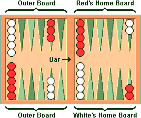
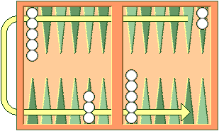
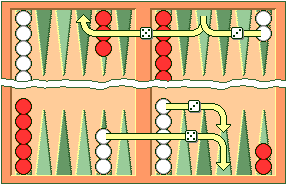
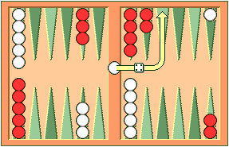
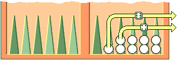

Rules of the Game
=================

This section describes how to play a game, a match, or a session of money games against **GNU Backgammon** or a human opponent.
It is adapted from the rules section of `Backgammon Galore <https://www.bkgm.com/>`_, courtesy of Tom Keith.

Setup
-----

Backgammon is a game for two players, played on a board consisting of twenty-four narrow triangles called *points*.
The triangles alternate in color and are grouped into four quadrants of six triangles each. These quadrants are referred
to as a player's *home board* and *outer board*, and the opponent's home and outer boards. The home and outer boards are
separated by a ridge called the *bar*.

   **Figure 1.** A board with the checkers in their initial position.

The points are numbered for each player starting from their home board. Each player has fifteen checkers.
The starting position is: 2 checkers on the 24-point, 5 on the 13-point, 3 on the 8-point, and 5 on the 6-point.

Each player has their own pair of dice and a dice cup. A doubling cube (values: 2, 4, 8, 16, 32, 64) is used to track stakes.

Object of the Game
------------------

The goal is to move all checkers into your home board and bear them off before your opponent.

   **Figure 2.** Direction of movement of White's checkers. Red's checkers move in the opposite direction.

Movement of the Checkers
------------------------

To start, each player rolls a die. The higher roll goes first, using both dice values. Turns then alternate using two dice.

The roll indicates how many points a checker may move (forward only). Rules:

1. Checkers may move to *open points* (not occupied by two or more opposing checkers).
2. Dice values are separate moves. For example, a 5 and 3 roll can be two moves or one combined move if the intermediate point is open.

   **Figure 3.** White opens the game with 5-3.

3. Doubles are played twice (e.g. 6-6 gives four 6-point moves).
4. A player must use both numbers if legally possible. If only one number is legal, the larger must be played.

Hitting and Entering
--------------------

A single opposing checker (a *blot*) can be hit and sent to the *bar*. Barred checkers must re-enter before other moves.

Re-entry is done by placing the checker on a point in the opponent's home board corresponding to a rolled number, if that point is open.

   **Figure 4.** White rolls 6-4 with a checker on the bar.

If neither point is open, the player forfeits the turn. All checkers must be entered before continuing with other moves.

Bearing Off
-----------

When all checkers are in the home board, a player may *bear off* by rolling a die corresponding to the checker’s position.

If no checker is on that point, use a higher-numbered one. If none are available, the turn is forfeited unless another move is legal.

   **Figure 5.** White rolls 6-4 and bears off two checkers.

A player must re-enter any hit checkers before continuing to bear off.

Doubling
--------

Backgammon can be played for stakes. Each game begins with a value of 1. A player may propose doubling at the start of their turn.

- The opponent may accept or concede.
- The doubling cube passes to the acceptor, who alone may re-double.
- There is no limit to redoubles.

Gammons and Backgammons
-----------------------

At game end:

- If the loser has borne off at least one checker: they lose 1x the cube value.
- If not: they are *gammoned* and lose 2x.
- If not and they have checkers on the bar or opponent's home board: they are *backgammoned* and lose 3x.

Optional Rules
--------------

1. **Automatic Doubles**: If doubles are rolled on the first turn, cube goes to 2. Usually limited to one per game.
2. **Beavers**: When doubled, a player may immediately redouble while retaining the cube.
3. **Jacoby Rule**: Gammons and backgammons count only as singles if no double was offered during the game.

Match Play
----------

Matches are played to a point goal (e.g., first to 5). The Crawford rule prevents doubling in the first game after one player is within one point of winning the match.

+------------------+--------+--------+-----------------+
| Match to 5       | White  | Black  | Doubling        |
+------------------+--------+--------+-----------------+
| White wins 2     | 2      | 0      | Allowed         |
| Black wins 1     | 2      | 1      | Allowed         |
| White wins 2     | 4      | 1      | Allowed         |
| Black wins 1     | 4      | 2      | *Crawford Game* |
| Black wins 2     | 4      | 4      | Allowed         |
| White wins 2     | 6      | 4      | Allowed         |
+------------------+--------+--------+-----------------+

There is no reward for winning by more than the required number of points.

Note: Automatic doubles, beavers, and the Jacoby rule are *not* used in match play.

